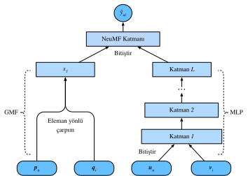

# Kişiselleştirilmiş Sıralama için Sinirsel İşbirlikçi Filtreleme

Bu bölüm, örtülü geri bildirimlerle öneri için sinirsel işbirlikçi filtreleme (NCF) çerçevesini tanıtarak, açık geri bildirimlerin ötesine geçmektedir. Örtülü geribildirim, tavsiye sistemlerinde yaygındır. Tıklamalar, satın almalar ve izlemeler gibi eylemler, toplanması kolay ve kullanıcıların tercihlerini belirten yaygın örtülü geri bildirimlerdir. Sinirsel matris çarpanlarına ayırmanın kısaltıldığı NeuMF :cite:`He.Liao.Zhang.ea.2017` başlıklı model, kişiselleştirilmiş sıralama görevini örtülü geri bildirimle ele almayı amaçlamaktadır. Bu model, modelin ifade edilebilirliğini artırmayı amaçlayan matrisi çarpanlarına ayırmanın nokta çarpımlarını değiştirmek için sinir ağlarının esnekliğini ve doğrusal olmama özelliğini kullanır. Özellikle bu model, genelleştirilmiş matris çarpanlara ayırması (GMF) ve MLP dahil olmak üzere iki alt ağla yapılandırılmıştır ve basit nokta çarpımları yerine iki yoldan etkileşimleri modeller. Bu iki ağın çıktıları nihai tahmin puanlarının hesaplanması için bitiştirilir. AutoRec'deki derecelendirme tahmini görevinden farklı olarak, bu model örtülü geri bildirime dayalı olarak her kullanıcı için sıralamalı bir tavsiye listesi oluşturur. Bu modeli eğitmek için son bölümde tanıtılan kişiselleştirilmiş sıralama kaybını kullanacağız. 

## NeuMF modeli

Yukarıda belirtildiği gibi, NeuMF iki alt ağı kaynaştırır. GMF, girdi kullanıcı ve öğe saklı faktörlerinin eleman yönlü çarpımı olduğu matris çarpanlarına ayırmanın genel bir sinir ağı versiyonudur. İki sinirsel katmandan oluşur: 

$$
\mathbf{x} = \mathbf{p}_u \odot \mathbf{q}_i \\
\hat{y}_{ui} = \alpha(\mathbf{h}^\top \mathbf{x}),
$$

burada $\odot$ vektörlerin Hadamard çarpımını gösterir. $\mathbf{P} \in \mathbb{R}^{m \times k}$ ve $\mathbf{Q} \in \mathbb{R}^{n \times k}$ sırasıyla kullanıcı ve öğe gizli matrisine karşılık gelir. $\mathbf{p}_u \in \mathbb{R}^{ k}$, $P$'nin $u.$ satırıdır ve $\mathbf{q}_i \in \mathbb{R}^{ k}$, $Q$ öğesinin $i.$ satırıdır. $\alpha$ ve $h$, çıktı katmanının etkinleştirme fonksiyonunu ve ağırlığını gösterir. $\hat{y}_{ui}$, $u$ kullanıcısının $i$ öğesine verebileceği tahmin puanıdır.

Bu modelin bir başka bileşeni ise MTP'dir. Model esnekliğini zenginleştirmek için MLP alt ağı, kullanıcı ve öğe gömmelerini GMF ile paylaşmaz. Girdi olarak kullanıcı ve öğe gömmelerini bitiştirmeyi kullanır. Karmaşık bağlantılar ve doğrusal olmayan dönüşümlerle, kullanıcılar ve öğeler arasındaki karmaşık etkileşimleri tahmin edebilir. Daha doğrusu, MLP alt ağı şu şekilde tanımlanır: 

$$
\begin{aligned}
z^{(1)} &= \phi_1(\mathbf{U}_u, \mathbf{V}_i) = \left[ \mathbf{U}_u, \mathbf{V}_i \right] \\
\phi^{(2)}(z^{(1)})  &= \alpha^1(\mathbf{W}^{(2)} z^{(1)} + b^{(2)}) \\
&... \\
\phi^{(L)}(z^{(L-1)}) &= \alpha^L(\mathbf{W}^{(L)} z^{(L-1)} + b^{(L)})) \\
\hat{y}_{ui} &= \alpha(\mathbf{h}^\top\phi^L(z^{(L-1)}))
\end{aligned}
$$

burada $\mathbf{W}^*, \mathbf{b}^*$ ve $\alpha^*$ ağırlık matrisini, ek girdi vektörünü ve etkinleştirme işlevini gösterir. $\phi^*$ karşılık gelen katmanın işlevini gösterir. $\mathbf{z}^*$ karşılık gelen katmanın çıktısını gösterir. 

GMF ve MLP sonuçlarını kaynaştırmak için, basit bir toplam yerine, NeuMF, iki alt ağın ikinci son katmanlarını bitiştirerek, diğer katmanlara iletilebilen bir öznitelik vektörü oluşturur. Daha sonra çıktılar $\mathbf{h}$ matrisi ve bir sigmoid etkinleştirme fonksiyonu ile yansıtılır. Tahmin katmanı şu şekilde formüle edilir:
$$
\hat{y}_{ui} = \sigma(\mathbf{h}^\top[\mathbf{x}, \phi^L(z^{(L-1)})]).
$$

Aşağıdaki şekil, NeuMF'nin model mimarisini göstermektedir. 



```{.python .input  n=1}
from d2l import mxnet as d2l
from mxnet import autograd, gluon, np, npx
from mxnet.gluon import nn
import mxnet as mx
import random

npx.set_np()
```

## Model Uygulaması 
Aşağıdaki kod NeuMF modelini uygular. Genelleştirilmiş bir matrisi çarpanlara ayırma modelinden ve farklı kullanıcı ve öğe gömme vektörlerine sahip bir MLP'den oluşur. MLP'nin yapısı `nums_hiddens` parametresi ile kontrol edilir. ReLU, varsayılan etkinleştirme işlevi olarak kullanılır.

```{.python .input  n=2}
class NeuMF(nn.Block):
    def __init__(self, num_factors, num_users, num_items, nums_hiddens,
                 **kwargs):
        super(NeuMF, self).__init__(**kwargs)
        self.P = nn.Embedding(num_users, num_factors)
        self.Q = nn.Embedding(num_items, num_factors)
        self.U = nn.Embedding(num_users, num_factors)
        self.V = nn.Embedding(num_items, num_factors)
        self.mlp = nn.Sequential()
        for num_hiddens in nums_hiddens:
            self.mlp.add(nn.Dense(num_hiddens, activation='relu',
                                  use_bias=True))
        self.prediction_layer = nn.Dense(1, activation='sigmoid', use_bias=False)

    def forward(self, user_id, item_id):
        p_mf = self.P(user_id)
        q_mf = self.Q(item_id)
        gmf = p_mf * q_mf
        p_mlp = self.U(user_id)
        q_mlp = self.V(item_id)
        mlp = self.mlp(np.concatenate([p_mlp, q_mlp], axis=1))
        con_res = np.concatenate([gmf, mlp], axis=1)
        return self.prediction_layer(con_res)
```

## Negatif Örnekleme ile Özelleştirilmiş Veri Kümesi

Çiftli sıralama kaybı için önemli bir adım negatif örneklemedir. Her kullanıcı için, bir kullanıcının etkileşim kurmadığı öğeler aday öğelerdir (gözlenmeyen girdiler). Aşağıdaki işlev, kullanıcı kimliğini ve aday öğelerini girdi olarak alır ve negatif öğeleri, o kullanıcının aday kümesindeki her kullanıcı için rastgele örneklemler. Eğitim aşamasında model, kullanıcının beğendiği öğelerin, sevmediği veya etkileşimde bulunmadığı öğelerden daha üst sıralarda yer almasını sağlar.

```{.python .input  n=3}
class PRDataset(gluon.data.Dataset):
    def __init__(self, users, items, candidates, num_items):
        self.users = users
        self.items = items
        self.cand = candidates
        self.all = set([i for i in range(num_items)])

    def __len__(self):
        return len(self.users)

    def __getitem__(self, idx):
        neg_items = list(self.all - set(self.cand[int(self.users[idx])]))
        indices = random.randint(0, len(neg_items) - 1)
        return self.users[idx], self.items[idx], neg_items[indices]
```

## Değerlendirici 
Bu bölümde, eğitim ve test kümelerini oluşturmak için zaman stratejisine göre bölünmeyi benimsedik. Model etkinliğini değerlendirmek için belirli bir $\ell$ ($\text{Hit}@\ell$) kesme noktasındaki isabet oranı ve ROC eğrisi (AUC) altındaki alan dahil olmak üzere iki değerlendirme ölçütü kullanılır. Her kullanıcı için verilen $\ell$ konumundaki isabet oranı, önerilen öğenin en üstteki $\ell$ sıralamasında yer alıp almadığını gösterir. Biçimsel tanım şöyledir: 

$$
\text{Hit}@\ell = \frac{1}{m} \sum_{u \in \mathcal{U}} \textbf{1}(rank_{u, g_u} <= \ell),
$$

burada $\textbf{1}$, referans gerçek öğesi $\ell$ listesinde üst sıralarda yer alıyorsa bire eşit olan bir gösterge işlevini belirtir, aksi takdirde sıfıra eşittir. $rank_{u, g_u}$, tavsiye listesinde $u$ kullanıcısının $g_u$ referans gerçek öğesinin sıralamasını belirtir (İdeal sıralama 1'dir). $m$ kullanıcı sayısıdır. $\mathcal{U}$ kullanıcı ayarıdır. 

AUC tanımı şöyledir: 

$$
\text{AUC} = \frac{1}{m} \sum_{u \in \mathcal{U}} \frac{1}{|\mathcal{I} \backslash S_u|} \sum_{j \in I \backslash S_u} \textbf{1}(rank_{u, g_u} < rank_{u, j}),
$$

burada $\mathcal{I}$ öğe kümesidir. $S_u$, $u$ kullanıcısının aday öğeleridir. Kesinlik, geri çağırma ve normalleştirilmiş indirimli toplu kazanç (NDCG) gibi diğer birçok değerlendirme protokollerinin de kullanılabileceğini unutmayın. 

Aşağıdaki işlev, her kullanıcı için isabet sayımlarını ve AUC'yi hesaplar.

```{.python .input  n=4}
#@save
def hit_and_auc(rankedlist, test_matrix, k):
    hits_k = [(idx, val) for idx, val in enumerate(rankedlist[:k])
              if val in set(test_matrix)]
    hits_all = [(idx, val) for idx, val in enumerate(rankedlist)
                if val in set(test_matrix)]
    max = len(rankedlist) - 1
    auc = 1.0 * (max - hits_all[0][0]) / max if len(hits_all) > 0 else 0
    return len(hits_k), auc
```

Ardından, genel isabet oranı ve AUC aşağıdaki gibi hesaplanır.

```{.python .input  n=5}
#@save
def evaluate_ranking(net, test_input, seq, candidates, num_users, num_items,
                     devices):
    ranked_list, ranked_items, hit_rate, auc = {}, {}, [], []
    all_items = set([i for i in range(num_users)])
    for u in range(num_users):
        neg_items = list(all_items - set(candidates[int(u)]))
        user_ids, item_ids, x, scores = [], [], [], []
        [item_ids.append(i) for i in neg_items]
        [user_ids.append(u) for _ in neg_items]
        x.extend([np.array(user_ids)])
        if seq is not None:
            x.append(seq[user_ids, :])
        x.extend([np.array(item_ids)])
        test_data_iter = gluon.data.DataLoader(
            gluon.data.ArrayDataset(*x), shuffle=False, last_batch="keep",
            batch_size=1024)
        for index, values in enumerate(test_data_iter):
            x = [gluon.utils.split_and_load(v, devices, even_split=False)
                 for v in values]
            scores.extend([list(net(*t).asnumpy()) for t in zip(*x)])
        scores = [item for sublist in scores for item in sublist]
        item_scores = list(zip(item_ids, scores))
        ranked_list[u] = sorted(item_scores, key=lambda t: t[1], reverse=True)
        ranked_items[u] = [r[0] for r in ranked_list[u]]
        temp = hit_and_auc(ranked_items[u], test_input[u], 50)
        hit_rate.append(temp[0])
        auc.append(temp[1])
    return np.mean(np.array(hit_rate)), np.mean(np.array(auc))
```

## Model Eğitimi ve Değerlendirilmesi

Eğitim fonksiyonu aşağıda tanımlanmıştır. Modeli çiftli şeklinde eğitiyoruz.

```{.python .input  n=6}
#@save
def train_ranking(net, train_iter, test_iter, loss, trainer, test_seq_iter,
                  num_users, num_items, num_epochs, devices, evaluator,
                  candidates, eval_step=1):
    timer, hit_rate, auc = d2l.Timer(), 0, 0
    animator = d2l.Animator(xlabel='epoch', xlim=[1, num_epochs], ylim=[0, 1],
                            legend=['test hit rate', 'test AUC'])
    for epoch in range(num_epochs):
        metric, l = d2l.Accumulator(3), 0.
        for i, values in enumerate(train_iter):
            input_data = []
            for v in values:
                input_data.append(gluon.utils.split_and_load(v, devices))
            with autograd.record():
                p_pos = [net(*t) for t in zip(*input_data[0:-1])]
                p_neg = [net(*t) for t in zip(*input_data[0:-2],
                                              input_data[-1])]
                ls = [loss(p, n) for p, n in zip(p_pos, p_neg)]
            [l.backward(retain_graph=False) for l in ls]
            l += sum([l.asnumpy() for l in ls]).mean()/len(devices)
            trainer.step(values[0].shape[0])
            metric.add(l, values[0].shape[0], values[0].size)
            timer.stop()
        with autograd.predict_mode():
            if (epoch + 1) % eval_step == 0:
                hit_rate, auc = evaluator(net, test_iter, test_seq_iter,
                                          candidates, num_users, num_items,
                                          devices)
                animator.add(epoch + 1, (hit_rate, auc))
    print(f'train loss {metric[0] / metric[1]:.3f}, '
          f'test hit rate {float(hit_rate):.3f}, test AUC {float(auc):.3f}')
    print(f'{metric[2] * num_epochs / timer.sum():.1f} examples/sec '
          f'on {str(devices)}')
```

Şimdi, MovieLens 100k veri kümesini yükleyebilir ve modeli eğitebiliriz. MovieLens veri kümesinde sadece derecelendirmeler olduğundan, bazı doğruluk kayıplarıyla birlikte, bu derecelendirmeleri sıfırlara ve birlere göre ikili hale getiriyoruz. Bir kullanıcı bir öğeyi derecelendirdiyse, örtülü geri bildirimi bir olarak değerlendiririz, aksi takdirde sıfır olarak kabul ederiz. Bir öğeyi derecelendirme eylemi, örtülü geri bildirim sağlama şekli olarak değerlendirilebilir. Burada, veri kümesini, kullanıcıların en son etkileşimde bulunduğu öğelerin test için dışarıda bırakıldığı `seq-aware` modunda böldük.

```{.python .input  n=11}
batch_size = 1024
df, num_users, num_items = d2l.read_data_ml100k()
train_data, test_data = d2l.split_data_ml100k(df, num_users, num_items,
                                              'seq-aware')
users_train, items_train, ratings_train, candidates = d2l.load_data_ml100k(
    train_data, num_users, num_items, feedback="implicit")
users_test, items_test, ratings_test, test_iter = d2l.load_data_ml100k(
    test_data, num_users, num_items, feedback="implicit")
train_iter = gluon.data.DataLoader(
    PRDataset(users_train, items_train, candidates, num_items ), batch_size,
    True, last_batch="rollover", num_workers=d2l.get_dataloader_workers())
```

Daha sonra modeli oluşturup ilkliyoruz. Sabit gizli 10 boyuta sahip üç katmanlı bir MLP kullanıyoruz.

```{.python .input  n=8}
devices = d2l.try_all_gpus()
net = NeuMF(10, num_users, num_items, nums_hiddens=[10, 10, 10])
net.initialize(ctx=devices, force_reinit=True, init=mx.init.Normal(0.01))
```

Aşağıdaki kod modeli eğitir.

```{.python .input  n=12}
lr, num_epochs, wd, optimizer = 0.01, 10, 1e-5, 'adam'
loss = d2l.BPRLoss()
trainer = gluon.Trainer(net.collect_params(), optimizer,
                        {"learning_rate": lr, 'wd': wd})
train_ranking(net, train_iter, test_iter, loss, trainer, None, num_users,
              num_items, num_epochs, devices, evaluate_ranking, candidates)
```

## Özet

* Matris çarpanlara ayırma modeline doğrusal olmayanlık eklemek, model kapasitesini ve etkinliğini geliştirmek için faydalıdır.
* NeuMF, matris çarpanlara ayırma ve çok katmanlı algılayıcının bir birleşimidir. Çok katmanlı algılayıcı, girdi olarak kullanıcı ve öğe gömmelerinin bitiştirilmesini alır.

## Alıştırmalar

* Gizli çarpanların boyutunu değiştirin. Gizli çarpanların boyutu model performansını nasıl etkiler?
* Performans üzerindeki etkisini kontrol etmek için MLP'nin mimarilerini (örn. katman sayısı, her katmanın nöron sayısı) değiştirin.
* Farklı eniyileyicileri, öğrenme oranını ve ağırlık sönümü oranını deneyin.
* Bu modeli eniyilemek için son bölümde tanımlanan menteşe kaybını kullanmaya çalışın.

:begin_tab:`mxnet`
[Tartışmalar](https://discuss.d2l.ai/t/403)
:end_tab:
