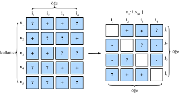

# Tavsiye Sistemleri için Kişiselleştirilmiş Sıralama

Önceki bölümlerde, sadece açık geri bildirim dikkate alındı ve modeller gözlemlenen derecelendirmeler üzerinde eğitildi ve test edildi. Bu tür yöntemlerin iki dezavantajı vardır: Birincisi, çoğu geri bildirim açık değildir, ancak gerçek dünya senaryolarında örtüktür ve açık geri bildirimlerin toplanması daha pahalı olabilir. İkinci olarak, kullanıcıların ilgi alanları için tahminde bulunabilecek, gözlemlenmeyen kullanıcı-öğe çiftleri tamamen göz ardı edilir, bu da bu yöntemleri, derecelendirmelerin rastgele değil de, kullanıcıların tercihleri nedeniyle eksik olduğu durumlar için uygunsuz hale getirir. Gözlemlenmeyen kullanıcı öğe çiftleri, gerçek olumsuz geri bildirim (kullanıcılar öğelerle ilgilenmez) ve eksik değerlerin bir karışımıdır (kullanıcı gelecekte öğelerle etkileşime girebilir). Matris çarpanlarına ayırmada ve AutoRec'te gözlemlenmeyen çiftleri basitçe yok sayarız. Açıkçası, bu modeller gözlenen ve gözlemlenmeyen çiftler arasında ayrım yapamaz ve genellikle kişiselleştirilmiş sıralama görevleri için uygun değildir. 

Bu amaçla, örtülü geri bildirimlerden sıralanmış tavsiye listeleri oluşturmayı hedefleyen bir tavsiye modeli sınıfı popülerlik kazanmıştır. Genel olarak, kişiselleştirilmiş sıralama modelleri noktasal, ikili veya list halinde yaklaşımlarla optimize edilebilir. Noktasal yaklaşımlar, bir seferde tek bir etkileşimi dikkate alır ve bireysel tercihleri tahmin etmek için bir sınıflandırıcı veya bir bağlanım eğitir. Matrisi çarpanlarına ayırma ve AutoRec noktasal amaç işlevleriyle optimize edilmiştir. İkili yaklaşımlar her kullanıcı için bir çift öğe dikkate alır ve bu çift için en uygun sıralamayı yaklaşıklandırmayı amaçlar. Genellikle, ikili yaklaşımlar sıralama görevi için daha uygundur, çünkü göreli sırayı tahmin etmek sıralamanın doğasını anımsatır. Liste halinde yaklaşımlar, örneğin Normalleştirilmiş İndirgenmiş Toplu Kazanç ([NDCG](https://en.wikipedia.org/wiki/Discounted_cumulative_gain)) gibi, sıralama ölçütlerini doğrudan optimize etmek gibi tüm öğe listesinin sıralamasını yaklaşık olarak değerlendirir. Bununla birlikte, listeye dayalı yaklaşımlar noktasal veya  ikili yaklaşımlardan daha karmaşık ve hesaplama yoğundur. Bu bölümde, iki çiftli amaç/kayıp, Bayezian Kişiselleştirilmiş Sıralama kaybı ve Menteşe kaybı ve bunların ilgili uygulamaları sunulacaktır. 

## Bayesian Kişiselleştirilmiş Sıralama Kaybı ve Uygulaması

Bayesian kişiselleştirilmiş sıralama (BPR) :cite:`Rendle.Freudenthaler.Gantner.ea.2009`, maksimum sonsal olasılık tahmincisinden türetilmiş ikili kişiselleştirilmiş sıralama kaybıdır. Birçok mevcut tavsiye modelinde yaygın olarak kullanılmaktadır. BPR'nin eğitim verisi hem olumlu hem de olumsuz çiftlerden (eksik değerler) oluşur. Kullanıcının, gözlemlenmeyen diğer tüm öğeler üzerinde olumlu öğeyi tercih ettiği varsayılır. 

Biçimsel olarak, eğitim verileri $(u, i, j)$ biçiminde çoklular tarafından oluşturulur; bu, $u$ kullanıcısının $i$ öğesini $j$ öğesine tercih ettiğini gösterir. Sonsal olasılığın en üst düzeye çıkarılmasını amaçlayan BPR'nin Bayesian formülasyonu aşağıda verilmiştir: 

$$
p(\Theta \mid >_u )  \propto  p(>_u \mid \Theta) p(\Theta)
$$

$\Theta$ keyfi bir öneri modelinin parametrelerini temsil ettiği yerde, $>_u$, $u$ kullanıcısı için tüm öğelerin istenen kişiselleştirilmiş toplam sıralamasını temsil eder. Kişiselleştirilmiş sıralama görevi için genel eniyileştirme kriterini elde etmek için maksimum sonsal olasılık tahminciyi formüle edebiliriz. 

$$
\begin{aligned}
\text{BPR-OPT} : &= \ln p(\Theta \mid >_u) \\
         & \propto \ln p(>_u \mid \Theta) p(\Theta) \\
         &= \ln \prod_{(u, i, j \in D)} \sigma(\hat{y}_{ui} - \hat{y}_{uj}) p(\Theta) \\
         &= \sum_{(u, i, j \in D)} \ln \sigma(\hat{y}_{ui} - \hat{y}_{uj}) + \ln p(\Theta) \\
         &= \sum_{(u, i, j \in D)} \ln \sigma(\hat{y}_{ui} - \hat{y}_{uj}) - \lambda_\Theta \|\Theta \|^2
\end{aligned}
$$

$D := \{(u, i, j) \mid i \in I^+_u \wedge j \in I \backslash I^+_u \}$ eğitim kümesidir, $I^+_u$ $u$ kullanıcının sevdiği öğeleri, $I$ tüm öğeleri ve $I \backslash I^+_u$, kullanıcının sevdiği öğeler hariç diğer tüm öğeleri belirtir. $\hat{y}_{ui}$ ve $\hat{y}_{uj}$, sırasıyla $i$ ve $j$ öğesi için $u$ kullanıcısının tahmini puanlarıdır. Önsel olasılık $p(\Theta)$, sıfır ortalama ve $\Sigma_\Theta$ varyans-kovaryans matrisi ile normal bir dağılımdır. Burada, $\Sigma_\Theta = \lambda_\Theta I$ olsun. 

 `mxnet.gluon.loss.Loss` temel sınıfını uygulayacağız ve Bayesian kişiselleştirilmiş sıralama kaybını oluşturmak için `forward` yöntemini geçersiz kılacağız. Kayıp (Loss) sınıfını ve np modülünü içe aktararak başlıyoruz.

```{.python .input  n=5}
from mxnet import gluon, np, npx
npx.set_np()
```

BPR kaybının uygulanması aşağıdaki gibidir.

```{.python .input  n=2}
#@save
class BPRLoss(gluon.loss.Loss):
    def __init__(self, weight=None, batch_axis=0, **kwargs):
        super(BPRLoss, self).__init__(weight=None, batch_axis=0, **kwargs)

    def forward(self, positive, negative):
        distances = positive - negative
        loss = - np.sum(np.log(npx.sigmoid(distances)), 0, keepdims=True)
        return loss
```

## Menteşe Kaybı ve Uygulanması

Sıralama için Menteşe kaybı, SVM'ler gibi sınıflandırıcılarda sıklıkla kullanılan gluon kütüphanesinde sağlanan [menteşe kaybı](https://mxnet.incubator.apache.org/api/python/gluon/loss.html#mxnet.gluon.loss.HingeLoss)ndan farklı bir şekle sahiptir. Tavsiye sistemlerinde sıralamada kullanılan kayıp aşağıdaki formdadır. 

$$
 \sum_{(u, i, j \in D)} \max( m - \hat{y}_{ui} + \hat{y}_{uj}, 0)
$$

burada $m$ güvenlik kenar payı boyutudur. Olumsuz öğeleri olumlu öğelerden uzaklaştırmayı amaçlar. BPR'ye benzer şekilde, mutlak çıktılar yerine olumlu ve olumsuz örneklemler arasındaki mesafeyi optimize etmeyi amaçlar ve bu onu tavsiye sistemlerine çok uygun hale getirir.

```{.python .input  n=3}
#@save
class HingeLossbRec(gluon.loss.Loss):
    def __init__(self, weight=None, batch_axis=0, **kwargs):
        super(HingeLossbRec, self).__init__(weight=None, batch_axis=0,
                                            **kwargs)

    def forward(self, positive, negative, margin=1):
        distances = positive - negative
        loss = np.sum(np.maximum(- distances + margin, 0))
        return loss
```

Bu iki kayıp tavsiye kişiselleştirilmiş sıralama için değiştirilebilir. 

## Özet

- Tavsiye sistemlerinde kişiselleştirilmiş sıralama görevi için üç tür sıralama kaybı vardır; yani noktasal, çiftli ve liste halinde yöntemler.
- İki çiftli kayıp, Bayes kişiselleştirilmiş sıralama kaybı ve menteşe kaybı, birbirinin yerine kullanılabilir.

## Alıştırmalar

- BPR ve menteşe kaybının başka biçimleri var mıdır?
- BPR veya menteşe kaybı kullanan herhangi bir tavsiye modeli bulabilir misiniz?

:begin_tab:`mxnet`
[Tartışmalar](https://discuss.d2l.ai/t/402)
:end_tab:
