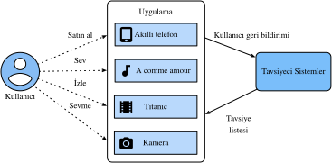

# Tavsiye Sistemlerine Genel Bakış

Son on yılda İnternet, iletişim kurma, haber okuma, ürün satın alma ve film izleme şeklimizi derinden değiştiren büyük ölçekli çevrimiçi hizmetler için bir platform haline geldi. Bu arada, benzeri görülmemiş sayıda öğe (filmler, haberler, kitaplar ve ürünlere atıfta bulunmak için *öğe* terimini kullanıyoruz.) çevrimiçi olarak sunulan, tercih ettiğimiz öğeleri keşfetmemize yardımcı olabilecek bir sistem gerektirir. Bu nedenle tavsiye sistemleri, kişiselleştirilmiş hizmetleri kolaylaştırabilen ve bireysel kullanıcılara özel deneyim sunabilen güçlü bilgi filtreleme araçlarıdır. Kısacası, tavsiye sistemleri, seçimleri yönetilebilir hale getirmek için mevcut veri zenginliğinin kullanılmasında önemli bir rol oynamaktadır. Günümüzde öneri sistemleri Amazon, Netflix ve YouTube gibi bir dizi çevrimiçi hizmet sağlayıcısının özünde yer almaktadır. :numref:`subsec_recommender_systems` içinde Amazon tarafından önerilen derin öğrenme kitaplarının örneğini hatırlayın. Tavsiye sistemlerini kullanmanın faydaları iki yönlüdür: Bir yandan, kullanıcıların öğeleri bulma çabalarını büyük ölçüde azaltabilir ve aşırı bilgi yüklemesi sorununu hafifletebilir. Öte yandan, çevrimiçi servis sağlayıcılara iş değeri katabilir ve önemli bir gelir kaynağıdır. Bu ünite, uygulamaya konan örneklerle birlikte tavsiye sistemleri alanında derin öğrenme ile ilgili temel kavramları, klasik modelleri ve son ilerlemeleri tanıtacaktır. 

## İşbirlikçi Filtreleme

Yolculuğa, tavsiye sistemlerindeki önemli kavram ile başlıyoruz: İlk olarak Goblen sistemi tarafından icat edilen işbirlikçi filtreleme (İF) :cite:`Goldberg.Nichols.Oki.ea.1992`, "İnsanlar, haber gruplarına gönderilen çok miktarda e-posta ve iletiyi işlerken filtreleme işlemini gerçekleştirmede birbirlerine yardımcı olmak için işbirliği yapıyor" diye ifade edilmiştir. Bu terim daha fazla anlam ile zenginleştirilmiştir. Geniş anlamda, birden çok kullanıcı, aracılar ve veri kaynağı arasında işbirliği içeren teknikleri kullanarak bilgi veya desenler için filtreleme işlemidir. İF birçok biçime sahiptir, ortaya çıkışından bu yana önerilen çok sayıda İF yöntemi vardır.   

Genel olarak, İF teknikleri, bellek tabanlı İF, model tabanlı İF, and onların melezleri ile kategorize edilebilir :cite:`Su.Khoshgoftaar.2009`. Temsilci bellek tabanlı İF teknikleri, kullanıcı tabanlı İF ve öğe tabanlı İF :cite:`Sarwar.Karypis.Konstan.ea.2001` gibi en yakın komşu tabanlı İF teknikleridir. Matris ayrıştırma gibi saklı çarpan modelleri model tabanlı İF örnekleridir. Bellek tabanlı İF, benzerlik değerlerini ortak öğelere göre hesapladığı için seyrek ve büyük ölçekli verilerle uğraşırken sınırlamalara sahiptir. Model tabanlı yöntemler, seyreklik ve ölçeklenebilirlik ile başa çıkmadaki daha iyi yeteneği ile daha popüler hale gelmektedir. Birçok model tabanlı İF yaklaşımı sinir ağları ile genişletilebilir, bu da derin öğrenmedeki :cite:`Zhang.Yao.Sun.ea.2019` hesaplama hızlandırmasıyla daha esnek ve ölçeklenebilir modellere yol açar. Genel olarak, İF yalnızca tahmin ve tavsiyeler yapmak için kullanıcı-öğe etkileşim verilerini kullanır. İF'nin yanı sıra, içerik tabanlı ve bağlam tabanlı öneri sistemleri, öğelerin/kullanıcıların içerik açıklamalarını, zaman damgaları ve konumlar gibi bağlamsal sinyaller ile birleştirmede de yararlıdır. Açıkçası, farklı girdi verileri mevcut olduğunda model türlerini/yapılarını ayarlamamız gerekebilir. 

## Açık Geri Bildirim ve Kapalı Geri Bildirim

Kullanıcıların tercihini öğrenmek için sistem onlardan geri bildirim toplayacaktır. Geri bildirim açık veya örtülü :cite:`Hu.Koren.Volinsky.2008` olabilir. Örneğin, [IMDB](https://www.imdb.com/) filmler için bir ila on yıldız arasında değişen yıldız derecelendirmelerini toplar. YouTube, kullanıcıların tercihlerini göstermeleri için başparmak yukarı ve aşağı düğmelerini sağlar. Açık geri bildirim toplamanın, kullanıcıların ilgi alanlarını proaktif olarak belirtmelerini gerektirdiği açıktır. Bununla birlikte, birçok kullanıcı ürünleri derecelendirmeye isteksiz olabileceğinden, açık geri bildirimler her zaman hazır değildir. Göreceli konuşursak, örtülü geri bildirimler genellikle kullanıcı tıklamaları gibi örtülü davranışların modellenmesiyle ilgili olduğu için genellikle kolayca kullanılabilir. Bu nedenle, birçok tavsiye sistemi, kullanıcı davranışlarını gözlemleyerek kullanıcının görüşünü dolaylı olarak yansıtan örtülü geri bildirimlere odaklanmıştır. Satın alma geçmişi, tarama geçmişi, saatler ve hatta fare hareketleri dahil olmak üzere çeşitli örtülü geri bildirim formları vardır. Örneğin, aynı yazar tarafından birçok kitap satın alan bir kullanıcı muhtemelen bu yazarı sever. Örtülü geri bildirimin doğal olarak gürültülü olduğunu unutmayın. Sadece tercihlerini ve gerçek motiflerini *tahmin edebiliriz*. Bir kullanıcı bir filmi izlemişse, o film hakkında olumlu bir görüşe sahip olduğunu göstermez.

## Tavsiye Görevleri

Geçtiğimiz yıllarda bir dizi tavsiye görevi araştırılmıştır. Uygulama alanına göre film tavsiyesi, haber tavsiyesi, ilgi noktası tavsiyesi :cite:`Ye.Yin.Lee.ea.2011` vb. vardır. Görevleri geri bildirim ve girdi verilerinin türlerine göre ayırt etmek de mümkündür, örneğin, derecelendirme tahmini görevi açık derecelendirmeleri tahmin etmeyi amaçlamaktadır. Zirve-$n$ tavsiyesi (öğe sıralaması), örtük geri bildirimlere dayanarak her kullanıcı için kişisel olarak tüm öğeleri sıralar. Zaman damgası bilgileri de dahil edilmişse, :cite:`Quadrana.Cremonesi.Jannach.2018` dizi duyarlı tavsiye oluşturabiliriz. Bir başka popüler görev, örtülü geri bildirimlere dayanan tıklama oranı tahmini olarak adlandırılır, ancak çeşitli kategorik öznitelikler kullanılabilir. Yeni kullanıcılara tavsiyede bulunmaya ve mevcut kullanıcılara yeni öğeler önermeye soğuk başlangıç tavsiyesi denir :cite:`Schein.Popescul.Ungar.ea.2002`. 

## Özet

* Tavsiye sistemleri bireysel kullanıcılar ve endüstriler için önemlidir. İşbirlikçi filtreleme, tavsiyede önemli bir kavramdır.
* İki tür geri bildirim vardır: Örtülü geri bildirim ve açık geri bildirim. Son on yılda bir dizi tavsiye görevi araştırılmıştır.

## Alıştırmalar

1. Tavsiye sistemlerinin günlük yaşamınızı nasıl etkilediğini açıklayabilir misiniz?
2. Hangi ilginç tavsiye görevlerinin araştırılabileceğini düşünüyorsunuz?

[Tartışmalar](https://discuss.d2l.ai/t/398)
