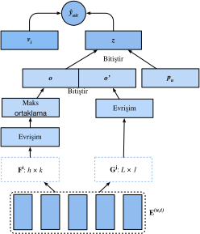
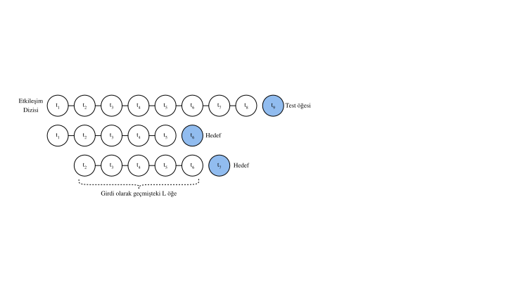

# Sıra Duyarlı Tavsiye Sistemleri

Önceki bölümlerde, kullanıcıların kısa vadeli davranışlarını dikkate almadan tavsiye görevini matris tamamlama sorunu olarak özetleriz. Bu bölümde, sıralı olarak sıralanmış kullanıcı etkileşim günlüklerini dikkate alan bir öneri modeli sunacağız. Giriş, geçmiş kullanıcı eylemlerinin sıralı ve genellikle zaman damgalı listesi olduğu sırada bilinçli bir öneri :cite:`Quadrana.Cremonesi.Jannach.2018`'tür. Bir dizi yeni literatür, bu tür bilgileri kullanıcıların zamansal davranış kalıplarını modellemede ve ilgi alanlarının kaymasını keşfetmede kullanışlılığını göstermiştir. 

Tanıtılacağımız model Caser :cite:`Tang.Wang.2018`, evrimsel dizinin gömülü öneri modelinin kısaltıldığı, evrimsel sinir ağları kullanıcıların son faaliyetlerinin dinamik desen etkilerini yakalama benimser. Caser'in ana bileşeni yatay bir evrimsel ağ ve dikey bir evrimsel ağdan oluşur ve sırasıyla sendika düzeyinde ve nokta düzeyinde dizi kalıplarını ortaya çıkarmayı amaçlar. Nokta düzeyi deseni, tek bir öğenin geçmiş dizideki hedef öğe üzerindeki etkisini belirtirken, sendika düzeyi deseni önceki birkaç eylemin sonraki hedef üzerindeki etkilerini ima eder. Örneğin, hem süt hem de tereyağı birlikte satın almak, sadece birini satın almaktan çok un satın alma olasılığına yol açar. Dahası, kullanıcıların genel ilgi alanları veya uzun vadeli tercihleri de son tamamen bağlı katmanlarda modellenmiştir ve bu da kullanıcı ilgi alanlarının daha kapsamlı bir modellenmesi ile sonuçlanır. Modelin detayları aşağıdaki gibi açıklanmıştır. 

## Model Mimarileri

Sıraya duyarlı öneri sisteminde, her kullanıcı öğe kümesindeki bazı öğelerin dizisiyle ilişkilendirilir. Let $S^u = (S_1^u, ... S_{|S_u|}^u)$ sipariş dizisini gösterir. Caser'in amacı, kullanıcı genel zevklerini ve kısa vadeli niyetini göz önünde bulundurarak öğeyi tavsiye etmektir. Önceki $L$ öğelerini göz önünde bulundurduğumuzu varsayalım, $t$ zaman adımı için eski etkileşimleri temsil eden bir gömme matrisi oluşturulabilir: 

$$
\mathbf{E}^{(u, t)} = [ \mathbf{q}_{S_{t-L}^u} , ..., \mathbf{q}_{S_{t-2}^u}, \mathbf{q}_{S_{t-1}^u} ]^\top,
$$

burada $\mathbf{Q} \in \mathbb{R}^{n \times k}$ öğe gömme temsil eder ve $\mathbf{q}_i$ $i.$ satırını gösterir. $\mathbf{E}^{(u, t)} \in \mathbb{R}^{L \times k}$, $u$ kullanıcı $u$ geçici ilgisini zaman adım $t$ olarak çıkarmak için kullanılabilir. Giriş matrisini $\mathbf{E}^{(u, t)}$ sonraki iki konvolüsyonel bileşenin girişi olan bir görüntü olarak görebiliriz. 

Yatay kıvrımlı tabaka $d$ yatay filtrelere sahiptir $\mathbf{F}^j \in \mathbb{R}^{h \times k}, 1 \leq j \leq d, h = \{1, ..., L\}$ ve dikey kıvrımlı tabaka $d'$ dikey filtrelere sahiptir $\mathbf{G}^j \in \mathbb{R}^{ L \times 1}, 1 \leq j \leq d'$. Bir dizi konvolüsyonel ve havuz operasyonundan sonra, iki çıkış elde ediyoruz: 

$$
\mathbf{o} = \text{HConv}(\mathbf{E}^{(u, t)}, \mathbf{F}) \\
\mathbf{o}'= \text{VConv}(\mathbf{E}^{(u, t)}, \mathbf{G}) ,
$$

burada $\mathbf{o} \in \mathbb{R}^d$ yatay evrimsel ağın çıkışıdır ve $\mathbf{o}' \in \mathbb{R}^{kd'}$ dikey konvolsiyonel ağın çıkışıdır. Basitlik için, evrişim ve havuz operasyonlarının ayrıntılarını atlıyoruz. Daha yüksek seviyeli temsiller elde etmek için birleştirilir ve tamamen bağlı bir sinir ağı katmanına beslenir. 

$$
\mathbf{z} = \phi(\mathbf{W}[\mathbf{o}, \mathbf{o}']^\top + \mathbf{b}),
$$

burada $\mathbf{W} \in \mathbb{R}^{k \times (d + kd')}$ ağırlık matrisi ve $\mathbf{b} \in \mathbb{R}^k$ önyargısıdır. Öğrenilen vektör $\mathbf{z} \in \mathbb{R}^k$, kullanıcının kısa vadeli niyetinin gösterimidir. 

Sonunda, tahmin fonksiyonu, kullanıcıların kısa vadeli ve genel zevklerini bir araya getirir ve bu da şu şekilde tanımlanır: 

$$
\hat{y}_{uit} = \mathbf{v}_i \cdot [\mathbf{z}, \mathbf{p}_u]^\top + \mathbf{b}'_i,
$$

burada $\mathbf{V} \in \mathbb{R}^{n \times 2k}$ matrisi gömme başka bir öğedir. $\mathbf{b}' \in \mathbb{R}^n$, öğeye özgü önyargıdır. $\mathbf{P} \in \mathbb{R}^{m \times k}$, kullanıcıların genel zevkleri için matrisi gömme kullanıcıdır. $\mathbf{p}_u \in \mathbb{R}^{ k}$ $P$ ve $\mathbf{v}_i \in \mathbb{R}^{2k}$ $\mathbf{V}$'ün $i.$ sırasıdır. 

Model BPR veya Menteşe kaybı ile öğrenilebilir. Caser mimarisi aşağıda gösterilmiştir: 



Önce gerekli kütüphaneleri içe aktarıyoruz.

```{.python .input  n=3}
from d2l import mxnet as d2l
from mxnet import gluon, np, npx
from mxnet.gluon import nn
import mxnet as mx
import random

npx.set_np()
```

## Model Uygulaması Aşağıdaki kod Caser modelini uygular. Dikey bir kıvrımsal tabaka, yatay bir kıvrım tabakası ve tam bağlı bir katmandan oluşur.

```{.python .input  n=4}
class Caser(nn.Block):
    def __init__(self, num_factors, num_users, num_items, L=5, d=16,
                 d_prime=4, drop_ratio=0.05, **kwargs):
        super(Caser, self).__init__(**kwargs)
        self.P = nn.Embedding(num_users, num_factors)
        self.Q = nn.Embedding(num_items, num_factors)
        self.d_prime, self.d = d_prime, d
        # Vertical convolution layer
        self.conv_v = nn.Conv2D(d_prime, (L, 1), in_channels=1)
        # Horizontal convolution layer
        h = [i + 1 for i in range(L)]
        self.conv_h, self.max_pool = nn.Sequential(), nn.Sequential()
        for i in h:
            self.conv_h.add(nn.Conv2D(d, (i, num_factors), in_channels=1))
            self.max_pool.add(nn.MaxPool1D(L - i + 1))
        # Fully-connected layer
        self.fc1_dim_v, self.fc1_dim_h = d_prime * num_factors, d * len(h)
        self.fc = nn.Dense(in_units=d_prime * num_factors + d * L,
                           activation='relu', units=num_factors)
        self.Q_prime = nn.Embedding(num_items, num_factors * 2)
        self.b = nn.Embedding(num_items, 1)
        self.dropout = nn.Dropout(drop_ratio)

    def forward(self, user_id, seq, item_id):
        item_embs = np.expand_dims(self.Q(seq), 1)
        user_emb = self.P(user_id)
        out, out_h, out_v, out_hs = None, None, None, []
        if self.d_prime:
            out_v = self.conv_v(item_embs)
            out_v = out_v.reshape(out_v.shape[0], self.fc1_dim_v)
        if self.d:
            for conv, maxp in zip(self.conv_h, self.max_pool):
                conv_out = np.squeeze(npx.relu(conv(item_embs)), axis=3)
                t = maxp(conv_out)
                pool_out = np.squeeze(t, axis=2)
                out_hs.append(pool_out)
            out_h = np.concatenate(out_hs, axis=1)
        out = np.concatenate([out_v, out_h], axis=1)
        z = self.fc(self.dropout(out))
        x = np.concatenate([z, user_emb], axis=1)
        q_prime_i = np.squeeze(self.Q_prime(item_id))
        b = np.squeeze(self.b(item_id))
        res = (x * q_prime_i).sum(1) + b
        return res
```

## Negatif Örnekleme ile Sıralı Veri Kümesi Sıralı etkileşim verilerini işlemek için Dataset sınıfını yeniden uygulamalıyız. Aşağıdaki kod, `SeqDataset` adlı yeni bir dataset sınıfı oluşturur. Her örnekte, kullanıcı kimliğini, önceki $L$ etkileşim öğeleri bir dizi olarak ve hedef olarak etkileşim sonraki öğe çıktılar. Aşağıdaki şekil, bir kullanıcı için veri yükleme işlemini göstermektedir. Bu kullanıcının 9 filmi sevdiğini varsayalım, bu dokuz filmi kronolojik sırayla düzenliyoruz. En son film test öğesi olarak bırakılır. Kalan sekiz film için, her örnek beş ($L=5$) filmden oluşan bir dizi ve hedef öğe olarak sonraki öğesi içeren üç eğitim örneği alabiliriz. Negatif örnekler, Özelleştirilmiş veri kümesine de dahil edilir. 



```{.python .input  n=5}
class SeqDataset(gluon.data.Dataset):
    def __init__(self, user_ids, item_ids, L, num_users, num_items,
                 candidates):
        user_ids, item_ids = np.array(user_ids), np.array(item_ids)
        sort_idx = np.array(sorted(range(len(user_ids)),
                                   key=lambda k: user_ids[k]))
        u_ids, i_ids = user_ids[sort_idx], item_ids[sort_idx]
        temp, u_ids, self.cand = {}, u_ids.asnumpy(), candidates
        self.all_items = set([i for i in range(num_items)])
        [temp.setdefault(u_ids[i], []).append(i) for i, _ in enumerate(u_ids)]
        temp = sorted(temp.items(), key=lambda x: x[0])
        u_ids = np.array([i[0] for i in temp])
        idx = np.array([i[1][0] for i in temp])
        self.ns = ns = int(sum([c - L if c >= L + 1 else 1 for c
                                in np.array([len(i[1]) for i in temp])]))
        self.seq_items = np.zeros((ns, L))
        self.seq_users = np.zeros(ns, dtype='int32')
        self.seq_tgt = np.zeros((ns, 1))
        self.test_seq = np.zeros((num_users, L))
        test_users, _uid = np.empty(num_users), None
        for i, (uid, i_seq) in enumerate(self._seq(u_ids, i_ids, idx, L + 1)):
            if uid != _uid:
                self.test_seq[uid][:] = i_seq[-L:]
                test_users[uid], _uid = uid, uid
            self.seq_tgt[i][:] = i_seq[-1:]
            self.seq_items[i][:], self.seq_users[i] = i_seq[:L], uid

    def _win(self, tensor, window_size, step_size=1):
        if len(tensor) - window_size >= 0:
            for i in range(len(tensor), 0, - step_size):
                if i - window_size >= 0:
                    yield tensor[i - window_size:i]
                else:
                    break
        else:
            yield tensor

    def _seq(self, u_ids, i_ids, idx, max_len):
        for i in range(len(idx)):
            stop_idx = None if i >= len(idx) - 1 else int(idx[i + 1])
            for s in self._win(i_ids[int(idx[i]):stop_idx], max_len):
                yield (int(u_ids[i]), s)

    def __len__(self):
        return self.ns

    def __getitem__(self, idx):
        neg = list(self.all_items - set(self.cand[int(self.seq_users[idx])]))
        i = random.randint(0, len(neg) - 1)
        return (self.seq_users[idx], self.seq_items[idx], self.seq_tgt[idx],
                neg[i])
```

## MovieLens 100K veri kümesini yükleme

Daha sonra, MovieLens 100K veri kümesini sıra duyarlı modda okur ve yukarıda uygulanan sıralı dataloader ile eğitim verilerini yükleriz.

```{.python .input  n=6}
TARGET_NUM, L, batch_size = 1, 5, 4096
df, num_users, num_items = d2l.read_data_ml100k()
train_data, test_data = d2l.split_data_ml100k(df, num_users, num_items,
                                              'seq-aware')
users_train, items_train, ratings_train, candidates = d2l.load_data_ml100k(
    train_data, num_users, num_items, feedback="implicit")
users_test, items_test, ratings_test, test_iter = d2l.load_data_ml100k(
    test_data, num_users, num_items, feedback="implicit")
train_seq_data = SeqDataset(users_train, items_train, L, num_users,
                            num_items, candidates)
train_iter = gluon.data.DataLoader(train_seq_data, batch_size, True,
                                   last_batch="rollover",
                                   num_workers=d2l.get_dataloader_workers())
test_seq_iter = train_seq_data.test_seq
train_seq_data[0]
```

Eğitim veri yapısı yukarıda gösterilmiştir. İlk öğe kullanıcı kimliğidir, bir sonraki liste bu kullanıcının sevdiği son beş öğeyi gösterir ve son öğe, bu kullanıcının beş öğeden sonra sevdiği öğedir. 

## Modeli Şimdi eğitin, modeli eğitelim. Sonuçların karşılaştırılabilir olması için son bölümde öğrenme hızı, iyileştirici ve $k$ dahil NeuMF ile aynı ayarı kullanıyoruz.

```{.python .input  n=7}
devices = d2l.try_all_gpus()
net = Caser(10, num_users, num_items, L)
net.initialize(ctx=devices, force_reinit=True, init=mx.init.Normal(0.01))
lr, num_epochs, wd, optimizer = 0.04, 8, 1e-5, 'adam'
loss = d2l.BPRLoss()
trainer = gluon.Trainer(net.collect_params(), optimizer,
                        {"learning_rate": lr, 'wd': wd})

d2l.train_ranking(net, train_iter, test_iter, loss, trainer, test_seq_iter,
                  num_users, num_items, num_epochs, devices,
                  d2l.evaluate_ranking, candidates, eval_step=1)
```

## Özet * Bir kullanıcının kısa vadeli ve uzun vadeli çıkarlarını çıkarması, daha etkili bir şekilde tercih ettiği bir sonraki öğenin tahmin edilmesini sağlayabilir.* Konvolsiyonel sinir ağları, kullanıcıların kısa vadeli çıkarlarını sıralı etkileşimlerden yakalamak için kullanılabilir. 

## Egzersizler

* Yatay ve dikey kıvrımsal ağlardan birini kaldırarak bir ablasyon çalışması yürütmek, hangi bileşen daha önemlidir?
* Hiperparametre $L$ değiştir. Daha uzun tarihsel etkileşimler daha yüksek doğruluk getirir mi?
* Yukarıda tanıtılan sıraya duyarlı öneri görevinin yanı sıra, oturum tabanlı öneri :cite:`Hidasi.Karatzoglou.Baltrunas.ea.2015` adlı başka bir dizi duyarlı öneri görevi türü vardır. Bu iki görev arasındaki farkları açıklayabilir misiniz?

:begin_tab:`mxnet`
[Discussions](https://discuss.d2l.ai/t/404)
:end_tab:
