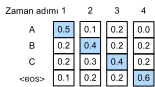
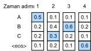
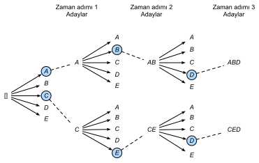

# Işın Arama
:label:`sec_beam-search`

:numref:`sec_seq2seq` içinde, özel dizi sonu andıcı, "&lt;eos&gt;", tahmin edilene kadar çıktı dizisini andıç andıç ile tahmin ettik. Bu bölümde, bu *açgözlü arama* stratejisini formüle dökmeye ve onunla ilgili sorunları araştırmaya başlayacağız, daha sonra bu stratejiyi diğer seçeneklerle karşılaştıracağız: *Kapsamlı arama (exhaustive search)* ve *ışın arama (beam search)*.

Açgözlü aramaya biçimsel bir girişten önce, :numref:`sec_seq2seq` içindeki aynı matematiksel gösterimi kullanarak arama problemini formülleştirelim. Herhangi bir $t'$ zamanda adımında, $y_{t'}$ kodçüzücü çıktı olasılığı önceki çıktı altdizisi $y_1, \ldots, y_{t'-1}$  $y_1, \ldots, y_{t'-1}$'e ve girdi dizisinin bilgilerini kodlayan bağlam değişkeni $\mathbf{c}$'ye koşulludur. Hesaplama maliyetini ölçmek için, ("&lt;eos&gt;" içeren) çıktı kelime dağarcığını $\mathcal{Y}$ ile belirtelim. Yani bu kelime kümesinin küme büyüklüğü $\left|\mathcal{Y}\right|$ kelime dağarcığı büyüklüğündedir. Ayrıca, bir çıktı dizisinin en fazla andıç adedini $T'$ olarak belirtelim. Sonuç olarak, hedefimiz tüm $\mathcal{O}(\left|\mathcal{Y}\right|^{T'})$ olası çıktı dizilerinden ideal bir çıktı aramaktır. Tabii ki, tüm bu çıktı dizileri için, gerçek çıktıda "&lt;eos&gt;" dahil sonrasındaki bölümler atılacaktır.

## Açgözlü Arama

İlk olarak, basit bir stratejiye bir göz atalım: *Açgözlü arama*. Bu strateji :numref:`sec_seq2seq` içindeki dizileri tahmin etmek için kullanılmıştır. Açgözlü aramada, çıktı dizisinin herhangi bir $t'$ zaman adımında, çıktı olarak $\mathcal{Y}$'ten en yüksek koşullu olasılığa sahip andıcı ararız, yani,

$$y_{t'} = \operatorname*{argmax}_{y \in \mathcal{Y}} P(y \mid y_1, \ldots, y_{t'-1}, \mathbf{c}),$$
 
"&lt;eos&gt;" yayıldıktan veya çıktı dizisi maksimum uzunluğuna ulaştıktan sonra çıktı dizisi tamamlanmış olur.

Peki açgözlü arama ile ne yanlış gidebilir? Aslında, *en iyi dizi*  maksimum $\prod_{t'=1}^{T'} P(y_{t'} \mid y_1, \ldots, y_{t'-1}, \mathbf{c})$ değerine sahip çıktı dizisi olmalıdır, ki bu da girdi dizisine dayalı bir çıktı dizisi oluşturmanın koşullu olasılığıdır. Ne yazık ki, en iyi dizinin açgözlü arama ile elde edileceğinin garantisi yoktur.

:label:`fig_s2s-prob1`

Bir örnekle gösterelim. Çıktı sözlüğünde “A”, “B”, “C” ve "&lt;eos&gt;" dört andıcı olduğunu varsayalım. :numref:`fig_s2s-prob1` şeklinde, her zaman adımının altındaki dört sayı, o zaman adımında sırasıyla “A”, “B”, “C” ve "&lt;eos&gt;" üretme koşullu olasılıklarını temsil eder. Her adımda, açgözlü arama, en yüksek koşullu olasılığa sahip andıcı seçer. Bu nedenle, :numref:`fig_s2s-prob1` şeklinde “A”, “B”, “C” ve "&lt;eos&gt;" çıktı dizisi tahmin edilecektir. Bu çıktı dizisinin koşullu olasılığı $0.5\times0.4\times0.4\times0.6 = 0.048$'dir.

:label:`fig_s2s-prob2`

Sonra, :numref:`fig_s2s-prob2` şeklindeki başka bir örneğe bakalım. :numref:`fig_s2s-prob1` şeklindekinin aksine, zaman adımında :numref:`fig_s2s-prob2` şeklinde *ikinci* en yüksek koşullu olasılığa sahip “C” andıcını seçiyoruz. 3. zaman adımı dayandığı zaman adımları 1 ve 2, çıktı dizileri :numref:`fig_s2s-prob1` örneğinde “A” ve “B”'den :numref:`fig_s2s-prob2` örneğinde “A” ve “C”'ye değiştiğinden, :numref:`fig_s2s-prob2` örneğinde her andıcın koşullu olasılığı 3. zaman adımında da değişti. 3. zaman adımında “B” andıcını seçtiğimizi varsayalım. Şimdi adım 4, :numref:`fig_s2s-prob1` örneğinde  ilk üç zaman adımın çıktısı  "A", "B" ve "C" altdizisinden farklı olan “A”, “C” ve “B” üzerinde koşulludur. Bu nedenle, :numref:`fig_s2s-prob2` örneğindeki 4. adımda her andıcı üretmenin koşullu olasılığı da :numref:`fig_s2s-prob1` örneğindeki durumdan farklıdır. Sonuç olarak, :numref:`fig_s2s-prob2` örneğinde “A”, “C”, “B” ve "&lt;eos&gt;" çıktı dizisinin koşullu olasılığı $0.5\times0.3 \times0.6\times0.6=0.054$'tür, bu da :numref:`fig_s2s-prob1` örneğindeki açgözlü aramadakinden daha büyüktür. Bu örnekte, açgözlü arama ile elde edilen “A”, “B”, “C” ve"&lt;eos&gt;" çıktı dizisi en uygun sıra değildir.

## Kapsamlı Arama

Amaç en uygun diziyi elde etmekse, *kapsamlı arama* kullanmayı düşünebiliriz: Olası tüm çıktı dizilerini koşullu olasılıklarıyla kapsamlı bir şekilde numaralandıralım, ardından en yüksek koşullu olasılığa sahip olanı çıktıyı alalım.

En iyi diziyi elde etmek için kapsamlı arama kullanabilsek de, hesaplama maliyeti $\mathcal{O}(\left|\mathcal{Y}\right|^{T'})$'in aşırı derecede yüksek olması muhtemeldir. Örneğin, $|\mathcal{Y}|=10000$ ve $T'=10$ olduğunda, $10000^{10} = 10^{40}$ tane dizi değerlendirmemiz gerekecek. Bu imkansıza yakın! Öte yandan, açgözlü aramanın hesaplama maliyeti $\mathcal{O}(\left|\mathcal{Y}\right|T')$'dir: Genellikle kapsamlı aramadakinden önemli ölçüde daha küçüktür. Örneğin, $|\mathcal{Y}|=10000$ ve $T'=10$ olduğunda, sadece $10000\times10=10^5$ tane dizi değerlendirmemiz gerekir.

## Işın Arama

Sıra arama stratejileri ile ilgili kararlar, her iki uçtaki kolay sorularla birlikte bir spektrumda yatar. Eğer sadece doğruluk önemliyse? Açıkça görülüyor ki, kapsamlı arama. Ya sadece hesaplamalı maliyet önemliyse? Açıkça, açgözlü arama. Gerçek dünya uygulamaları genellikle bu iki uç arasında bir yerde karmaşık bir soru sorar.

*Işın arama* açgözlü aramanın geliştirilmiş bir versiyonudur. *Işın boyutu* adında bir $k$ hiper parametresi vardır.
Zaman adımında, en yüksek koşullu olasılıklara sahip $k$ tane andıcı seçiyoruz. Her biri sırasıyla $k$ aday çıktı dizilerinin ilk andıcı olacak. Sonraki her zaman adımında, önceki zaman adımındaki $k$ aday çıktı dizilerine dayanarak, $k\left|\mathcal{Y}\right|$ olası seçeneklerden en yüksek koşullu olasılıklara sahip $k$ tane aday çıktı dizisini seçmeye devam ediyoruz.

:label:`fig_beam-search`

:numref:`fig_beam-search`, bir örnek ile ışın arama sürecini gösterir. Çıktı kelime dağarcığının sadece beş öğe içerdiğini varsayalım: $\mathcal{Y} = \{A, B, C, D, E\}$ ve bunlardan biri “&lt;eos&gt;”dir. Işın boyutunun 2 ve bir çıktı dizisinin maksimum uzunluğunun 3 olduğunu düşünün. 1. zaman adımında, $P(y_1 \mid \mathbf{c})$ en yüksek koşullu olasılıklara sahip andıçların $A$ ve $C$ olduğunu varsayalım. 2. zaman adımında, tüm $y_2 \in \mathcal{Y},$ için hesaplarız:

$$\begin{aligned}P(A, y_2 \mid \mathbf{c}) = P(A \mid \mathbf{c})P(y_2 \mid A, \mathbf{c}),\\ P(C, y_2 \mid \mathbf{c}) = P(C \mid \mathbf{c})P(y_2 \mid C, \mathbf{c}),\end{aligned}$$  

ve bu on değer arasında en büyük ikisini seçeriz, diyelim ki $P(A, B \mid \mathbf{c})$ ve $P(C, E \mid \mathbf{c})$. Sonra zaman adımı 3'te, tüm $y_3 \in \mathcal{Y}$ için hesaplarız:

$$\begin{aligned}P(A, B, y_3 \mid \mathbf{c}) = P(A, B \mid \mathbf{c})P(y_3 \mid A, B, \mathbf{c}),\\P(C, E, y_3 \mid \mathbf{c}) = P(C, E \mid \mathbf{c})P(y_3 \mid C, E, \mathbf{c}),\end{aligned}$$ 

ve bu on değer arasında en büyük ikisini seçeriz, diyelim ki $P(A, B, D \mid \mathbf{c})$ ve $P(C, E, D \mid  \mathbf{c}).$ Sonuç olarak, altı aday çıktı dizisi elde ederiz: (i) $A$; (ii) $C$; (iii) $A$, $B$; (iv) $C$, $E$; (v) $A$, $B$, $D$ ve (vi) $C$, $E$, $D$.

Sonunda, bu altı diziye dayalı nihai aday çıktı dizileri kümesini elde ederiz (örneğin, “&lt;eos&gt;” ve sonrasındaki tüm parçaları atın). Ardından, çıktı dizisi olarak aşağıdaki skorun en yüksek seviyesine sahip diziyi seçeriz:

$$ \frac{1}{L^\alpha} \log P(y_1, \ldots, y_{L}\mid \mathbf{c}) = \frac{1}{L^\alpha} \sum_{t'=1}^L \log P(y_{t'} \mid y_1, \ldots, y_{t'-1}, \mathbf{c}),$$
:eqlabel:`eq_beam-search-score`

Burada $L$, son aday dizisinin uzunluğudur ve $\alpha$ genellikle 0.75 olarak ayarlanır. Daha uzun bir dizi :eqref:`eq_beam-search-score` toplamında daha fazla logaritmik terime sahip olduğundan, paydadaki $L^\alpha$ terimi uzun dizileri cezalandırır.

Işın aramasının hesaplama maliyeti $\mathcal{O}(k\left|\mathcal{Y}\right|T')$'dir. Bu sonuç açgözlü arama ile kapsamlı arama arasında yer alır. Aslında, açgözlü arama, 1 ışın boyutuna sahip özel bir ışın araması türü olarak kabul edilebilir. Esnek bir ışın boyutu seçimi ile ışın arama, hesaplama maliyetine karşı doğruluk arasında bir denge sağlar.

## Özet

* Dizi arama stratejileri, açgözlü arama, kapsamlı arama ve ışın aramasını içerir.
* Işın arama, ışın boyutunun esnek seçimi ile hesaplama maliyetine karşılık doğruluk arasında bir denge sağlar.

## Alıştırmalar

1. Kapsamlı aramayı özel bir ışın araması türü olarak ele alabilir miyiz? Neden ya da neden olmasın?
1. :numref:`sec_seq2seq` içindeki makine çeviri probleminde ışın aramasını uygulayın. Işın boyutu çeviri sonuçlarını ve tahmin hızını nasıl etkiler?
1. :numref:`sec_rnn_scratch` içinde kullanıcı tarafından sağlanan önekleri takip eden metin üretmek için dil modelleme kullandık. Hangi tür bir arama stratejisi kullanılıyor? Bunu geliştirebilir misiniz?

[Tartışmalar](https://discuss.d2l.ai/t/338)
