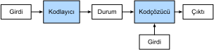

# Kodlayıcı-Kodçözücü Mimarisi
:label:`sec_encoder-decoder`

:numref:`sec_machine_translation` içinde tartıştığımız gibi, makine çevirisi, girdinin ve çıktının ikisinin de değişken uzunlukta diziler olduğu dizi dönüştürme modelleri için önemli bir problem sahasıdır. Bu tür girdi ve çıktıları işlemek için iki ana bileşenli bir mimari tasarlayabiliriz. İlk bileşen bir *kodlayıcı*dır (encoder): Girdi olarak değişken uzunlukta bir diziyi alır ve sabit bir şekle sahip bir duruma dönüştürür. İkinci bileşen bir *kodçözücü*dür (decoder): Sabit şekilli bir kodlanmış durumu değişken uzunlukta bir diziye eşler. Bu, :numref:`fig_encoder_decoder` şeklinde tasvir edildiği gibi *kodlayıcı-kodçözücü* mimarisi olarak adlandırılır.


:label:`fig_encoder_decoder`

Örnek olarak İngilizce'den Fransızca'ya makine çevirisini ele alalım. İngilizce bir girdi dizisi göz önüne alındığımızda, örneğin “They”, “are”, “watching”,”.“, (Onlar izliyorlar.) gibi, kodlayıcı-kodçözücü mimarisi önce değişken uzunluklu girdiyi bir duruma kodlar, sonra da durumu her seferinde bir andıç işleyerek çevrilmiş dizi çıktısını oluşturmak üzere çözer: “Ils”, “regardent”, “.”. Kodlayıcı-kodçözücü mimarisi, sonraki bölümlerdeki farklı dizi dönüştürme modellerinin temelini oluşturduğundan, bu bölüm bu mimariyi daha sonra uygulanacak bir arayüze dönüştürecektir.

## (**Kodlayıcı**)

Kodlayıcı arayüzünde, kodlayıcının `X` girdisi olarak değişken uzunlukta dizileri aldığını belirtiyoruz. Uygulaması, bu temel `Encoder` sınıfından kalıtımla türetilmiş model tarafından sağlanacaktır.

```{.python .input}
from mxnet.gluon import nn

#@save
class Encoder(nn.Block):
    """Kodlayıcı-kod çözücü mimarisi için temel kodlayıcı arabirimi."""
    def __init__(self, **kwargs):
        super(Encoder, self).__init__(**kwargs)

    def forward(self, X, *args):
        raise NotImplementedError
```

```{.python .input}
#@tab pytorch
from torch import nn

#@save
class Encoder(nn.Module):
    """Kodlayıcı-kod çözücü mimarisi için temel kodlayıcı arabirimi."""
    def __init__(self, **kwargs):
        super(Encoder, self).__init__(**kwargs)

    def forward(self, X, *args):
        raise NotImplementedError
```

```{.python .input}
#@tab tensorflow
import tensorflow as tf

#@save
class Encoder(tf.keras.layers.Layer):
    """Kodlayıcı-kod çözücü mimarisi için temel kodlayıcı arabirimi."""
    def __init__(self, **kwargs):
        super(Encoder, self).__init__(**kwargs)

    def call(self, X, *args, **kwargs):
        raise NotImplementedError
```

## [**Kodçözücü**]

Aşağıdaki kodçözücü arayüzünde, kodlayıcı çıktısını (`enc_outputs`) kodlanmış duruma dönüştürmek için ek bir `init_state` işlevi ekliyoruz. Bu adımın :numref:`subsec_mt_data_loading` içinde açıklanan girdinin geçerli uzunluğu gibi ek girdiler gerektirebileceğini unutmayın. Her seferinde bir andıç yaratarak değişken uzunlukta bir dizi oluşturmak için, her zaman kodçözücü bir girdiyi (örneğin, önceki zaman adımında oluşturulan andıç) ve kodlanmış durumu şu anki zaman adımındaki bir çıktı andıcına eşler.

```{.python .input}
#@save
class Decoder(nn.Block):
    """Kodlayıcı-kod çözücü mimarisi için temel kodçözücü arabirimi."""
    def __init__(self, **kwargs):
        super(Decoder, self).__init__(**kwargs)

    def init_state(self, enc_outputs, *args):
        raise NotImplementedError

    def forward(self, X, state):
        raise NotImplementedError
```

```{.python .input}
#@tab pytorch
#@save
class Decoder(nn.Module):
    """Kodlayıcı-kod çözücü mimarisi için temel kodçözücü arabirimi."""
    def __init__(self, **kwargs):
        super(Decoder, self).__init__(**kwargs)

    def init_state(self, enc_outputs, *args):
        raise NotImplementedError

    def forward(self, X, state):
        raise NotImplementedError
```

```{.python .input}
#@tab tensorflow
#@save
class Decoder(tf.keras.layers.Layer):
    """Kodlayıcı-kod çözücü mimarisi için temel kodçözücü arabirimi."""
    def __init__(self, **kwargs):
        super(Decoder, self).__init__(**kwargs)

    def init_state(self, enc_outputs, *args):
        raise NotImplementedError

    def call(self, X, state, **kwargs):
        raise NotImplementedError
```

## [**Kodlayıcıyı ve Kodçözücüyü Bir Araya Koyma**]

Sonunda, kodlayıcı-kodçözücü mimarisi, isteğe bağlı olarak ekstra argümanlarla beraber, hem bir kodlayıcı hem de bir kodçözücü içeriyor. İleri yaymada, kodlayıcının çıktısı kodlanmış durumu üretmek için kullanılır ve bu durum daha sonrasında kodçözücü tarafından girdilerinden biri olarak kullanılacaktır.

```{.python .input}
#@save
class EncoderDecoder(nn.Block):
    """Kodlayıcı-kod çözücü mimarisi için temel sınıf."""
    def __init__(self, encoder, decoder, **kwargs):
        super(EncoderDecoder, self).__init__(**kwargs)
        self.encoder = encoder
        self.decoder = decoder

    def forward(self, enc_X, dec_X, *args):
        enc_outputs = self.encoder(enc_X, *args)
        dec_state = self.decoder.init_state(enc_outputs, *args)
        return self.decoder(dec_X, dec_state)
```

```{.python .input}
#@tab pytorch
#@save
class EncoderDecoder(nn.Module):
    """Kodlayıcı-kod çözücü mimarisi için temel sınıf."""
    def __init__(self, encoder, decoder, **kwargs):
        super(EncoderDecoder, self).__init__(**kwargs)
        self.encoder = encoder
        self.decoder = decoder

    def forward(self, enc_X, dec_X, *args):
        enc_outputs = self.encoder(enc_X, *args)
        dec_state = self.decoder.init_state(enc_outputs, *args)
        return self.decoder(dec_X, dec_state)
```

```{.python .input}
#@tab tensorflow
#@save
class EncoderDecoder(tf.keras.Model):
    """Kodlayıcı-kod çözücü mimarisi için temel sınıf."""
    def __init__(self, encoder, decoder, **kwargs):
        super(EncoderDecoder, self).__init__(**kwargs)
        self.encoder = encoder
        self.decoder = decoder

    def call(self, enc_X, dec_X, *args, **kwargs):
        enc_outputs = self.encoder(enc_X, *args, **kwargs)
        dec_state = self.decoder.init_state(enc_outputs, *args)
        return self.decoder(dec_X, dec_state, **kwargs)
```

Kodlayıcı-kodçözücü mimarisindeki “durum” terimi, muhtemelen durumlara sahip sinir ağlarını kullanarak bu mimariyi uygulamak için size ilham vermiştir. Bir sonraki bölümde, bu kodlayıcı-kodçözücü mimarisine dayanan dizi dönüştürme modellerini tasarlamak için RNN'lerin nasıl uygulanacağını göreceğiz.

## Özet

* Kodlayıcı-kodçözücü mimarisi, hem değişken uzunlukta diziler olan girdi ve çıktıları işleyebilir, bu nedenle makine çevirisi gibi dizi dönüştürme problemleri için uygundur.
* Kodlayıcı, girdi olarak değişken uzunlukta bir diziyi alır ve sabit bir şekle sahip bir duruma dönüştürür.
* Kodçözücü, sabit şekilli bir kodlanmış durumu değişken uzunlukta bir diziye eşler.

## Alıştırmalar

1. Kodlayıcı-kodçözücü mimarisini uygulamak için sinir ağları kullandığımızı varsayalım. Kodlayıcı ve kodçözücü aynı tür sinir ağı olmak zorunda mıdır?
1. Makine çevirisinin yanı sıra, kodlayıcı-kodçözücü mimarisinin uygulanabileceği başka bir uygulama düşünebiliyor musunuz?

:begin_tab:`mxnet`
[Tartışmalar](https://discuss.d2l.ai/t/341)
:end_tab:

:begin_tab:`pytorch`
[Tartışmalar](https://discuss.d2l.ai/t/1061)
:end_tab:
