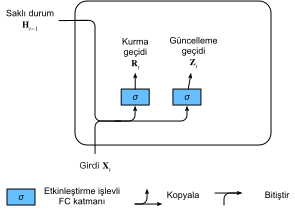
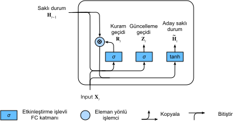
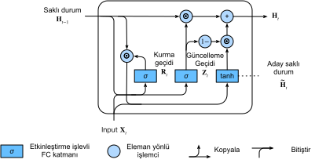

# Geçitli Yinelemeli Birimler (GRU)
:label:`sec_gru`

:numref:`sec_bptt` içinde, gradyanların RNN'lerde nasıl hesaplandığını tartıştık. Özellikle matrislerin uzun çarpımlarının kaybolan veya patlayan gradyanlara yol açabileceğini gördük. Bu tür gradyan sıradışılıklarının pratikte ne anlama geldiğini hakkında kısaca düşünelim:

* Gelecekteki tüm gözlemleri tahmin etmek için erken bir gözlemin son derece önemli olduğu bir durumla karşılaşabiliriz. Biraz karmaşık bir durumu düşünün; ilk gözlem bir sağlama toplamı (checksum) içerir ve hedef de sağlama toplamının dizinin sonunda doğru olup olmadığını fark etmektir. Bu durumda, ilk andıcın etkisi hayati önem taşır. Hayati önem taşıyan erken bilgileri bir *bellek hücresinde* depolamak için bazı mekanizmalara sahip olmak isteriz. Böyle bir mekanizma olmadan, bu gözlemlere çok büyük bir gradyan atamak zorunda kalacağız, çünkü sonraki tüm gözlemleri etkilerler.
* Bazı andıçların uygun gözlem taşımadığı durumlarla karşılaşabiliriz. Örneğin, bir web sayfasını ayrıştırırken, sayfada iletilen duygunun değerlendirilmesi amacıyla alakasız olan yardımcı HTML kodu olabilir. Gizli durum temsilinde bu tür andıçları *atlamak* için birtakım mekanizmaya sahip olmak isteriz.
* Bir dizinin parçaları arasında mantıksal bir kırılma olduğu durumlarla karşılaşabiliriz. Örneğin, bir kitaptaki bölümler arasında bir geçiş veya menkul kıymetler piyasasında hisse değerleri arasında bir geçiş olabilir. Bu durumda iç durum temsilimizi *sıfırlamak* için bir araca sahip olmak güzel olurdu.

Bunu ele almak için bir dizi yöntem önerilmiştir. İlk öncülerden biri :numref:`sec_lstm` içinde tartışacağımız uzun ömürlü kısa-dönem belleğidir :cite:`Hochreiter.Schmidhuber.1997`. Geçitli yinelemeli birim (GRU) :cite:`Cho.Van-Merrienboer.Bahdanau.ea.2014`, genellikle benzer performans sunan ve hesaplanmanın önemli ölçüde daha hızlı olduğu biraz daha elverişli bir türdür :cite:`Chung.Gulcehre.Cho.ea.2014`. Sadeliğinden dolayı, GRU ile başlayalım.

## Geçitli Gizli Durum

Sıradan RNN ve GRU'lar arasındaki anahtar ayrım, ikincisinin gizli durumu geçitlemeyi desteklemesidir. Bu, gizli bir durumun *güncellenmesi* gerektiği zamanlara ve ayrıca *sıfırlanması* gerektiği zamanlara yönelik özel mekanizmalarımız olduğu anlamına gelir. Bu mekanizmalar öğrenilir ve yukarıda listelenen kaygıları ele alır. Örneğin, ilk andıç büyük önem taşıyorsa, ilk gözlemden sonra gizli durumu güncellememeyi öğreneceğiz. Aynı şekilde, ilgisiz geçici gözlemleri atlamayı öğreneceğiz. Son olarak, gerektiğinde gizli durumu sıfırlamayı öğreneceğiz. Bunları aşağıda ayrıntılı olarak tartışıyoruz.

### Sıfırlama Geçidi ve Güncelleme Geçidi

Tanışmamız gereken ilk kavramlar, *sıfırlama geçidi* ve *güncelleme geçidi*dir. Onları $(0, 1)$'de girdileri olan vektörler olacak şekilde tasarlıyoruz, böylece dışbükey bileşimleri gerçekleştirebiliriz. Örneğin, bir sıfırlama geçidi, önceki durumun ne kadarını hala hatırlamak isteyebileceğimizi kontrol etmemizi sağlar. Aynı şekilde, bir güncelleme geçidi yeni durumun ne kadarının eski durumun bir kopyası olacağını kontrol etmemizi sağlayacaktır.

Bu geçitleri işleyerek başlıyoruz. :numref:`fig_gru_1`, mevcut zaman adımının girdiyi ve önceki zaman adımının gizli durumu göz önüne alındığında, bir GRU'daki hem sıfırlama hem de güncelleme geçitleri için girdileri göstermektedir. İki geçidin çıktıları, sigmoid etkinleştirme işlevine sahip iki tam bağlı katman tarafından verilir.


:label:`fig_gru_1`

Matematiksel olarak, belirli bir zaman adımı $t$ için, girdinin bir minigrubun $\mathbf{X}_t \in \mathbb{R}^{n \times d}$ (örnek sayısı: $n$, girdi sayısı: $d$) ve önceki zaman adımının gizli durumunun $\mathbf{H}_{t-1} \in \mathbb{R}^{n \times h}$ (gizli birimlerin sayısı: $h$) olduğunu varsayalım. O zaman, sıfırlama geçidi $\mathbf{R}_t \in \mathbb{R}^{n \times h}$ ve güncelleştirme geçidi $\mathbf{Z}_t \in \mathbb{R}^{n \times h}$ aşağıdaki gibi hesaplanır:

$$
\begin{aligned}
\mathbf{R}_t = \sigma(\mathbf{X}_t \mathbf{W}_{xr} + \mathbf{H}_{t-1} \mathbf{W}_{hr} + \mathbf{b}_r),\\
\mathbf{Z}_t = \sigma(\mathbf{X}_t \mathbf{W}_{xz} + \mathbf{H}_{t-1} \mathbf{W}_{hz} + \mathbf{b}_z),
\end{aligned}
$$

burada $\mathbf{W}_{xr}, \mathbf{W}_{xz} \in \mathbb{R}^{d \times h}$ ve $\mathbf{W}_{hr}, \mathbf{W}_{hz} \in \mathbb{R}^{h \times h}$ ağırlık parametreleridir ve $\mathbf{b}_r, \mathbf{b}_z \in \mathbb{R}^{1 \times h}$ ek girdilerdir. Yayınlamanın (bkz. :numref:`subsec_broadcasting`) toplama sırasında tetiklendiğini unutmayın. Girdi değerlerini $(0, 1)$ aralığına dönüştürmek için sigmoid işlevleri (:numref:`sec_mlp` içinde tanıtıldığı gibi) kullanırız.

### Aday Gizli Durum

Ardından, $\mathbf{R}_t$'i sıfırlama geçidini :eqref:`rnn_h_with_state` denklemindeki normal gizli durum güncelleme mekanizmasıyla tümleştirelim. Bizi $t$ zaman adımında aşağıdaki *aday gizli durum* $\tilde{\mathbf{H}}_t \in \mathbb{R}^{n \times h}$'ye yönlendirir:

$$\tilde{\mathbf{H}}_t = \tanh(\mathbf{X}_t \mathbf{W}_{xh} + \left(\mathbf{R}_t \odot \mathbf{H}_{t-1}\right) \mathbf{W}_{hh} + \mathbf{b}_h),$$
:eqlabel:`gru_tilde_H`

burada $\mathbf{W}_{xh} \in \mathbb{R}^{d \times h}$ ve $\mathbf{W}_{hh} \in \mathbb{R}^{h \times h}$ ağırlık parametreleridir, $\mathbf{b}_h \in \mathbb{R}^{1 \times h}$ ek girdi ve $\odot$ sembolü Hadamard (eleman yönlü) çarpım işlemidir. Burada, aday gizli durumdaki değerlerin $(-1, 1)$ aralığında kalmasını sağlamak için tanh şeklinde bir doğrusal olmayan bir işlev kullanıyoruz.

Sonuç, hala güncelleme geçidinin eylemini dahil etmemiz gerektiğinden bir *adaydır*. :eqref:`rnn_h_with_state` ile karşılaştırıldığında, önceki durumların etkisi $\mathbf{R}_t$ ve $\mathbf{H}_{t-1}$'nin :eqref:`gru_tilde_H` denkleminde eleman yönlü çarpımı ile azaltılabilir. Sıfırlama geçidi $\mathbf{R}_t$ girdileri 1'e yakın olduğunda, :eqref:`rnn_h_with_state` denkleminde olduğu gibi sıradan bir RNN elde ederiz. Sıfırlama geçidi $\mathbf{R}_t$'nın 0'a yakın olan tüm girdileri için, aday gizli durum, girdisi $\mathbf{X}_t$ olan bir MLP'nin sonucudur. Önceden var olan herhangi bir gizli durum böylece *sıfırlanarak* varsayılanlara döner.

:numref:`fig_gru_2` sıfırlama geçidini uyguladıktan sonraki hesaplama akışını gösterir.


:label:`fig_gru_2`

### Gizli Durum

Son olarak, güncelleme geçidi $\mathbf{Z}_t$'nin etkisini dahil etmemiz gerekiyor. Bu, yeni gizli durum $\mathbf{H}_t \in \mathbb{R}^{n \times h}$'in sadece eski durum $\mathbf{H}_{t-1}$'in ve yeni aday durum $\tilde{\mathbf{H}}_t$'nin ne kadar kullanıldığını belirler. $\mathbf{Z}_t$ güncelleme geçidi bu amaçla kullanılabilir, basitçe hem $\mathbf{H}_{t-1}$ hem de $\tilde{\mathbf{H}}_t$ arasındaki eleman yönlü dışbükey birleşimler alarak kullanılabilir. Bu da, GRU için son güncelleştirme denklemine yol açar:

$$\mathbf{H}_t = \mathbf{Z}_t \odot \mathbf{H}_{t-1}  + (1 - \mathbf{Z}_t) \odot \tilde{\mathbf{H}}_t.$$

Güncelleme geçidi $\mathbf{Z}_t$ 1'e yakın olduğunda, sadece eski durumu koruruz. Bu durumda $\mathbf{X}_t$'den gelen bilgiler esasen göz ardı edilir, bağlılık zincirinde $t$ zaman adımı etkin bir şekilde atlanır. Buna karşılık, $\mathbf{Z}_t$ 0'a yakın olduğunda, yeni gizli durum $\mathbf{H}_t$ aday gizli durum $\tilde{\mathbf{H}}_t$'ye yaklaşır. Bu tasarımlar, RNN'lerdeki kaybolan gradyan sorunuyla başa çıkmamıza ve büyük zaman adım mesafeleri olan diziler için bağlılıkları daha iyi yakalamamıza yardımcı olabilirler. Örneğin, güncelleme geçidi tüm bir alt dizinin tüm zaman adımları için 1'e yakınsa, başlangıç zamanındaki eski gizli durum alt sıranın uzunluğuna bakılmaksızın kolayca korunur ve sonuna kadar geçirilir.

:numref:`fig_gru_3` güncelleme geçidi harekete geçtikten sonra hesaplama akışını gösterir.


:label:`fig_gru_3`

Özetle, GRU'lar aşağıdaki iki ayırt edici özelliğe sahiptir:

* Sıfırlama geçitleri dizilerdeki kısa vadeli bağlılıkları yakalamaya yardımcı olur.
* Güncelleme geçitleri dizilerdeki uzun vadeli bağlılıkları yakalamaya yardımcı olur.

## Sıfırdan Uygulama

GRU modelini daha iyi anlamak için sıfırdan uygulayalım. :numref:`sec_rnn_scratch` içinde kullandığımız zaman makinesi veri kümesini okuyarak başlıyoruz. Veri kümesini okuma kodu aşağıda verilmiştir.

```{.python .input}
from d2l import mxnet as d2l
from mxnet import np, npx
from mxnet.gluon import rnn
npx.set_np()

batch_size, num_steps = 32, 35
train_iter, vocab = d2l.load_data_time_machine(batch_size, num_steps)
```

```{.python .input}
#@tab pytorch
from d2l import torch as d2l
import torch
from torch import nn

batch_size, num_steps = 32, 35
train_iter, vocab = d2l.load_data_time_machine(batch_size, num_steps)
```

```{.python .input}
#@tab tensorflow
from d2l import tensorflow as d2l
import tensorflow as tf

batch_size, num_steps = 32, 35
train_iter, vocab = d2l.load_data_time_machine(batch_size, num_steps)
```

### (**Model Parametrelerini İlkleme**)

Bir sonraki adım model parametrelerini ilklemektir. Ağırlıkları standart sapması 0.01 olan bir Gauss dağılımından çekiyoruz ve ek girdiyi 0'a ayarlıyoruz. Hiper parametre `num_hiddens`, gizli birimlerin sayısını tanımlar. Güncelleme geçidi, sıfırlama geçidi, aday gizli durumu ve çıktı katmanı ile ilgili tüm ağırlıkları ve ek girdileri ilkleyeceğiz.

```{.python .input}
def get_params(vocab_size, num_hiddens, device):
    num_inputs = num_outputs = vocab_size

    def normal(shape):
        return np.random.normal(scale=0.01, size=shape, ctx=device)

    def three():
        return (normal((num_inputs, num_hiddens)),
                normal((num_hiddens, num_hiddens)),
                np.zeros(num_hiddens, ctx=device))

    W_xz, W_hz, b_z = three()  # Geçit parametrelerini güncelle
    W_xr, W_hr, b_r = three()  # Geçit parametrelerini sıfırla
    W_xh, W_hh, b_h = three()  # Aday gizli durum parametreleri
    # Çıktı katmanı parametreleri
    W_hq = normal((num_hiddens, num_outputs))
    b_q = np.zeros(num_outputs, ctx=device)
    # Gradyanları iliştir
    params = [W_xz, W_hz, b_z, W_xr, W_hr, b_r, W_xh, W_hh, b_h, W_hq, b_q]
    for param in params:
        param.attach_grad()
    return params
```

```{.python .input}
#@tab pytorch
def get_params(vocab_size, num_hiddens, device):
    num_inputs = num_outputs = vocab_size

    def normal(shape):
        return torch.randn(size=shape, device=device)*0.01

    def three():
        return (normal((num_inputs, num_hiddens)),
                normal((num_hiddens, num_hiddens)),
                d2l.zeros(num_hiddens, device=device))

    W_xz, W_hz, b_z = three()  # Geçit parametrelerini güncelle
    W_xr, W_hr, b_r = three()  # Geçit parametrelerini sıfırla
    W_xh, W_hh, b_h = three()  # Aday gizli durum parametreleri
    # Çıktı katmanı parametreleri
    W_hq = normal((num_hiddens, num_outputs))
    b_q = d2l.zeros(num_outputs, device=device)
    # Gradyanları iliştir
    params = [W_xz, W_hz, b_z, W_xr, W_hr, b_r, W_xh, W_hh, b_h, W_hq, b_q]
    for param in params:
        param.requires_grad_(True)
    return params
```
```{.python .input}
#@tab tensorflow
def get_params(vocab_size, num_hiddens):
    num_inputs = num_outputs = vocab_size

    def normal(shape):
        return d2l.normal(shape=shape,stddev=0.01,mean=0,dtype=tf.float32)

    def three():
        return (tf.Variable(normal((num_inputs, num_hiddens)), dtype=tf.float32),
                tf.Variable(normal((num_hiddens, num_hiddens)), dtype=tf.float32),
                tf.Variable(d2l.zeros(num_hiddens), dtype=tf.float32))

    W_xz, W_hz, b_z = three()  # Geçit parametrelerini güncelle
    W_xr, W_hr, b_r = three()  # Geçit parametrelerini sıfırla
    W_xh, W_hh, b_h = three()  # Aday gizli durum parametreleri
    # Çıktı katmanı parametreleri
    W_hq = tf.Variable(normal((num_hiddens, num_outputs)), dtype=tf.float32)
    b_q = tf.Variable(d2l.zeros(num_outputs), dtype=tf.float32)
    params = [W_xz, W_hz, b_z, W_xr, W_hr, b_r, W_xh, W_hh, b_h, W_hq, b_q]
    return params
```

### Modelin Tanımlanması

Şimdi [**gizli durum ilkleme işlevini**] tanımlayacağız `init_gru_state`. :numref:`sec_rnn_scratch` içinde tanımlanan `init_rnn_state` işlevi gibi, bu işlev, değerleri sıfırlar olan (toplu boyut, gizli birim sayısı) şekline sahip bir tensör döndürür.

```{.python .input}
def init_gru_state(batch_size, num_hiddens, device):
    return (np.zeros(shape=(batch_size, num_hiddens), ctx=device), )
```

```{.python .input}
#@tab pytorch
def init_gru_state(batch_size, num_hiddens, device):
    return (torch.zeros((batch_size, num_hiddens), device=device), )
```

```{.python .input}
#@tab tensorflow
def init_gru_state(batch_size, num_hiddens):
    return (d2l.zeros((batch_size, num_hiddens)), )
```

Şimdi [**GRU modelini tanımlamaya**] hazırız. Yapısı, güncelleme denklemlerinin daha karmaşık olması dışında, temel RNN hücresinin yapısı ile aynıdır.

```{.python .input}
def gru(inputs, state, params):
    W_xz, W_hz, b_z, W_xr, W_hr, b_r, W_xh, W_hh, b_h, W_hq, b_q = params
    H, = state
    outputs = []
    for X in inputs:
        Z = npx.sigmoid(np.dot(X, W_xz) + np.dot(H, W_hz) + b_z)
        R = npx.sigmoid(np.dot(X, W_xr) + np.dot(H, W_hr) + b_r)
        H_tilda = np.tanh(np.dot(X, W_xh) + np.dot(R * H, W_hh) + b_h)
        H = Z * H + (1 - Z) * H_tilda
        Y = np.dot(H, W_hq) + b_q
        outputs.append(Y)
    return np.concatenate(outputs, axis=0), (H,)
```

```{.python .input}
#@tab pytorch
def gru(inputs, state, params):
    W_xz, W_hz, b_z, W_xr, W_hr, b_r, W_xh, W_hh, b_h, W_hq, b_q = params
    H, = state
    outputs = []
    for X in inputs:
        Z = torch.sigmoid((X @ W_xz) + (H @ W_hz) + b_z)
        R = torch.sigmoid((X @ W_xr) + (H @ W_hr) + b_r)
        H_tilda = torch.tanh((X @ W_xh) + ((R * H) @ W_hh) + b_h)
        H = Z * H + (1 - Z) * H_tilda
        Y = H @ W_hq + b_q
        outputs.append(Y)
    return torch.cat(outputs, dim=0), (H,)
```

```{.python .input}
#@tab tensorflow
def gru(inputs, state, params):
    W_xz, W_hz, b_z, W_xr, W_hr, b_r, W_xh, W_hh, b_h, W_hq, b_q = params
    H, = state
    outputs = []
    for X in inputs:
        X = tf.reshape(X,[-1,W_xh.shape[0]])
        Z = tf.sigmoid(tf.matmul(X, W_xz) + tf.matmul(H, W_hz) + b_z)
        R = tf.sigmoid(tf.matmul(X, W_xr) + tf.matmul(H, W_hr) + b_r)
        H_tilda = tf.tanh(tf.matmul(X, W_xh) + tf.matmul(R * H, W_hh) + b_h)
        H = Z * H + (1 - Z) * H_tilda
        Y = tf.matmul(H, W_hq) + b_q
        outputs.append(Y)
    return tf.concat(outputs, axis=0), (H,)
```

### Eğitme ve Tahmin Etme

[**Eğitim**] ve tahmin, tam olarak :numref:`sec_rnn_scratch` içindekiyle aynı şekilde çalışır. Eğitimden sonra, sırasıyla sağlanan “zaman yolcusu” ve “yolcusu” ön eklerini takip eden eğitim kümesindeki şaşkınlığı ve tahmin edilen diziyi yazdırırız.

```{.python .input}
#@tab mxnet, pytorch
vocab_size, num_hiddens, device = len(vocab), 256, d2l.try_gpu()
num_epochs, lr = 500, 1
model = d2l.RNNModelScratch(len(vocab), num_hiddens, device, get_params,
                            init_gru_state, gru)
d2l.train_ch8(model, train_iter, vocab, lr, num_epochs, device)
```
```{.python .input}
#@tab tensorflow
vocab_size, num_hiddens, device_name = len(vocab), 256, d2l.try_gpu()._device_name
# tensorflow eğitim stratejisini tanımlama
strategy = tf.distribute.OneDeviceStrategy(device_name)
num_epochs, lr = 500, 1
with strategy.scope():
    model = d2l.RNNModelScratch(len(vocab), num_hiddens, init_gru_state, gru, get_params)

d2l.train_ch8(model, train_iter, vocab, lr, num_epochs, strategy)
```


## [**Kısa Uygulama**]

Üst düzey API'lerde, doğrudan bir GPU modelini oluşturabiliriz. Bu, yukarıda açıkça yaptığımız tüm yapılandırma ayrıntılarını gizler. Kod, daha önce yazdığımız birçok ayrıntı için Python yerine derlenmiş operatörleri kullandığı için önemli ölçüde daha hızlıdır.

```{.python .input}
gru_layer = rnn.GRU(num_hiddens)
model = d2l.RNNModel(gru_layer, len(vocab))
d2l.train_ch8(model, train_iter, vocab, lr, num_epochs, device)
```

```{.python .input}
#@tab pytorch
num_inputs = vocab_size
gru_layer = nn.GRU(num_inputs, num_hiddens)
model = d2l.RNNModel(gru_layer, len(vocab))
model = model.to(device)
d2l.train_ch8(model, train_iter, vocab, lr, num_epochs, device)
```

```{.python .input}
#@tab tensorflow
gru_cell = tf.keras.layers.GRUCell(num_hiddens,
    kernel_initializer='glorot_uniform')
gru_layer = tf.keras.layers.RNN(gru_cell, time_major=True,
    return_sequences=True, return_state=True)

device_name = d2l.try_gpu()._device_name
strategy = tf.distribute.OneDeviceStrategy(device_name)
with strategy.scope():
    model = d2l.RNNModel(gru_layer, vocab_size=len(vocab))

d2l.train_ch8(model, train_iter, vocab, lr, num_epochs, strategy)
```

## Özet

* Geçitli RNN'ler, büyük zaman adım mesafeleri olan diziler için bağlılıkları daha iyi yakalayabilir.
* Sıfırlama geçitleri dizilerdeki kısa vadeli bağlılıkları yakalamaya yardımcı olur.
* Güncelleme geçitleri dizilerdeki uzun vadeli bağlılıkları yakalamaya yardımcı olur.
* GRU'lar, sıfırlama geçidi açıldığında en uç durum olarak temel RNN'leri içerir. Ayrıca güncelleme geçidini açarak alt dizileri atlayabilirler.

## Alıştırmalar

1. Sadece $t'$ zaman adımını girdi olarak kullanarak $t > t'$ zaman adımlarındaki çıktıyı tahmin etmek için istediğimizi varsayalım. Her zaman adımında sıfırlama ve güncelleme geçitleri için en iyi değerler nelerdir?
1. Hiper parametreleri ayarlayın ve çalışma süresi, şaşkınlık ve çıktı dizisi üzerindeki etkilerini analiz edin.
1. `rnn.RNN` ve `rnn.GRU` uygulamaları için çalışma zamanı, şaşkınlık ve çıktı dizgilerini birbirleriyle karşılaştırın.
1. Yalnızca GRU'nun parçalarını, örneğin yalnızca bir sıfırlama geçidi veya yalnızca bir güncelleme geçidi, uygularsanız ne olur?

:begin_tab:`mxnet`
[Tartışmalar](https://discuss.d2l.ai/t/342)
:end_tab:

:begin_tab:`pytorch`
[Tartışmalar](https://discuss.d2l.ai/t/1056)
:end_tab:
