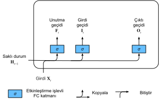
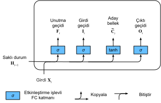
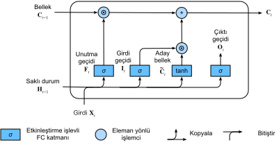
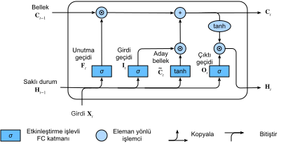

# Uzun Ömürlü Kısa-Dönem Belleği (LSTM)
:label:`sec_lstm`

Gizli değişkenli modellerde uzun vadeli bilgi koruma ve kısa vadeli girdi atlama sorunu uzun zamandır var olmuştur. Bunu ele almak için öncü yaklaşımlardan biri uzun ömürlü kısa-dönem belleği (LSTM) :cite:`Hochreiter.Schmidhuber.1997` oldu. GRU'nun birçok özelliklerini paylaşıyor. İlginçtir ki, LSTM'ler GRU'lardan biraz daha karmaşık bir tasarıma sahiptir, ancak GRU'lardan neredeyse yirmi yıl önce ortaya konmuştur.

## Geçitli Bellek Hücresi

Muhtemelen LSTM'nin tasarımı bir bilgisayarın mantık kapılarından esinlenilmiştir. LSTM, gizli durumla aynı şekle sahip bir *bellek hücresi* (veya kısaca *hücre*) tanıtır (bazı çalışmalar, bellek hücresini gizli durumun özel bir türü olarak görür), ki ek bilgileri kaydetmek için tasarlanmıştır. Hafıza hücresini kontrol etmek için birkaç geçide ihtiyacımız vardır. Hücreden girdileri okumak için bir geçit gerekiyor. Biz buna *çıktı geçidi* olarak atıfta bulunacağız. Hücreye veri ne zaman okunacağına karar vermek için ikinci bir geçit gereklidir. Bunu *girdi geçidi* olarak adlandırıyoruz. Son olarak, *unutma geçidi* tarafından yönetilen hücrenin içeriğini sıfırlamak için bir mekanizmaya ihtiyacımız var. Böyle bir tasarımın motivasyonu GRU'larla aynıdır, yani özel bir mekanizma aracılığıyla gizli durumdaki girdileri ne zaman hatırlayacağınıza ve ne zaman gözardı edeceğinize karar verebilmek. Bunun pratikte nasıl çalıştığını görelim.

### Girdi Geçidi, Unutma Geçidi ve Çıktı Geçidi

Tıpkı GRU'larda olduğu gibi, LSTM geçitlerine beslenen veriler, :numref:`lstm_0` içinde gösterildiği gibi, geçerli zaman adımındaki girdi ve önceki zaman adımının gizli durumudur. Girdi, unutma ve çıktı geçitleri değerlerini hesaplamak için sigmoid etkinleştirme fonksiyonuna sahip üç tam bağlı katman tarafından işlenir. Sonuç olarak, üç geçidin değerleri $(0, 1)$ aralığındadır.


:label:`lstm_0`

Matematiksel olarak, $h$ tane gizli birim, $n$ tane toplu iş ve $d$ tane girdi olduğunu varsayalım. Böylece, girdi $\mathbf{X}_t \in \mathbb{R}^{n \times d}$ ve önceki zaman adımının gizli durumu $\mathbf{H}_{t-1} \in \mathbb{R}^{n \times h}$'dir. Buna göre, $t$ zaman adımındaki geçitler şu şekilde tanımlanır: Girdi geçidi $\mathbf{I}_t \in \mathbb{R}^{n \times h}$, unutma geçidi $\mathbf{F}_t \in \mathbb{R}^{n \times h}$ ve çıktı geçidi $\mathbf{O}_t \in \mathbb{R}^{n \times h}$'dır. Bunlar aşağıdaki gibi hesaplanır:

$$
\begin{aligned}
\mathbf{I}_t &= \sigma(\mathbf{X}_t \mathbf{W}_{xi} + \mathbf{H}_{t-1} \mathbf{W}_{hi} + \mathbf{b}_i),\\
\mathbf{F}_t &= \sigma(\mathbf{X}_t \mathbf{W}_{xf} + \mathbf{H}_{t-1} \mathbf{W}_{hf} + \mathbf{b}_f),\\
\mathbf{O}_t &= \sigma(\mathbf{X}_t \mathbf{W}_{xo} + \mathbf{H}_{t-1} \mathbf{W}_{ho} + \mathbf{b}_o),
\end{aligned}
$$

burada $\mathbf{W}_{xi}, \mathbf{W}_{xf}, \mathbf{W}_{xo} \in \mathbb{R}^{d \times h}$ ve $\mathbf{W}_{hi}, \mathbf{W}_{hf}, \mathbf{W}_{ho} \in \mathbb{R}^{h \times h}$ ağırlık parametreleridir ve $\mathbf{b}_i, \mathbf{b}_f, \mathbf{b}_o \in \mathbb{R}^{1 \times h}$ ek girdi parametreleridir.

### Aday Bellek Hücresi

Sonraki adımda hafıza hücresini tasarlıyoruz. Çeşitli geçitlerin eylemini henüz belirtmediğimizden, öncelikle *aday* bellek hücresi $\tilde{\mathbf{C}}_t \in \mathbb{R}^{n \times h}$'i tanıtıyoruz. Hesaplamalar, yukarıda açıklanan üç geçittekine benzer, ancak etkinleştirme fonksiyonu olarak $(-1, 1)$'de bir değer aralığına sahip bir $\tanh$ işlevini kullanır. Bu, $t$ zaman adımında aşağıdaki denkleme yol açar:

$$\tilde{\mathbf{C}}_t = \text{tanh}(\mathbf{X}_t \mathbf{W}_{xc} + \mathbf{H}_{t-1} \mathbf{W}_{hc} + \mathbf{b}_c),$$

burada $\mathbf{W}_{xc} \in \mathbb{R}^{d \times h}$ ve $\mathbf{W}_{hc} \in \mathbb{R}^{h \times h}$ ağırlık parametreleridir ve $\mathbf{b}_c \in \mathbb{R}^{1 \times h}$ bir ek girdi parametresidir.

Aday bellek hücresinin hızlı bir gösterimi :numref:`lstm_1` içinde verilmiştir.


:label:`lstm_1`

### Bellek Hücresi

GRU'larda, girdiyi ve unutmayı (veya atlamayı) yönetecek bir mekanizmamız vardır. Benzer şekilde, LSTM'lerde bu tür amaçlar için iki özel geçidimiz var: $\mathbf{I}_t$ girdi geçidi $\tilde{\mathbf{C}}_t$ aracılığıyla yeni verileri ne kadar hesaba kattığımızı ve $\mathbf{F}_t$, eski bellek hücresi içeriğinin $\mathbf{C}_{t-1} \in \mathbb{R}^{n \times h}$'nin ne kadarını tuttuğumuzu kontrol eder. Daha önce olduğu gibi aynı noktasal çarpım hilesini kullanarak, aşağıdaki güncelleme denklemine ulaşırız:

$$\mathbf{C}_t = \mathbf{F}_t \odot \mathbf{C}_{t-1} + \mathbf{I}_t \odot \tilde{\mathbf{C}}_t.$$

Unutma geçidi her zaman yaklaşık 1 ise ve girdi geçidi her zaman yaklaşık 0 ise, geçmiş bellek hücreleri $\mathbf{C}_{t-1}$ zamanla kaydedilir ve geçerli zaman adımına geçirilir. Bu tasarım, kaybolan gradyan sorununu hafifletmek ve diziler içindeki uzun menzilli bağlılıkları daha iyi yakalamak için sunuldu.

Böylece :numref:`lstm_2` içindeki akış şemasına ulaşırız.


:label:`lstm_2`

### Gizli Durum

Son olarak, $\mathbf{H}_t \in \mathbb{R}^{n \times h}$ gizli durumunu nasıl hesaplayacağımızı tanımlamamız gerekiyor. Çıktı geçidinin devreye girdiği yer burasıdır. Basitçe LSTM'de, bellek hücresinin $\tanh$'li geçitli versiyonudur. Bu, $\mathbf{H}_t$ değerlerinin her zaman $(-1, 1)$ aralığında olmasını sağlar.

$$\mathbf{H}_t = \mathbf{O}_t \odot \tanh(\mathbf{C}_t).$$

Çıktı geçidi 1'e yaklaştığında, tüm bellek bilgilerini etkin bir şekilde tahminciye aktarırız, oysa 0'a yakın çıktı geçidi için tüm bilgileri yalnızca bellek hücresinde saklarız ve daha fazla işlem yapmayız.

:numref:`lstm_3` içinde veri akışının grafiksel bir gösterimi vardır.


:label:`lstm_3`

## Sıfırdan Uygulama

Şimdi sıfırdan bir LSTM uygulayalım. :numref:`sec_rnn_scratch` içindeki deneylerle aynı şekilde, önce zaman makinesi veri kümesini yükleriz.

```{.python .input}
from d2l import mxnet as d2l
from mxnet import np, npx
from mxnet.gluon import rnn
npx.set_np()

batch_size, num_steps = 32, 35
train_iter, vocab = d2l.load_data_time_machine(batch_size, num_steps)
```

```{.python .input}
#@tab pytorch
from d2l import torch as d2l
import torch
from torch import nn

batch_size, num_steps = 32, 35
train_iter, vocab = d2l.load_data_time_machine(batch_size, num_steps)
```

```{.python .input}
#@tab tensorflow
from d2l import tensorflow as d2l
import tensorflow as tf
batch_size, num_steps = 32, 35
train_iter, vocab = d2l.load_data_time_machine(batch_size, num_steps)
```

### [**Model Parametrelerini İlkleme**]

Daha sonra model parametrelerini tanımlamamız ve ilklememiz gerekiyor. Daha önce olduğu gibi, hiper parametre `num_hiddens` gizli birimlerin sayısını tanımlar. 0.01 standart sapmalı Gauss dağılımı ile ağırlıkları ilkleriz ve ek girdileri 0'a ayarlarız.

```{.python .input}
def get_lstm_params(vocab_size, num_hiddens, device):
    num_inputs = num_outputs = vocab_size

    def normal(shape):
        return np.random.normal(scale=0.01, size=shape, ctx=device)

    def three():
        return (normal((num_inputs, num_hiddens)),
                normal((num_hiddens, num_hiddens)),
                np.zeros(num_hiddens, ctx=device))

    W_xi, W_hi, b_i = three()  # Girdi geçidi parametreleri
    W_xf, W_hf, b_f = three()  # Unutma geçidi parametreleri
    W_xo, W_ho, b_o = three()  # Çıktı geçidi parametreleri
    W_xc, W_hc, b_c = three()  # Aday bellek hücresi parametreleri
    # Çıktı katmanı parametreleri
    W_hq = normal((num_hiddens, num_outputs))
    b_q = np.zeros(num_outputs, ctx=device)
    # Gradyanları iliştir
    params = [W_xi, W_hi, b_i, W_xf, W_hf, b_f, W_xo, W_ho, b_o, W_xc, W_hc,
              b_c, W_hq, b_q]
    for param in params:
        param.attach_grad()
    return params
```

```{.python .input}
#@tab pytorch
def get_lstm_params(vocab_size, num_hiddens, device):
    num_inputs = num_outputs = vocab_size

    def normal(shape):
        return torch.randn(size=shape, device=device)*0.01

    def three():
        return (normal((num_inputs, num_hiddens)),
                normal((num_hiddens, num_hiddens)),
                d2l.zeros(num_hiddens, device=device))

    W_xi, W_hi, b_i = three()  # Girdi geçidi parametreleri
    W_xf, W_hf, b_f = three()  # Unutma geçidi parametreleri
    W_xo, W_ho, b_o = three()  # Çıktı geçidi parametreleri
    W_xc, W_hc, b_c = three()  # Aday bellek hücresi parametreleri
    # Çıktı katmanı parametreleri
    W_hq = normal((num_hiddens, num_outputs))
    b_q = d2l.zeros(num_outputs, device=device)
    # Gradyanları iliştir
    params = [W_xi, W_hi, b_i, W_xf, W_hf, b_f, W_xo, W_ho, b_o, W_xc, W_hc,
              b_c, W_hq, b_q]
    for param in params:
        param.requires_grad_(True)
    return params
```

```{.python .input}
#@tab tensorflow
def get_lstm_params(vocab_size, num_hiddens):
    num_inputs = num_outputs = vocab_size

    def normal(shape):
        return tf.Variable(tf.random.normal(shape=shape, stddev=0.01,
                                            mean=0, dtype=tf.float32))
    def three():
        return (normal((num_inputs, num_hiddens)),
                normal((num_hiddens, num_hiddens)),
                tf.Variable(tf.zeros(num_hiddens), dtype=tf.float32))

    W_xi, W_hi, b_i = three()  # Girdi geçidi parametreleri
    W_xf, W_hf, b_f = three()  # Unutma geçidi parametreleri
    W_xo, W_ho, b_o = three()  # Çıktı geçidi parametreleri
    W_xc, W_hc, b_c = three()  # Aday bellek hücresi parametreleri
    # Çıktı katmanı parametreleri
    W_hq = normal((num_hiddens, num_outputs))
    b_q = tf.Variable(tf.zeros(num_outputs), dtype=tf.float32)
    # Gradyanları iliştir
    params = [W_xi, W_hi, b_i, W_xf, W_hf, b_f, W_xo, W_ho, b_o, W_xc, W_hc,
              b_c, W_hq, b_q]
    return params
```

### Modeli Tanımlama

[**İlkleme işlevinde**], LSTM'nin gizli durumunun değeri 0 ve şekli (toplu iş boyutu, gizli birimlerin sayısı) olan bir *ek* bellek hücresi döndürmesi gerekir. Böylece aşağıdaki durum ilklemesini elde ederiz.

```{.python .input}
def init_lstm_state(batch_size, num_hiddens, device):
    return (np.zeros((batch_size, num_hiddens), ctx=device),
            np.zeros((batch_size, num_hiddens), ctx=device))
```

```{.python .input}
#@tab pytorch
def init_lstm_state(batch_size, num_hiddens, device):
    return (torch.zeros((batch_size, num_hiddens), device=device),
            torch.zeros((batch_size, num_hiddens), device=device))
```

```{.python .input}
#@tab tensorflow
def init_lstm_state(batch_size, num_hiddens):
    return (tf.zeros(shape=(batch_size, num_hiddens)),
            tf.zeros(shape=(batch_size, num_hiddens)))
```

[**Gerçek model**], daha önce tartıştığımız gibi tanımlanmıştır: Üç geçit ve bir yardımcı bellek hücresi sağlar. Çıktı katmanına yalnızca gizli durumun iletildiğini unutmayın. Bellek hücresi $\mathbf{C}_t$ doğrudan çıktı hesaplamasına katılmaz.

```{.python .input}
def lstm(inputs, state, params):
    [W_xi, W_hi, b_i, W_xf, W_hf, b_f, W_xo, W_ho, b_o, W_xc, W_hc, b_c,
     W_hq, b_q] = params
    (H, C) = state
    outputs = []
    for X in inputs:
        I = npx.sigmoid(np.dot(X, W_xi) + np.dot(H, W_hi) + b_i)
        F = npx.sigmoid(np.dot(X, W_xf) + np.dot(H, W_hf) + b_f)
        O = npx.sigmoid(np.dot(X, W_xo) + np.dot(H, W_ho) + b_o)
        C_tilda = np.tanh(np.dot(X, W_xc) + np.dot(H, W_hc) + b_c)
        C = F * C + I * C_tilda
        H = O * np.tanh(C)
        Y = np.dot(H, W_hq) + b_q
        outputs.append(Y)
    return np.concatenate(outputs, axis=0), (H, C)
```

```{.python .input}
#@tab pytorch
def lstm(inputs, state, params):
    [W_xi, W_hi, b_i, W_xf, W_hf, b_f, W_xo, W_ho, b_o, W_xc, W_hc, b_c,
     W_hq, b_q] = params
    (H, C) = state
    outputs = []
    for X in inputs:
        I = torch.sigmoid((X @ W_xi) + (H @ W_hi) + b_i)
        F = torch.sigmoid((X @ W_xf) + (H @ W_hf) + b_f)
        O = torch.sigmoid((X @ W_xo) + (H @ W_ho) + b_o)
        C_tilda = torch.tanh((X @ W_xc) + (H @ W_hc) + b_c)
        C = F * C + I * C_tilda
        H = O * torch.tanh(C)
        Y = (H @ W_hq) + b_q
        outputs.append(Y)
    return torch.cat(outputs, dim=0), (H, C)
```

```{.python .input}
#@tab tensorflow
def lstm(inputs, state, params):
    W_xi, W_hi, b_i, W_xf, W_hf, b_f, W_xo, W_ho, b_o, W_xc, W_hc, b_c, W_hq, b_q = params
    (H, C) = state
    outputs = []
    for X in inputs:
        X=tf.reshape(X,[-1,W_xi.shape[0]])
        I = tf.sigmoid(tf.matmul(X, W_xi) + tf.matmul(H, W_hi) + b_i)
        F = tf.sigmoid(tf.matmul(X, W_xf) + tf.matmul(H, W_hf) + b_f)
        O = tf.sigmoid(tf.matmul(X, W_xo) + tf.matmul(H, W_ho) + b_o)
        C_tilda = tf.tanh(tf.matmul(X, W_xc) + tf.matmul(H, W_hc) + b_c)
        C = F * C + I * C_tilda
        H = O * tf.tanh(C)
        Y = tf.matmul(H, W_hq) + b_q
        outputs.append(Y)
    return tf.concat(outputs, axis=0), (H,C)
```

### [**Eğitim**] ve Tahmin Etme

:numref:`sec_rnn_scratch` içinde tanıtılan `RNNModelScratch` sınıfını başlatarak :numref:`sec_gru` içinde yaptığımız gibi bir LSTM'yi eğitmeye başlayalım.

```{.python .input}
#@tab mxnet, pytorch
vocab_size, num_hiddens, device = len(vocab), 256, d2l.try_gpu()
num_epochs, lr = 500, 1
model = d2l.RNNModelScratch(len(vocab), num_hiddens, device, get_lstm_params,
                            init_lstm_state, lstm)
d2l.train_ch8(model, train_iter, vocab, lr, num_epochs, device)
```

```{.python .input}
#@tab tensorflow
vocab_size, num_hiddens, device_name = len(vocab), 256, d2l.try_gpu()._device_name
num_epochs, lr = 500, 1
strategy = tf.distribute.OneDeviceStrategy(device_name)
with strategy.scope():
    model = d2l.RNNModelScratch(len(vocab), num_hiddens, init_lstm_state, lstm, get_lstm_params)
d2l.train_ch8(model, train_iter, vocab, lr, num_epochs, strategy)
```

## [**Kısa Uygulama**]

Üst düzey API'leri kullanarak doğrudan bir `LSTM` modeli oluşturabiliriz. Bu, yukarıda açıkça yaptığımız tüm yapılandırma ayrıntılarını gizler. Daha önce ayrıntılı olarak yazdığımız birçok detay yerine Python'un derlenmiş operatörlerini kullandığından kod önemli ölçüde daha hızlıdır.

```{.python .input}
lstm_layer = rnn.LSTM(num_hiddens)
model = d2l.RNNModel(lstm_layer, len(vocab))
d2l.train_ch8(model, train_iter, vocab, lr, num_epochs, device)
```

```{.python .input}
#@tab pytorch
num_inputs = vocab_size
lstm_layer = nn.LSTM(num_inputs, num_hiddens)
model = d2l.RNNModel(lstm_layer, len(vocab))
model = model.to(device)
d2l.train_ch8(model, train_iter, vocab, lr, num_epochs, device)
```

```{.python .input}
#@tab tensorflow
lstm_cell = tf.keras.layers.LSTMCell(num_hiddens,
    kernel_initializer='glorot_uniform')
lstm_layer = tf.keras.layers.RNN(lstm_cell, time_major=True,
    return_sequences=True, return_state=True)
device_name = d2l.try_gpu()._device_name
strategy = tf.distribute.OneDeviceStrategy(device_name)
with strategy.scope():
    model = d2l.RNNModel(lstm_layer, vocab_size=len(vocab))
d2l.train_ch8(model, train_iter, vocab, lr, num_epochs, strategy)
```

LSTM'ler, apaçık olmayan durum kontrolüne sahip ilk örnek saklı değişken özbağlanımlı modeldir. Birçok türevi yıllar içinde önerilmiştir, örn. birden fazla katman, artık bağlantılar, farklı düzenlileştirme türleri. Bununla birlikte, LSTM'leri ve diğer dizi modellerini (GRU'lar gibi) eğitmek dizinin uzun menzilli bağlılığı nedeniyle oldukça maliyetlidir. Daha sonra bazı durumlarda kullanılabilen dönüştürücüler (transformers) gibi diğer seçenek modeller ile karşılaşacağız.

## Özet

* LSTM'lerin üç tip geçit vardır: Girdi, unutma ve bilgi akışını kontrol eden çıktı geçitleri.
* Gizli katman çıktısı LSTM gizli durumu ve bellek hücresini içerir. Çıktı katmanına yalnızca gizli durum iletilir. Hafıza hücresi tamamen içseldir.
* LSTM'ler kaybolan ve patlayan gradyanları hafifletebilir.

## Alıştırmalar

1. Hiper parametreleri ayarlayın ve çalışma süresi, şaşkınlık ve çıktı dizisi üzerindeki etkilerini analiz edin.
1. Karakter dizilerinin aksine doğru kelimeler üretmek için modeli nasıl değiştirmeniz gerekir?
1. Belirli bir gizli boyuttaki GRU'lar, LSTM'ler ve normal RNN'ler için hesaplama maliyetini karşılaştırın. Eğitim ve çıkarsama maliyetine özel dikkat gösterin.
1. Aday hafıza hücresi, tanh fonksiyonunu kullanarak değer aralığının -1 ile 1 arasında olmasını sağladığından, çıktı değeri aralığının -1 ile 1 arasında olmasını sağlamak için gizli durumun neden tekrar tanh fonksiyonunu kullanması gerekiyor?
1. Karakter sırası tahmini yerine zaman serisi tahmini için bir LSTM modeli uygulayın.

:begin_tab:`mxnet`
[Tartışmalar](https://discuss.d2l.ai/t/343)
:end_tab:

:begin_tab:`pytorch`
[Tartışmalar](https://discuss.d2l.ai/t/1057)
:end_tab:
