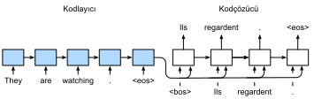
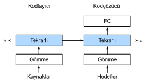
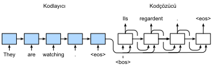

# Diziden Diziye Öğrenme
:label:`sec_seq2seq`

:numref:`sec_machine_translation` içinde gördüğümüz gibi, makine çevirisinde hem girdi hem de çıktı değişken uzunlukta dizilerdir. Bu tür problemleri çözmek için :numref:`sec_encoder-decoder` içinde genel bir kodlayıcı-kodçözücü mimarisi tasarladık. Bu bölümde, bu mimarinin kodlayıcısını ve kodçözücüsünü tasarlamak için iki RNN kullanacağız ve makine çevirisi :cite:`Sutskever.Vinyals.Le.2014,Cho.Van-Merrienboer.Gulcehre.ea.2014` için *diziden diziye* öğrenmeyi uygulayacağız.

Kodlayıcı-kodçözücü mimarisinin tasarım ilkesini takiben, RNN kodlayıcı girdi olarak değişken uzunlukta bir diziyi alabilir ve bir sabit şekilli gizli duruma dönüştürebilir. Başka bir deyişle, girdi (kaynak) dizisinin bilgileri RNN kodlayıcısının gizli durumunda *kodlanmış* olur. Çıktı dizisini andıç andıç oluşturmak için, ayrı bir RNN kodçözücü, girdi dizisinin kodlanmış bilgileriyle birlikte, hangi andıçların görüldüğünü (dil modellemesinde olduğu gibi) veya oluşturulduğuna bağlı olarak bir sonraki andıcı tahmin edebilir. :numref:`fig_seq2seq`, makine çevirisinde diziden diziye öğrenme için iki RNN'nin nasıl kullanılacağını gösterir.


:label:`fig_seq2seq`

:numref:`fig_seq2seq` şeklinde, özel "&lt;eos&gt;" andıcı dizinin sonunu işaretler. Model, bu andıç oluşturulduktan sonra tahminlerde bulunmayı durdurabilir. RNN kodçözücüsünün ilk zaman adımında, iki özel tasarım kararı vardır. İlk olarak, özel dizi başlangıç andıcı, "&lt;bos&gt;", bir girdidir. İkincisi, RNN kodlayıcısının son gizli durumu, kodçözücünün gizli durumunu ilklemek için kullanılır. :cite:`Sutskever.Vinyals.Le.2014` çalışmasındaki gibi tasarımlarda, kodlanmış girdi dizisi bilgilerinin çıktı (hedef) dizisini oluşturmak için kodçözücüsüne beslenmesi tam olarak da budur. :cite:`Cho.Van-Merrienboer.Gulcehre.ea.2014` gibi diğer bazı tasarımlarda, kodlayıcının son gizli durumu, :numref:`fig_seq2seq` şeklinde gösterildiği gibi her adımda girdilerin bir parçası olarak kodçözücüye beslenir. :numref:`sec_language_model` içindeki dil modellerinin eğitimine benzer şekilde, etiketlerin bir andıç ile kaydırılmış orijinal çıktı dizisi olmasına izin verebiliriz: "&lt;bos&gt;", “Ils”, “regardent”, “.” $\rightarrow$ “Ils”, “regardent”,”.“,"&lt;eos&gt;".

Aşağıda, :numref:`fig_seq2seq` tasarımını daha ayrıntılı olarak açıklayacağız. Bu modeli :numref:`sec_machine_translation` içinde tanıtılan İngilizce-Fransız veri kümesinden makine çevirisi için eğiteceğiz.

```{.python .input}
import collections
from d2l import mxnet as d2l
import math
from mxnet import np, npx, init, gluon, autograd
from mxnet.gluon import nn, rnn
npx.set_np()
```

```{.python .input}
#@tab pytorch
import collections
from d2l import torch as d2l
import math
import torch
from torch import nn
```

```{.python .input}
#@tab tensorflow
import collections
from d2l import tensorflow as d2l
import math
import tensorflow as tf
```

## Kodlayıcı

Teknik olarak konuşursak, kodlayıcı değişken uzunluktaki bir girdi dizisini sabit şekilli *bağlam değişkeni* $\mathbf{c}$'ye dönüştürür ve bu bağlam değişkeninde girdi dizisinin bilgilerini kodlar. :numref:`fig_seq2seq` şeklinde gösterildiği gibi, kodlayıcıyı tasarlamak için bir RNN kullanabiliriz.

Bir dizi örneği düşünelim (toplu küme boyutu: 1). Girdi dizimizin $x_1, \ldots, x_T$ olduğunu varsayalım, öyle ki $x_t$ girdi metin dizisindeki $t.$ andıç olsun. $t$ zaman adımında, RNN $x_t$ için girdi öznitelik vektörü $\mathbf{x}_t$'yi ve önceki zaman adımından gizli durum $\mathbf{h}_{t-1}$'yi şu anki gizli durum $\mathbf{h}_t$'ye dönüştürür. RNN'nin yinelemeli tabakasının dönüşümünü ifade etmek için $f$ işlevini kullanabiliriz:

$$\mathbf{h}_t = f(\mathbf{x}_t, \mathbf{h}_{t-1}). $$

Genel olarak, kodlayıcı, gizli durumları her zaman adımında özelleştirilmiş bir $q$ işlevi aracılığıyla bağlam değişkenine dönüştürür:

$$\mathbf{c} =  q(\mathbf{h}_1, \ldots, \mathbf{h}_T).$$

Örneğin, :numref:`fig_seq2seq` şeklinde olduğu gibi $q(\mathbf{h}_1, \ldots, \mathbf{h}_T) = \mathbf{h}_T$'yi seçerken, bağlam değişkeni yalnızca son zaman adımındaki girdi dizisinin gizli durumu $\mathbf{h}_T$'dir.

Şimdiye kadar kodlayıcıyı tasarlamak için tek yönlü bir RNN kullandık, burada gizli bir durum yalnızca gizli durumun önceki ve o anki zaman adımındaki girdi altdizisine bağlıdır. Ayrıca çift yönlü RNN'leri kullanarak kodlayıcılar da oluşturabiliriz. Bu durumda, tüm dizinin bilgilerini kodlayan gizli durum, zaman adımından önceki ve sonraki altdiziye (geçerli zaman adımındaki girdi dahil) bağlıdır.

Şimdi [**RNN kodlayıcısını uygulamaya başlayalım**]. Girdi dizisindeki her andıç için öznitelik vektörünü elde ederken bir *gömme katmanı* kullandığımıza dikkat edin. Bir gömme katmanın ağırlığı, satır sayısı girdi kelime dağarcığının boyutuna (`vocab_size`) ve sütun sayısı öznitelik vektörünün boyutuna eşit olan bir matristir (`embed_size`). Herhangi bir girdi andıcı dizini $i$ için gömme katmanı, öznitelik vektörünü döndürmek üzere ağırlık matrisinin $i.$ satırını (0'dan başlayarak) getirir. Ayrıca, burada kodlayıcıyı uygulamak için çok katmanlı bir GRU seçiyoruz.

```{.python .input}
#@save
class Seq2SeqEncoder(d2l.Encoder):
    """Diziden diziye öğrenme için RNN kodlayıcı."""
    def __init__(self, vocab_size, embed_size, num_hiddens, num_layers,
                 dropout=0, **kwargs):
        super(Seq2SeqEncoder, self).__init__(**kwargs)
        # Gömme katmanı
        self.embedding = nn.Embedding(vocab_size, embed_size)
        self.rnn = rnn.GRU(num_hiddens, num_layers, dropout=dropout)

    def forward(self, X, *args):
        # `X` çıktısının şekli: (`batch_size`, `num_steps`, `embed_size`)
        X = self.embedding(X)
        # RNN modellerinde ilk eksen zaman adımlarına karşılık gelir
        X = X.swapaxes(0, 1)
        state = self.rnn.begin_state(batch_size=X.shape[1], ctx=X.ctx)
        output, state = self.rnn(X, state)
        # `output` (çıktı) şekli: (`num_steps`, `batch_size`, `num_hiddens`)
        # `state[0]` (durum) şekli: (`num_layers`, `batch_size`, `num_hiddens`)
        return output, state
```

```{.python .input}
#@tab pytorch
#@save
class Seq2SeqEncoder(d2l.Encoder):
    """Diziden diziye öğrenme için RNN kodlayıcı."""
    def __init__(self, vocab_size, embed_size, num_hiddens, num_layers,
                 dropout=0, **kwargs):
        super(Seq2SeqEncoder, self).__init__(**kwargs)
        # Gömme katmanı
        self.embedding = nn.Embedding(vocab_size, embed_size)
        self.rnn = nn.GRU(embed_size, num_hiddens, num_layers,
                          dropout=dropout)

    def forward(self, X, *args):
        # `X` çıktısının şekli: (`batch_size`, `num_steps`, `embed_size`)
        X = self.embedding(X)
        # RNN modellerinde ilk eksen zaman adımlarına karşılık gelir
        X = X.permute(1, 0, 2)
        # Durumdan bahsedilmediğinde varsayılan olarak sıfırdır.
        output, state = self.rnn(X)
        # `output` (çıktı) şekli: (`num_steps`, `batch_size`, `num_hiddens`)
        # `state[0]` (durum) şekli: (`num_layers`, `batch_size`, `num_hiddens`)
        return output, state
```

```{.python .input}
#@tab tensorflow
#@save
class Seq2SeqEncoder(d2l.Encoder):
    """Diziden diziye öğrenme için RNN kodlayıcı."""
    def __init__(self, vocab_size, embed_size, num_hiddens, num_layers, dropout=0, **kwargs): 
        super().__init__(*kwargs)
        # Gömme katmanı
        self.embedding = tf.keras.layers.Embedding(vocab_size, embed_size)
        self.rnn = tf.keras.layers.RNN(tf.keras.layers.StackedRNNCells(
            [tf.keras.layers.GRUCell(num_hiddens, dropout=dropout)
             for _ in range(num_layers)]), return_sequences=True,
                                       return_state=True)
    
    def call(self, X, *args, **kwargs):
        # `output` (çıktı) şekli: (`num_steps`, `batch_size`, `num_hiddens`)
        # `state[0]` (durum) şekli: (`num_layers`, `batch_size`, `num_hiddens`)
        X = self.embedding(X)
        output = self.rnn(X, **kwargs)
        state = output[1:]
        return output[0], state
```

Yinelemeli katmanların döndürülen değişkenleri :numref:`sec_rnn-concise` içinde açıklanmıştı. Yukarıdaki [**kodlayıcı uygulamasını göstermek**] için somut bir örnek kullanalım. Aşağıda, gizli birimlerin sayısı 16 olan iki katmanlı bir GRU kodlayıcısı oluşturuyoruz. `X` dizi girdilerinin bir minigrubu göz önüne alındığında (grup boyutu: 4, zaman adımı sayısı: 7), son katmanın gizli durumları (kodlayıcının yinelemeli katmanları tarafından döndürülen `output`) şekli (zaman adımlarının sayısı, grup boyutu, gizli birimlerin sayısı) olan tensörlerdir.

```{.python .input}
encoder = Seq2SeqEncoder(vocab_size=10, embed_size=8, num_hiddens=16,
                         num_layers=2)
encoder.initialize()
X = d2l.zeros((4, 7))
output, state = encoder(X)
output.shape
```

```{.python .input}
#@tab pytorch
encoder = Seq2SeqEncoder(vocab_size=10, embed_size=8, num_hiddens=16,
                         num_layers=2)
encoder.eval()
X = d2l.zeros((4, 7), dtype=torch.long)
output, state = encoder(X)
output.shape
```

```{.python .input}
#@tab tensorflow
encoder = Seq2SeqEncoder(vocab_size=10, embed_size=8, num_hiddens=16, num_layers=2)
X = tf.zeros((4, 7))
output, state = encoder(X, training=False)
output.shape
```


Burada bir GRU kullanıldığından, son zaman adımındaki çok katmanlı gizli durumlar (gizli katmanların sayısı, grup boyutu, gizli birim sayısı) şeklindedir. Bir LSTM kullanılıyorsa, bellek hücresi bilgileri de `state`'te yer alır.

```{.python .input}
len(state), state[0].shape
```

```{.python .input}
#@tab pytorch
state.shape
```

```{.python .input}
#@tab tensorflow
len(state), [element.shape for element in state]
```

## [**Kodçözücü**]
:label:`sec_seq2seq_decoder`

Az önce de belirttiğimiz gibi, kodlayıcının çıktısının $\mathbf{c}$ bağlam değişkeni $x_1, \ldots, x_T$ tüm girdi dizisini kodlar. Eğitim veri kümesinden $y_1, y_2, \ldots, y_{T'}$ çıktı dizisi göz önüne alındığında, her zaman adım $t'$ için (sembol, girdi dizilerinin veya kodlayıcıların $t$ zaman adımından farklıdır), kodçözücü çıktısının olasılığı $y_{t'}$, önceki çıktı altdizisi $y_1, \ldots, y_{t'-1}$ ve $\mathbf{c}$ bağlam değişkeni üzerinde koşulludur, yani, $P(y_{t'} \mid y_1, \ldots, y_{t'-1}, \mathbf{c})$.

Bu koşullu olasılığı diziler üzerinde modellemek için, kodçözücü olarak başka bir RNN kullanabiliriz. Herhangi bir $t^\prime$ zaman adımındaki çıktı dizisinde, RNN önceki zaman adımından $y_{t^\prime-1}$ çıktı dizisini ve $\mathbf{c}$ bağlam değişkenini girdi olarak alır, sonra onları ve önceki gizli durumu $\mathbf{s}_{t^\prime-1}$ ile beraber şu anki zaman adımındaki gizli durum $\mathbf{s}_{t^\prime}$'ye dönüştürür. Sonuç olarak, kodçözücünün gizli katmanının dönüşümünü ifade etmek için $g$ işlevini kullanabiliriz:

$$\mathbf{s}_{t^\prime} = g(y_{t^\prime-1}, \mathbf{c}, \mathbf{s}_{t^\prime-1}).$$
:eqlabel:`eq_seq2seq_s_t`

Kodçözücünün gizli durumunu elde ettikten sonra, $t^\prime$ adımındaki çıktı için koşullu olasılık dağılımını, $P(y_{t^\prime} \mid y_1, \ldots, y_{t^\prime-1}, \mathbf{c})$'yi hesaplamak için bir çıktı katmanını ve softmaks işlemini kullanabiliriz.

:numref:`fig_seq2seq` şeklini takiben, kodçözücüyü aşağıdaki gibi uygularken, kodçözücünün gizli durumunu ilklemek için kodlayıcının son zaman adımındaki gizli durumu doğrudan kullanırız. Bu, RNN kodlayıcı ve RNN kodçözücüsünün aynı sayıda katman ve gizli birimlere sahip olmasını gerektirir. Kodlanmış girdi dizisi bilgilerini daha da dahil etmek için, bağlam değişkeni kodçözücü girdisiyle her zaman adımda bitiştirilir. Çıktı andıcının olasılık dağılımını tahmin etmek için, RNN kodçözücüsünün son katmanındaki gizli durumunu dönüştüren tam bağlı bir katman kullanılır.

```{.python .input}
class Seq2SeqDecoder(d2l.Decoder):
    """Diziden diziye öğrenme için RNN kodçözücüsü."""
    def __init__(self, vocab_size, embed_size, num_hiddens, num_layers,
                 dropout=0, **kwargs):
        super(Seq2SeqDecoder, self).__init__(**kwargs)
        self.embedding = nn.Embedding(vocab_size, embed_size)
        self.rnn = rnn.GRU(num_hiddens, num_layers, dropout=dropout)
        self.dense = nn.Dense(vocab_size, flatten=False)

    def init_state(self, enc_outputs, *args):
        return enc_outputs[1]

    def forward(self, X, state):
        # `X` çıktısı şekli: (`num_steps`, `batch_size`, `embed_size`)
        X = self.embedding(X).swapaxes(0, 1)
        # `context` (bağlam) şekli: (`batch_size`, `num_hiddens`)
        context = state[0][-1]
        # `context`'ı yayınlayın, böylece `X` ile aynı `num_steps` değerine 
        # sahip olur
        context = np.broadcast_to(context, (
            X.shape[0], context.shape[0], context.shape[1]))
        X_and_context = d2l.concat((X, context), 2)
        output, state = self.rnn(X_and_context, state)
        output = self.dense(output).swapaxes(0, 1)
        # `output` (çıktı) şekli: (`batch_size`, `num_steps`, `vocab_size`)
        # `state[0]` şekli: (`num_layers`, `batch_size`, `num_hiddens`)
        return output, state
```

```{.python .input}
#@tab pytorch
class Seq2SeqDecoder(d2l.Decoder):
    """Diziden diziye öğrenme için RNN kodçözücüsü."""
    def __init__(self, vocab_size, embed_size, num_hiddens, num_layers,
                 dropout=0, **kwargs):
        super(Seq2SeqDecoder, self).__init__(**kwargs)
        self.embedding = nn.Embedding(vocab_size, embed_size)
        self.rnn = nn.GRU(embed_size + num_hiddens, num_hiddens, num_layers,
                          dropout=dropout)
        self.dense = nn.Linear(num_hiddens, vocab_size)

    def init_state(self, enc_outputs, *args):
        return enc_outputs[1]

    def forward(self, X, state):
        # `X` çıktısı şekli: (`num_steps`, `batch_size`, `embed_size`)
        X = self.embedding(X).permute(1, 0, 2)
        # `context`'ı yayınlayın, böylece `X` ile aynı `num_steps` değerine 
        # sahip olur
        context = state[-1].repeat(X.shape[0], 1, 1)
        X_and_context = d2l.concat((X, context), 2)
        output, state = self.rnn(X_and_context, state)
        output = self.dense(output).permute(1, 0, 2)
        # `output` (çıktı) şekli: (`batch_size`, `num_steps`, `vocab_size`)
        # `state` şekli: (`num_layers`, `batch_size`, `num_hiddens`)
        return output, state
```

```{.python .input}
#@tab tensorflow
class Seq2SeqDecoder(d2l.Decoder):
    """Diziden diziye öğrenme için RNN kodçözücüsü."""
    def __init__(self, vocab_size, embed_size, num_hiddens, num_layers,
                 dropout=0, **kwargs):
        super().__init__(**kwargs)
        self.embedding = tf.keras.layers.Embedding(vocab_size, embed_size)
        self.rnn = tf.keras.layers.RNN(tf.keras.layers.StackedRNNCells(
            [tf.keras.layers.GRUCell(num_hiddens, dropout=dropout)
             for _ in range(num_layers)]), return_sequences=True,
                                       return_state=True)
        self.dense = tf.keras.layers.Dense(vocab_size)
        
    def init_state(self, enc_outputs, *args):
        return enc_outputs[1]
    
    def call(self, X, state, **kwargs):
        # `X` çıktısı şekli: (`num_steps`, `batch_size`, `embed_size`)
        X = self.embedding(X)
        # `context`'ı yayınlayın, böylece `X` ile aynı `num_steps` değerine 
        # sahip olur
        context = tf.repeat(tf.expand_dims(state[-1], axis=1), repeats=X.shape[1], axis=1)
        X_and_context = tf.concat((X, context), axis=2)
        rnn_output = self.rnn(X_and_context, state, **kwargs)
        output = self.dense(rnn_output[0])
        # `output` (çıktı) şekli: (`batch_size`, `num_steps`, `vocab_size`)
        # `state`, `num_layers` girdileri içeren bir listedir. Her girdinin 
        # şekli vardır: (`batch_size`, `num_hiddens`)
        return output, rnn_output[1:]
```

[**Uygulanan kodçözücüyü göstermek için**], aşağıda belirtilen kodlayıcıdan aynı hiper parametrelerle ilkliyoruz. Gördüğümüz gibi, kodçözücünün çıktı şekli (küme boyutu, zaman adımlarının sayısı, kelime dağarcığı boyutu) olur, burada tensörün son boyutu tahmin edilen andıç dağılımını tutar.

```{.python .input}
decoder = Seq2SeqDecoder(vocab_size=10, embed_size=8, num_hiddens=16,
                         num_layers=2)
decoder.initialize()
state = decoder.init_state(encoder(X))
output, state = decoder(X, state)
output.shape, len(state), state[0].shape
```

```{.python .input}
#@tab pytorch
decoder = Seq2SeqDecoder(vocab_size=10, embed_size=8, num_hiddens=16,
                         num_layers=2)
decoder.eval()
state = decoder.init_state(encoder(X))
output, state = decoder(X, state)
output.shape, state.shape
```

```{.python .input}
#@tab tensorflow
decoder = Seq2SeqDecoder(vocab_size=10, embed_size=8, num_hiddens=16, num_layers=2)
state = decoder.init_state(encoder(X))
output, state = decoder(X, state, training=False)
output.shape, len(state), state[0].shape
```

Özetlemek gerekirse, yukarıdaki RNN kodlayıcı-kodçözücü modelindeki katmanlar :numref:`fig_seq2seq_details` içinde gösterilmektedir.


:label:`fig_seq2seq_details`

## Kayıp Fonksiyonu

Her adımda, kodçözücü çıktı andıçları için bir olasılık dağılımı öngörür. Dil modellemesine benzer şekilde, dağılımı elde etmek ve eniyilemek için çapraz entropi kaybını hesaplarken softmaks uygulayabiliriz. :numref:`sec_machine_translation` içindeki özel dolgu andıçlarının dizilerin sonuna eklendiğini hatırlayın, böylece değişen uzunluklardaki dizilerin aynı şekildeki minigruplara verimli bir şekilde yüklenebilmesini sağlanır. Bununla birlikte, dolgu andıçlarının tahminlenmesi kayıp hesaplamalarında harici tutulmalıdır.

Bu amaçla, [**alakasız girdileri sıfır değerleriyle maskelemek**] için aşağıdaki `sequence_mask` işlevini kullanabiliriz, böylece daha sonra alakasız tahminlerin sıfır ile çarpımı sıfıra eşit olur. Örneğin, dolgu andıçları hariç iki dizinin geçerli uzunluğu sırasıyla bir ve iki ise, ilk bir ve ilk iki girdiden sonra kalan girdiler sıfırlara çekilmiş olur.

```{.python .input}
X = np.array([[1, 2, 3], [4, 5, 6]])
npx.sequence_mask(X, np.array([1, 2]), True, axis=1)
```

```{.python .input}
#@tab pytorch
#@save
def sequence_mask(X, valid_len, value=0):
    """Dizilerdeki alakasız girdileri maskele."""
    maxlen = X.size(1)
    mask = torch.arange((maxlen), dtype=torch.float32,
                        device=X.device)[None, :] < valid_len[:, None]
    X[~mask] = value
    return X

X = torch.tensor([[1, 2, 3], [4, 5, 6]])
sequence_mask(X, torch.tensor([1, 2]))
```

```{.python .input}
#@tab tensorflow
#@save
def sequence_mask(X, valid_len, value=0):
    """Dizilerdeki alakasız girdileri maskele."""
    maxlen = X.shape[1]
    mask = tf.range(start=0, limit=maxlen, dtype=tf.float32)[
        None, :] < tf.cast(valid_len[:, None], dtype=tf.float32)
    
    if len(X.shape) == 3:
        return tf.where(tf.expand_dims(mask, axis=-1), X, value)
    else:
        return tf.where(mask, X, value)
    
X = tf.constant([[1, 2, 3], [4, 5, 6]])
sequence_mask(X, tf.constant([1, 2]))
```

(**Son birkaç eksendeki tüm girdileri de maskeleyebiliriz.**) İsterseniz, bu tür girdileri sıfır olmayan bir değerle değiştirmeyi bile belirtebilirsiniz.

```{.python .input}
X = d2l.ones((2, 3, 4))
npx.sequence_mask(X, np.array([1, 2]), True, value=-1, axis=1)
```

```{.python .input}
#@tab pytorch
X = d2l.ones(2, 3, 4)
sequence_mask(X, torch.tensor([1, 2]), value=-1)
```

```{.python .input}
#@tab tensorflow
X = tf.ones((2,3,4))
sequence_mask(X, tf.constant([1, 2]), value=-1)
```

[**Artık alakasız tahminlerin maskelenmesine izin vermek için softmaks çapraz entropi kaybını genişletebiliriz.**] Başlangıçta, tahmin edilen tüm andıçlar için maskeler bir olarak ayarlanır. Geçerli uzunluk verildikten sonra, herhangi bir dolgu andıcına karşılık gelen maske sıfır olarak ayarlanır. Sonunda, tüm andıçların kaybı, kayıptaki dolgu andıçlarının ilgisiz tahminlerini filtrelemek için maske ile çarpılacaktır.

```{.python .input}
#@save
class MaskedSoftmaxCELoss(gluon.loss.SoftmaxCELoss):
    """Maskelerle softmax çapraz entropi kaybı."""
    # `pred` şekli: (`batch_size`, `num_steps`, `vocab_size`)
    # `label` şekli: (`batch_size`, `num_steps`)
    # `valid_len` şekli: (`batch_size`,)
    def forward(self, pred, label, valid_len):
        # `weights` shape: (`batch_size`, `num_steps`, 1)
        weights = np.expand_dims(np.ones_like(label), axis=-1)
        weights = npx.sequence_mask(weights, valid_len, True, axis=1)
        return super(MaskedSoftmaxCELoss, self).forward(pred, label, weights)
```

```{.python .input}
#@tab pytorch
#@save
class MaskedSoftmaxCELoss(nn.CrossEntropyLoss):
    """Maskelerle softmax çapraz entropi kaybı."""
    # `pred` şekli: (`batch_size`, `num_steps`, `vocab_size`)
    # `label` şekli: (`batch_size`, `num_steps`)
    # `valid_len` şekli: (`batch_size`,)
    def forward(self, pred, label, valid_len):
        weights = torch.ones_like(label)
        weights = sequence_mask(weights, valid_len)
        self.reduction='none'
        unweighted_loss = super(MaskedSoftmaxCELoss, self).forward(
            pred.permute(0, 2, 1), label)
        weighted_loss = (unweighted_loss * weights).mean(dim=1)
        return weighted_loss
```

```{.python .input}
#@tab tensorflow
#@save
class MaskedSoftmaxCELoss(tf.keras.losses.Loss):
    """Maskelerle softmax çapraz entropi kaybı."""
    def __init__(self, valid_len):
        super().__init__(reduction='none')
        self.valid_len = valid_len
    
    # `pred` şekli: (`batch_size`, `num_steps`, `vocab_size`)
    # `label` şekli: (`batch_size`, `num_steps`)
    # `valid_len` şekli: (`batch_size`,)
    def call(self, label, pred):
        weights = tf.ones_like(label, dtype=tf.float32)
        weights = sequence_mask(weights, self.valid_len)
        label_one_hot = tf.one_hot(label, depth=pred.shape[-1])
        unweighted_loss = tf.keras.losses.CategoricalCrossentropy(
            from_logits=True, reduction='none')(label_one_hot, pred)
        weighted_loss = tf.reduce_mean((unweighted_loss*weights), axis=1)
        return weighted_loss
```

[**Makulluk kontrolü**] için üç özdeş dizi oluşturabiliriz. Ardından, bu dizilerin geçerli uzunluklarının sırasıyla 4, 2 ve 0 olduğunu belirtebiliriz. Sonuç olarak, birinci dizinin kaybı ikinci dizininkinden iki kat kadar büyük olmalı, üçüncü dizi sıfır kaybına sahip olmalıdır.

```{.python .input}
loss = MaskedSoftmaxCELoss()
loss(d2l.ones((3, 4, 10)), d2l.ones((3, 4)), np.array([4, 2, 0]))
```

```{.python .input}
#@tab pytorch
loss = MaskedSoftmaxCELoss()
loss(d2l.ones(3, 4, 10), d2l.ones((3, 4), dtype=torch.long),
     torch.tensor([4, 2, 0]))
```

```{.python .input}
#@tab tensorflow
loss = MaskedSoftmaxCELoss(tf.constant([4, 2, 0]))
loss(tf.ones((3,4), dtype = tf.int32), tf.ones((3, 4, 10))).numpy()
```

## [**Eğitim**]
:label:`sec_seq2seq_training`

Aşağıdaki eğitim döngüsünde, :numref:`fig_seq2seq` şeklinde gösterildiği gibi, kodçözücüye girdi olarak son andıç hariç özel dizi-başlangıç andıcını ve orijinal çıktı dizisini bitiştiririz. Buna *öğretici zorlama* denir çünkü orijinal çıktı dizisi (andıç etiketleri) kodçözücüye beslenir. Alternatif olarak, önceki zaman adımından *öngörülen* andıcı kodçözücüye geçerli girdi olarak da besleyebiliriz.

```{.python .input}
#@save
def train_seq2seq(net, data_iter, lr, num_epochs, tgt_vocab, device):
    """Bir modeli diziden diziye eğitin."""
    net.initialize(init.Xavier(), force_reinit=True, ctx=device)
    trainer = gluon.Trainer(net.collect_params(), 'adam',
                            {'learning_rate': lr})
    loss = MaskedSoftmaxCELoss()
    animator = d2l.Animator(xlabel='epoch', ylabel='loss',
                            xlim=[10, num_epochs])
    for epoch in range(num_epochs):
        timer = d2l.Timer()
        metric = d2l.Accumulator(2)  # Eğitim kaybı toplamı, andıç sayısı
        for batch in data_iter:
            X, X_valid_len, Y, Y_valid_len = [
                x.as_in_ctx(device) for x in batch]
            bos = np.array(
                [tgt_vocab['<bos>']] * Y.shape[0], ctx=device).reshape(-1, 1)
            dec_input = d2l.concat([bos, Y[:, :-1]], 1)  # Öğretici zorlama
            with autograd.record():
                Y_hat, _ = net(X, dec_input, X_valid_len)
                l = loss(Y_hat, Y, Y_valid_len)
            l.backward()
            d2l.grad_clipping(net, 1)
            num_tokens = Y_valid_len.sum()
            trainer.step(num_tokens)
            metric.add(l.sum(), num_tokens)
        if (epoch + 1) % 10 == 0:
            animator.add(epoch + 1, (metric[0] / metric[1],))
    print(f'loss {metric[0] / metric[1]:.3f}, {metric[1] / timer.stop():.1f} '
          f'tokens/sec on {str(device)}')
```

```{.python .input}
#@tab pytorch
#@save
def train_seq2seq(net, data_iter, lr, num_epochs, tgt_vocab, device):
    """Bir modeli diziden diziye eğitin."""
    def xavier_init_weights(m):
        if type(m) == nn.Linear:
            nn.init.xavier_uniform_(m.weight)
        if type(m) == nn.GRU:
            for param in m._flat_weights_names:
                if "weight" in param:
                    nn.init.xavier_uniform_(m._parameters[param])
    net.apply(xavier_init_weights)
    net.to(device)
    optimizer = torch.optim.Adam(net.parameters(), lr=lr)
    loss = MaskedSoftmaxCELoss()
    net.train()
    animator = d2l.Animator(xlabel='epoch', ylabel='loss',
                            xlim=[10, num_epochs])
    for epoch in range(num_epochs):
        timer = d2l.Timer()
        metric = d2l.Accumulator(2)  # Eğitim kaybı toplamı, andıç sayısı
        for batch in data_iter:
            optimizer.zero_grad()
            X, X_valid_len, Y, Y_valid_len = [x.to(device) for x in batch]
            bos = torch.tensor([tgt_vocab['<bos>']] * Y.shape[0],
                               device=device).reshape(-1, 1)
            dec_input = d2l.concat([bos, Y[:, :-1]], 1)  # Öğretici zorlama
            Y_hat, _ = net(X, dec_input, X_valid_len)
            l = loss(Y_hat, Y, Y_valid_len)
            l.sum().backward()  # `backward` için kaybı sayıl yap
            d2l.grad_clipping(net, 1)
            num_tokens = Y_valid_len.sum()
            optimizer.step()
            with torch.no_grad():
                metric.add(l.sum(), num_tokens)
        if (epoch + 1) % 10 == 0:
            animator.add(epoch + 1, (metric[0] / metric[1],))
    print(f'loss {metric[0] / metric[1]:.3f}, {metric[1] / timer.stop():.1f} '
          f'tokens/sec on {str(device)}')
```

```{.python .input}
#@tab tensorflow
#@save
def train_seq2seq(net, data_iter, lr, num_epochs, tgt_vocab, device):
    """Bir modeli diziden diziye eğitin."""
    optimizer = tf.keras.optimizers.Adam(learning_rate=lr)
    animator = d2l.Animator(xlabel="epoch", ylabel="loss",
                            xlim=[10, num_epochs])
    for epoch in range(num_epochs):
        timer = d2l.Timer()
        metric = d2l.Accumulator(2)  # Eğitim kaybı toplamı, andıç sayısı
        for batch in data_iter:
            X, X_valid_len, Y, Y_valid_len = [x for x in batch]
            bos = tf.reshape(tf.constant([tgt_vocab['<bos>']] * Y.shape[0]),
                             shape=(-1, 1))
            dec_input = tf.concat([bos, Y[:, :-1]], 1)  # Öğretici zorlama
            with tf.GradientTape() as tape:
                Y_hat, _ = net(X, dec_input, X_valid_len, training=True)
                l = MaskedSoftmaxCELoss(Y_valid_len)(Y, Y_hat)
            gradients = tape.gradient(l, net.trainable_variables)
            gradients = d2l.grad_clipping(gradients, 1)
            optimizer.apply_gradients(zip(gradients, net.trainable_variables))
            num_tokens = tf.reduce_sum(Y_valid_len).numpy()
            metric.add(tf.reduce_sum(l), num_tokens)
        if (epoch + 1) % 10 == 0:
            animator.add(epoch + 1, (metric[0] / metric[1],))
    print(f'loss {metric[0] / metric[1]:.3f}, {metric[1] / timer.stop():.1f} '
          f'tokens/sec on {str(device)}')
```

Artık makine çevirisi veri kümesinde diziden-diziye öğrenme için [**bir RNN kodlayıcı-kodçözücü modeli oluşturabilir ve eğitebiliriz**].

```{.python .input}
#@tab all
embed_size, num_hiddens, num_layers, dropout = 32, 32, 2, 0.1
batch_size, num_steps = 64, 10
lr, num_epochs, device = 0.005, 300, d2l.try_gpu()

train_iter, src_vocab, tgt_vocab = d2l.load_data_nmt(batch_size, num_steps)
encoder = Seq2SeqEncoder(
    len(src_vocab), embed_size, num_hiddens, num_layers, dropout)
decoder = Seq2SeqDecoder(
    len(tgt_vocab), embed_size, num_hiddens, num_layers, dropout)
net = d2l.EncoderDecoder(encoder, decoder)
train_seq2seq(net, train_iter, lr, num_epochs, tgt_vocab, device)
```

## [**Tahmin**]

Çıktı dizisi andıç andıç tahmin etmek için, her kodçözücü zaman adımında önceki zaman adımından tahmin edilen andıç kodçözücüye girdi olarak beslenir. Eğitime benzer şekilde, ilk zaman adımında dizi-başlangıç andıcı ("&lt;bos&gt;") kodçözücüye beslenir. Bu tahmin süreci :numref:`fig_seq2seq_predict` şeklinde gösterilmektedir. Dizi-sonu andıcı ("&lt;eos&gt;") tahmin edildiğinde, çıktı dizisinin tahmini tamamlanmış olur.


:label:`fig_seq2seq_predict`

:numref:`sec_beam-search` içinde dizi üretimi için farklı stratejiler sunacağız.

```{.python .input}
#@save
def predict_seq2seq(net, src_sentence, src_vocab, tgt_vocab, num_steps,
                    device, save_attention_weights=False):
    """Diziden diziye tahmin et."""
    src_tokens = src_vocab[src_sentence.lower().split(' ')] + [
        src_vocab['<eos>']]
    enc_valid_len = np.array([len(src_tokens)], ctx=device)
    src_tokens = d2l.truncate_pad(src_tokens, num_steps, src_vocab['<pad>'])
    # Toplu iş eksenini ekleyin
    enc_X = np.expand_dims(np.array(src_tokens, ctx=device), axis=0)
    enc_outputs = net.encoder(enc_X, enc_valid_len)
    dec_state = net.decoder.init_state(enc_outputs, enc_valid_len)
    # Toplu iş eksenini ekleyin
    dec_X = np.expand_dims(np.array([tgt_vocab['<bos>']], ctx=device), axis=0)
    output_seq, attention_weight_seq = [], []
    for _ in range(num_steps):
        Y, dec_state = net.decoder(dec_X, dec_state)
        # Bir sonraki zaman adımında kod çözücünün girdisi olarak en yüksek 
        # tahmin olasılığına sahip andıcı kullanıyoruz
        dec_X = Y.argmax(axis=2)
        pred = dec_X.squeeze(axis=0).astype('int32').item()
        # Dikkat ağırlıklarını kaydedin (daha sonra ele alınacaktır)
        if save_attention_weights:
            attention_weight_seq.append(net.decoder.attention_weights)
        # Dizi sonu andıcı tahmin edildiğinde, çıktı dizisinin oluşturulması 
        # tamamlanır
        if pred == tgt_vocab['<eos>']:
            break
        output_seq.append(pred)
    return ' '.join(tgt_vocab.to_tokens(output_seq)), attention_weight_seq
```

```{.python .input}
#@tab pytorch
#@save
def predict_seq2seq(net, src_sentence, src_vocab, tgt_vocab, num_steps,
                    device, save_attention_weights=False):
    """Diziden diziye tahmin et."""
    # Çıkarım için `net`'i değerlendirme moduna ayarlayın
    net.eval()
    src_tokens = src_vocab[src_sentence.lower().split(' ')] + [
        src_vocab['<eos>']]
    enc_valid_len = torch.tensor([len(src_tokens)], device=device)
    src_tokens = d2l.truncate_pad(src_tokens, num_steps, src_vocab['<pad>'])
    # Toplu iş eksenini ekleyin
    enc_X = torch.unsqueeze(
        torch.tensor(src_tokens, dtype=torch.long, device=device), dim=0)
    enc_outputs = net.encoder(enc_X, enc_valid_len)
    dec_state = net.decoder.init_state(enc_outputs, enc_valid_len)
    # Toplu iş eksenini ekleyin
    dec_X = torch.unsqueeze(torch.tensor(
        [tgt_vocab['<bos>']], dtype=torch.long, device=device), dim=0)
    output_seq, attention_weight_seq = [], []
    for _ in range(num_steps):
        Y, dec_state = net.decoder(dec_X, dec_state)
        # Bir sonraki zaman adımında kod çözücünün girdisi olarak en yüksek 
        # tahmin olasılığına sahip andıcı kullanıyoruz
        dec_X = Y.argmax(dim=2)
        pred = dec_X.squeeze(dim=0).type(torch.int32).item()
        # Dikkat ağırlıklarını kaydedin (daha sonra ele alınacaktır)
        if save_attention_weights:
            attention_weight_seq.append(net.decoder.attention_weights)
        # Dizi sonu andıcı tahmin edildiğinde, çıktı dizisinin oluşturulması 
        # tamamlanır
        if pred == tgt_vocab['<eos>']:
            break
        output_seq.append(pred)
    return ' '.join(tgt_vocab.to_tokens(output_seq)), attention_weight_seq
```

```{.python .input}
#@tab tensorflow
#@save
def predict_seq2seq(net, src_sentence, src_vocab, tgt_vocab, num_steps,
                    save_attention_weights=False):
    """Diziden diziye tahmin et."""
    src_tokens = src_vocab[src_sentence.lower().split(' ')] + [
        src_vocab['<eos>']]
    enc_valid_len = tf.constant([len(src_tokens)])
    src_tokens = d2l.truncate_pad(src_tokens, num_steps, src_vocab['<pad>'])
    # Toplu iş eksenini ekleyin
    enc_X = tf.expand_dims(src_tokens, axis=0)
    enc_outputs = net.encoder(enc_X, enc_valid_len, training=False)
    dec_state = net.decoder.init_state(enc_outputs, enc_valid_len)
    # Toplu iş eksenini ekleyin
    dec_X = tf.expand_dims(tf.constant([tgt_vocab['<bos>']]), axis=0)
    output_seq, attention_weight_seq = [], []
    for _ in range(num_steps):
        Y, dec_state = net.decoder(dec_X, dec_state, training=False)
        # Bir sonraki zaman adımında kod çözücünün girdisi olarak en yüksek 
        # tahmin olasılığına sahip andıcı kullanıyoruz
        dec_X = tf.argmax(Y, axis=2)
        pred = tf.squeeze(dec_X, axis=0)
        # Dikkat ağırlıklarını kaydedin (daha sonra ele alınacaktır)
        if save_attention_weights:
            attention_weight_seq.append(net.decoder.attention_weights)
        # Dizi sonu andıcı tahmin edildiğinde, çıktı dizisinin oluşturulması 
        # tamamlanır
        if pred == tgt_vocab['<eos>']:
            break
        output_seq.append(pred.numpy())
    return ' '.join(tgt_vocab.to_tokens(tf.reshape(output_seq, shape = -1).numpy().tolist())), attention_weight_seq
```

## Tahmin Edilen Dizilerin Değerlendirilmesi

Tahmin edilen bir diziyi etiket dizisi (gerçek referans değer) ile karşılaştırarak değerlendirebiliriz. BLEU (Bilingual Evaluation Understudy - İki Dilli Değerlendirme Dublörü), başlangıçta makine çevirisi sonuçlarını değerlendirmek için önerilmiş olsa da, farklı uygulamalar için çıktı dizilerinin kalitesini ölçmede yaygın olarak kullanılmaktadır. Prensip olarak, tahmin edilen dizideki herhangi bir $n$ gram için, BLEU bu $n$-gramın etiket dizisinde görüp görünmediğini değerlendirir.

$p_n$ ile $n$-gram hassasiyetini belirtelim; bu, öngörülen ve etiket dizilerindeki eşleşen $n$-gram adedinin tahmin edilen sıradaki $n$-gram adedine oranıdır. Açıklamak gerekirse $A$, $B$, $C$, $D$, $D$, $E$, $F$ etiket dizimiz ve $A$, $B$, $B$, $C$, $D$ tahmin edilen bir dizi olursa, elimizde $p_1 = 4/5$, $p_2 = 3/4$, $p_3 = 1/3$ ve $p_4 = 0$ olur. Ayrıca, $\mathrm{len}_{\text{label}}$ ve $\mathrm{len}_{\text{pred}}$'ün sırasıyla etiket dizisindeki ve tahmin edilen dizideki andıçların sayıları olmasına izin verin. Böylece, BLEU şöyle tanımlanır:

$$ \exp\left(\min\left(0, 1 - \frac{\mathrm{len}_{\text{label}}}{\mathrm{len}_{\text{pred}}}\right)\right) \prod_{n=1}^k p_n^{1/2^n},$$
:eqlabel:`eq_bleu`

burada $k$ eşleşme için en uzun $n$-gramdır.

:eqref:`eq_bleu` denklemindeki BLEU tanımına dayanarak, tahmin edilen dizi etiket dizisi ile aynı olduğunda, BLEU değeri 1 olur. Dahası, daha uzun $n$-gramları eşleştirmek daha zor olduğundan, BLEU daha uzun $n$-gram hassasiyetine daha büyük bir ağırlık atar. Özellikle $p_n$ sabit olduğunda $n$ büyüdükçe $p_n^{1/2^n}$ artar (orjinal makale $p_n^{1/n}$ kullanır). Ayrıca, daha kısa dizileri tahmin etmek daha yüksek bir $p_n$ değeri elde etme eğiliminde olduğundan, :eqref:`eq_bleu` denklemindeki çarpım teriminin öncesindeki katsayı daha kısa tahmin edilmiş dizileri cezalandırır. Örneğin, $k=2$, $A$, $B$, $C$, $D$, $E$, $F$ etiket dizisi ve $A$, $B$ tahminlenen dizi ise, $p_1 = p_2 = 1$ olmasına rağmen, ceza çarpanı, $\exp(1-6/2) \approx 0.14$, BLEU değerini düşürür.

[**BLEU ölçüsünü aşağıdaki gibi uyguluyoruz**].

```{.python .input}
#@tab all
def bleu(pred_seq, label_seq, k):  #@save
    """BLEU'yu hesapla."""
    pred_tokens, label_tokens = pred_seq.split(' '), label_seq.split(' ')
    len_pred, len_label = len(pred_tokens), len(label_tokens)
    score = math.exp(min(0, 1 - len_label / len_pred))
    for n in range(1, k + 1):
        num_matches, label_subs = 0, collections.defaultdict(int)
        for i in range(len_label - n + 1):
            label_subs[' '.join(label_tokens[i: i + n])] += 1
        for i in range(len_pred - n + 1):
            if label_subs[' '.join(pred_tokens[i: i + n])] > 0:
                num_matches += 1
                label_subs[' '.join(pred_tokens[i: i + n])] -= 1
        score *= math.pow(num_matches / (len_pred - n + 1), math.pow(0.5, n))
    return score
```

Sonunda, [**birkaç İngilizce cümleyi Fransızca'ya çevirmek**] ve sonuçların BLEU değerini hesaplamak için eğitilmiş RNN kodlayıcı-kodçözücüsünü kullanıyoruz.

```{.python .input}
#@tab mxnet, pytorch
engs = ['go .', "i lost .", 'he\'s calm .', 'i\'m home .']
fras = ['va !', 'j\'ai perdu .', 'il est calme .', 'je suis chez moi .']
for eng, fra in zip(engs, fras):
    translation, attention_weight_seq = predict_seq2seq(
        net, eng, src_vocab, tgt_vocab, num_steps, device)
    print(f'{eng} => {translation}, bleu {bleu(translation, fra, k=2):.3f}')
```

```{.python .input}
#@tab tensorflow
engs = ['go .', "i lost .", 'he\'s calm .', 'i\'m home .']
fras = ['va !', 'j\'ai perdu .', 'il est calme .', 'je suis chez moi .']
for eng, fra in zip(engs, fras):
    translation, attention_weight_seq = predict_seq2seq(
        net, eng, src_vocab, tgt_vocab, num_steps)
    print(f'{eng} => {translation}, bleu {bleu(translation, fra, k=2):.3f}')
```

## Özet

* Kodlayıcı-kodçözücü mimarisinin tasarımını takiben, diziden-diziye öğrenme için bir model tasarlarken iki RNN kullanabiliriz.
* Kodlayıcıyı ve kodçözücüyü uygularken, çok katmanlı RNN'leri kullanabiliriz.
* Kayıp hesaplanırken olduğu gibi ilgisiz hesaplamaları filtrelemek için maskeler kullanabiliriz.
* Kodlayıcı-kodçözücü eğitiminde, öğretici zorlama yaklaşımı (tahminlerin aksine) orijinal çıktı dizilerini kodçözücüye besler.
* BLEU, tahmin edilen dizi ve etiket dizisi arasında $n$-gram eşleştirerek çıktı dizilerini değerlendirmek için popüler bir ölçüdür.

## Alıştırmalar

1. Çeviri sonuçlarını iyileştirmek için hiper parametreleri ayarlayabilir misiniz?
1. Kayıp hesaplamasında maskeler kullanmadan deneyi yeniden çalıştırın. Ne sonuçlar gözlemliyorsunuz? Neden?
1. Kodlayıcı ve kodçözücü katman sayısı veya gizli birimlerin sayısı bakımından farklıysa, kodçözücünün gizli durumunu nasıl ilkleyebiliriz?
1. Eğitimde, eğitici zorlamayı kodçözücüye önceki zamanın tahminini besleme ile değiştirin. Bu performansı nasıl etkiler?
1. GRU'yu LSTM ile değiştirerek deneyi yeniden çalıştırın.
1. Kodçözücünün çıktı katmanını tasarlamanın başka yolları var mıdır?

:begin_tab:`mxnet`
[Tartışmalar](https://discuss.d2l.ai/t/345)
:end_tab:

:begin_tab:`pytorch`
[Tartışmalar](https://discuss.d2l.ai/t/1062)
:end_tab:
