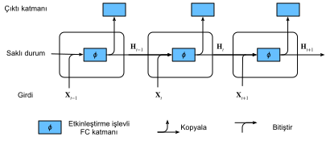
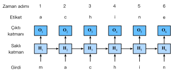

# Yinelemeli Sinir Ağları
:label:`sec_rnn`

:numref:`sec_language_model` içinde $n$-gramlık modelleri tanıttık; $x_t$ kelimesinin $t$ zaman adımındaki koşullu olasılığı sadece önceki $n-1$ kelimeye bağlıdır. Eğer $x_t$ üzerinde $t-(n-1)$ zaman adımından daha önceki kelimelerin olası etkisini dahil etmek istiyorsanız, $n$'yi artırmanız gerekir. Bununla birlikte, model parametrelerinin sayısı da katlanarak artacaktır, çünkü $\mathcal{V}$ kelime dağarcığı kümesi için $|\mathcal{V}|^n$ tane değer depolamamız gerekir. Bu nedenle, $P(x_t \mid x_{t-1}, \ldots, x_{t-n+1})$'yı modellemek yerine bir saklı değişken modeli kullanılmak tercih edilir:

$$P(x_t \mid x_{t-1}, \ldots, x_1) \approx P(x_t \mid h_{t-1}),$$

burada $h_{t-1}$, $t-1$ adıma kadar dizi bilgisi depolayan bir *gizli durum*dur (gizli değişken olarak da bilinir). Genel olarak, herhangi bir $t$ zaman adımındaki gizli durum, şimdiki girdi $x_{t}$ ve önceki gizli durum $h_{t-1}$ temel alınarak hesaplanabilir:

$$h_t = f(x_{t}, h_{t-1}).$$
:eqlabel:`eq_ht_xt`

:eqref:`eq_ht_xt` içindeki yeterince güçlü bir $f$ işlevi için, saklı değişken modeli bir yaklaşım değildir. Sonuçta, $h_t$ şimdiye kadar gözlemlediği tüm verileri saklayabilir. Ancak, potansiyel olarak hem hesaplamayı hem de depolamayı pahalı hale getirebilir.

:numref:`chap_perceptrons` içinde gizli birimli gizli katmanları tartıştığımızı anımsayın. Gizli katmanların ve gizli durumların iki çok farklı kavramı ifade etmeleri önemlidir. Gizli katmanlar, açıklandığı gibi, girdiden çıktıya giden yolda gözden gizlenen katmanlardır. Gizli durumlar teknik olarak belirli bir adımda yaptığımız işleme *girdiler*dir ve yalnızca önceki zaman adımlarındaki verilere bakarak hesaplanabilirler.

*Yinelemeli sinir ağları* (RNN) gizli durumlara sahip sinir ağlarıdır. RNN modelini tanıtmadan önce, ilk olarak :numref:`sec_mlp` içinde tanıtılan MLP modelini anımsayalım.

## Gizli Durumu Olmayan Sinir Ağları

Tek bir gizli katmana sahip bir MLP'ye bir göz atalım. Gizli katmanın etkinleştirme işlevinin $\phi$ olduğunu varsayalım. $n$ küme boyutlu ve $d$ girdili bir minigrup örneklemi $\mathbf{X} \in \mathbb{R}^{n \times d}$ göz önüne alındığında, gizli katmanın çıktısı $\mathbf{H} \in \mathbb{R}^{n \times h}$ şöyle hesaplanır:

$$\mathbf{H} = \phi(\mathbf{X} \mathbf{W}_{xh} + \mathbf{b}_h).$$
:eqlabel:`rnn_h_without_state`

:eqref:`rnn_h_without_state`'te, $\mathbf{W}_{xh} \in \mathbb{R}^{d \times h}$ ağırlık parametresine, $\mathbf{b}_h \in \mathbb{R}^{1 \times h}$ ek girdi parametresine ve gizli katman için $h$ gizli birim adedine sahibiz. Böylece, toplama esnasında yayınlama (bkz. :numref:`subsec_broadcasting`) uygulanır. Ardından, çıktı katmanının girdisi olarak $\mathbf{H}$ gizli değişkeni kullanılır. Çıktı katmanı şöyle gösterilir,

$$\mathbf{O} = \mathbf{H} \mathbf{W}_{hq} + \mathbf{b}_q,$$

burada $\mathbf{O} \in \mathbb{R}^{n \times q}$ çıktı değişkeni, $\mathbf{W}_{hq} \in \mathbb{R}^{h \times q}$ ağırlık parametresi ve $\mathbf{b}_q \in \mathbb{R}^{1 \times q}$ çıktı katmanının ek girdi parametresidir. Eğer bir sınıflandırma problemi ise, çıktı kategorilerinin olasılık dağılımını hesaplamak için $\text{softmaks}(\mathbf{O})$'i kullanabiliriz.

Bu, :numref:`sec_sequence` içinde daha önce çözdüğümüz bağlanım problemine tamamen benzer, dolayısıyla ayrıntıları atlıyoruz. Öznitelik-etiket çiftlerini rastgele seçebileceğimizi ve ağımızın parametrelerini otomatik türev alma ve rasgele eğim inişi yoluyla öğrenebileceğimizi söylemek yeterli.

## Gizli Durumlu Yinelemeli Sinir Ağları
:label:`subsec_rnn_w_hidden_states`

Gizli durumlarımız olduğunda işler tamamen farklıdır. Yapıyı biraz daha ayrıntılı olarak inceleyelim.

$t$ zaman adımında girdileri $\mathbf{X}_t \in \mathbb{R}^{n \times d}$ olan bir minigrubumuz olduğunu varsayalım. Başka bir deyişle, $n$ dizi örneklerinden oluşan bir minigrup için, $\mathbf{X}_t$'nin her satırı, dizinin $t$ adımındaki bir örneğine karşılık gelir. Ardından, $\mathbf{H}_t  \in \mathbb{R}^{n \times h}$ ile $t$ zaman adımındaki gizli değişkeni belirtelim. MLP'den farklı olarak, burada gizli değişkeni $\mathbf{H}_{t-1}$'yi önceki zaman adımından kaydediyoruz ve şimdiki zaman adımında önceki zaman adımının gizli değişkeni nasıl kullanılacağını açıklamak için $\mathbf{W}_{hh} \in \mathbb{R}^{h \times h}$ yeni ağırlık parametresini tanıtıyoruz. Özellikle, şimdiki zaman adımının gizli değişkeninin hesaplanması, önceki zaman adımının gizli değişkeni ile birlikte şimdiki zaman adımının girdisi tarafından belirlenir:

$$\mathbf{H}_t = \phi(\mathbf{X}_t \mathbf{W}_{xh} + \mathbf{H}_{t-1} \mathbf{W}_{hh}  + \mathbf{b}_h).$$
:eqlabel:`rnn_h_with_state`

:eqref:`rnn_h_without_state` ile karşılaştırıldığında, :eqref:`rnn_h_with_state` bir terim daha, $\mathbf{H}_{t-1} \mathbf{W}_{hh}$, ekler ve böylece :eqref:`eq_ht_xt`'den bir örnek oluşturur. Bitişik zaman adımlarındaki $\mathbf{H}_t$ ve $\mathbf{H}_{t-1}$ gizli değişkenlerinin arasındaki ilişkiden, bu değişkenlerin dizinin tarihsel bilgilerini şu anki zaman adımına kadar yakaladığını ve sakladığını biliyoruz; tıpkı sinir ağının şimdiki zaman adımının durumu veya hafızası gibi. Bu nedenle, böyle bir gizli değişken *gizli durum* olarak adlandırılır. Gizli durum şu anki zaman adımında önceki zaman adımının aynı tanımını kullandığından, :eqref:`rnn_h_with_state`'nın hesaplanması *yineleme*dir. Bu nedenle, yinelemeli hesaplamalara dayalı gizli durumlara sahip sinir ağları *yinelemeli sinir ağları*dır. RNN'lerde :eqref:`rnn_h_with_state`'ün hesaplanmasını gerçekleştiren katmanlar *yinelemeli katmanlar* olarak adlandırılır.

RNN oluşturmak için birçok farklı yol vardır. :eqref:`rnn_h_with_state` içinde tanımlanan gizli bir duruma sahip RNN'ler çok yaygındır. Zaman adımı $t$ için çıktı katmanının çıktısı MLP'deki hesaplamaya benzer:

$$\mathbf{O}_t = \mathbf{H}_t \mathbf{W}_{hq} + \mathbf{b}_q.$$

RNN parametreleri gizli katmanın $\mathbf{W}_{xh} \in \mathbb{R}^{d \times h}, \mathbf{W}_{hh} \in \mathbb{R}^{h \times h}$ ağırlıkları ve $\mathbf{b}_h \in \mathbb{R}^{1 \times h}$ ek girdisi ile birlikte çıktı katmanının $\mathbf{W}_{hq} \in \mathbb{R}^{h \times q}$ ağırlıklarını ve $\mathbf{b}_q \in \mathbb{R}^{1 \times q}$ ek girdilerini içerir. Farklı zaman adımlarında bile, RNN'lerin her zaman bu model parametrelerini kullandığını belirtmek gerekir. Bu nedenle, bir RNN parametrelendirmenin maliyeti zaman adım sayısı arttıkça büyümez.

:numref:`fig_rnn`, bitişik üç zaman adımında bir RNN'nin hesaplama mantığını göstermektedir. Herhangi bir $t$ zaman adımında, gizli durumun hesaplanması şu şekilde düşünülebilir: (i) $t$ şimdiki zaman adımındaki $\mathbf{X}_t$ girdisi ile önceki $t-1$ zaman adımındaki $\mathbf{H}_{t-1}$ gizli durumu bitiştirme; (ii) bitiştirme sonucunu $\phi$ etkinleştirme fonksiyonlu tam bağlı bir katmana besleme. Bu şekilde tam bağlı bir katmanın çıktısı, $t$ şimdiki zaman adımı $\mathbf{H}_t$ gizli durumudur. Bu durumda, model parametrelerinin hepsi :eqref:`rnn_h_with_state`'teki $\mathbf{W}_{xh}$ ve $\mathbf{W}_{hh}$'ün bitiştirilmesi ve $\mathbf{b}_h$ ek girdisidir. Şimdiki $t$ zaman adımının $\mathbf{H}_t$ gizli durumu, sonraki $t+1$ adımının $\mathbf{H}_{t+1}$ gizli durumunun hesaplanmasına katılacaktır. Dahası, $\mathbf{H}_t$, $t$ şimdiki zaman adımının $\mathbf{O}_t$ çıktısını hesaplamak için tam bağlı çıktı katmanına da beslenir.


:label:`fig_rnn`

Gizli durum $\mathbf{X}_t \mathbf{W}_{xh} + \mathbf{H}_{t-1} \mathbf{W}_{hh}$ hesaplamasının $\mathbf{X}_t$ ve $\mathbf{H}_{t-1}$ ile $\mathbf{W}_{xh}$ ve $\mathbf{W}_{hh}$ bitişik matrislerinin çarpmasına eşdeğer olduğunu belirttik. Bu matematiksel olarak kanıtlanmış olsa da, aşağıda kısaca bunu göstermek için basit bir kod parçacığı kullanıyoruz. Başlangıç olarak, şekilleri (3, 1), (1, 4), (3, 4) ve (4, 4) olan `X`, `W_xh`, `H` ve `W_hh` matrislerini tanımlıyoruz. Sırasıyla `X` ile `W_xh`'yi ve `H` ile `W_hh`'yi çarpıyoruz ve daha sonra bu iki çarpımı toplayarak (3, 4) şekilli bir matris elde ederiz.

```{.python .input}
from d2l import mxnet as d2l
from mxnet import np, npx
npx.set_np()
```

```{.python .input}
#@tab pytorch
from d2l import torch as d2l
import torch
```

```{.python .input}
#@tab tensorflow
from d2l import tensorflow as d2l
import tensorflow as tf
```

```{.python .input}
#@tab mxnet, pytorch
X, W_xh = d2l.normal(0, 1, (3, 1)), d2l.normal(0, 1, (1, 4))
H, W_hh = d2l.normal(0, 1, (3, 4)), d2l.normal(0, 1, (4, 4))
d2l.matmul(X, W_xh) + d2l.matmul(H, W_hh)
```

```{.python .input}
#@tab tensorflow
X, W_xh = d2l.normal((3, 1), 0, 1), d2l.normal((1, 4), 0, 1)
H, W_hh = d2l.normal((3, 4), 0, 1), d2l.normal((4, 4), 0, 1)
d2l.matmul(X, W_xh) + d2l.matmul(H, W_hh)
```

Şimdi `X` ve `H` matrislerini sütunlar boyunca (eksen 1) ve `W_xh` ve `W_hh` matrislerini satırlar boyunca (eksen 0) bitiştiririz. Bu iki bitiştirme, sırasıyla (3, 5) ve (5, 4) şekilli matrisler ile sonuçlanır. Bu iki bitiştirilmiş matrisi çarparak, yukarıdaki gibi (3, 4) şekilli aynı çıktı matrisini elde ederiz.

```{.python .input}
#@tab all
d2l.matmul(d2l.concat((X, H), 1), d2l.concat((W_xh, W_hh), 0))
```

## RNN Tabanlı Karakter Düzeyinde Dil Modelleri

:numref:`sec_language_model` içindeki dil modellemesi için şimdiki ve geçmiş andıçlara dayanarak bir sonraki simgeyi tahmin etmeyi amaçladığımızı hatırlayın, böylece orijinal diziyi etiketler olarak bir andıç kaydırıyoruz. Bengio ve ark. önce dil modelleme için bir sinir ağı kullanmayı önerdi :cite:`Bengio.Ducharme.Vincent.ea.2003`. Aşağıda, bir dil modeli oluşturmak için RNN'lerin nasıl kullanılabileceğini gösteriyoruz. Minigrup boyutu bir olsun ve metnin sırası "makine" (machine) olsun. Sonraki bölümlerdeki eğitimi basitleştirmek için, metni sözcükler yerine karakterler haline getiririz ve *karakter düzeyinde bir dil modeli*ni göz önünde bulundururuz. :numref:`fig_rnn_train`, karakter düzeyinde dil modellemesi için bir RNN aracılığıyla şimdiki ve önceki karakterlere dayanarak bir sonraki karakterin nasıl tahmin edileceğini gösterir.


:label:`fig_rnn_train`

Eğitim işlemi sırasında, çıktı katmanından çıktıda her zaman adım için bir softmaks işlemi çalıştırırız ve daha sonra model çıktısı ile etiket arasındaki hatayı hesaplamak için çapraz entropi kaybını kullanırız. Gizli katmandaki gizli durumun yinelemeli hesaplanması nedeniyle, :numref:`fig_rnn_train`, $\mathbf{O}_3$'teki 3. zaman adımının çıktısı, “m”, “a” ve “c” metin dizisi ile belirlenir. Eğitim verilerindeki dizinin bir sonraki karakteri “h” olduğu için, 3. zaman adımının kaybı, “m”, “a”, “c”'ye göre oluşturulan bir sonraki karakterin olasılık dağılımına ve bu zaman adımının “h” etiketine bağlı olacaktır.

Uygulamada, her andıç bir $d$ boyutlu vektör ile temsil edilir ve grup boyutu olarak $n>1$ kullanırız. Bu nedenle, $t$'deki $\mathbf X_t$ girdisi :numref:`subsec_rnn_w_hidden_states` içinde tartıştığımız gibi $n\times d$ şekilli bir matris olacaktır.

## Şaşkınlık
:label:`subsec_perplexity`

Son olarak, sonraki bölümlerde RNN tabanlı modellerimizi değerlendirmek için kullanılacak dil modelinin kalitesini nasıl ölçeceğimizi tartışalım. Bir yol, metnin ne kadar şaşırtıcı olduğunu kontrol etmektir. İyi bir dil modeli, daha sonra ne göreceğimizi yüksek hassasiyetli andıçlarla tahmin edebilir. Farklı dil modelleri tarafından önerilen “Yağmur yağıyor” ifadesinin aşağıdaki devamlarını göz önünde bulundurun:

1. “Dışarıda yağmur yağıyor”
1. “Muz ağacı yağıyor”
1. “Piouw yağıyor; kcj pwepoiut”

Kalite açısından, örnek 1 açıkça en iyisidir. Sözcükler mantıklı ve mantıksal olarak da tutarlı. Hangi kelimenin anlamsal olarak takip ettiğini tam olarak doğru bir şekilde yansıtmayabilir (“San Francisco'da” ve “kışın” mükemmel şekilde makul uzantıları olurdu), ama model hangi kelimenin takip edebileceğini yakalayabilir. Örnek 2, mantıksız bir uzantı ürettiğinden oldukça kötüdür. Yine de, model en azından kelimelerin nasıl yazılacağını ve kelimeler arasındaki korelasyon derecesini öğrendi. Son olarak, örnek 3, veriye düzgün şekilde uymayan kötü eğitilmiş bir modeli gösterir.

Dizinin olabilirliğini hesaplayarak modelin kalitesini ölçebiliriz. Ne yazık ki bu, anlaşılması ve karşılaştırılması zor bir sayıdır. Sonuçta, daha kısa dizilerin daha uzun olanlara göre gerçekleşme olasılığı daha yüksektir, bu nedenle model Tolstoy'un şaheseri *Savaş ve Barış*'ı değerlendirirken kaçınılmaz olarak Saint-Exupery'nin “Küçük Prens” romanından çok daha küçük bir olabilirlik üretecektir. Eksik olan bir ortalama eşdeğeridir.

Bilgi teorisi burada işe yarar. Softmaks bağlanımını (:numref:`subsec_info_theory_basics`) tanıttığımızda entropiyi, sürprizi ve çapraz entropiyi tanımladık ve [bilgi teorisi üzerine çevrimiçi ek](https://d2l.ai/chapter_appendix-mathematics-for-deep-learning/information-theory.html)'de bilgi teorisi daha fazla tartışılmaktadır. Metni sıkıştırmak istiyorsak, geçerli andıç kümesi verilince bir sonraki andıcı tahmin etmeyi sorabiliriz. Daha iyi bir dil modeli, bizim bir sonraki andıcı daha doğru tahmin etmemizi sağlamalıdır. Böylece, diziyi sıkıştırmak için daha az bit harcamamıza izin vermelidir. Böylece, bir dizinin tüm $n$ andıçları üzerinden ortalamasıyla çapraz entropi kaybıyla ölçebiliriz:

$$\frac{1}{n} \sum_{t=1}^n -\log P(x_t \mid x_{t-1}, \ldots, x_1),$$
:eqlabel:`eq_avg_ce_for_lm`

Burada $P$ bir dil modeli tarafından verilir ve $x_t$, diziden $t$ adımında gözlenen gerçek andıçtır. Bu, farklı uzunluklardaki belgelerdeki performansları karşılaştırılabilir hale getirir. Tarihsel nedenlerden dolayı, doğal dil işlemedeki bilim adamları *şaşkınlık (perplexity)* adı verilen bir ölçüm kullanmayı tercih ederler. Kısacası, :eqref:`eq_avg_ce_for_lm`'ün üssüdür:

$$\exp\left(-\frac{1}{n} \sum_{t=1}^n \log P(x_t \mid x_{t-1}, \ldots, x_1)\right).$$

Şaşkınlık, en iyi hangi andıcı seçeceğimize karar verirken sahip olduğumuz gerçek seçeneklerin sayısının harmonik ortalaması olarak anlaşılabilir. Birkaç vakaya bakalım:

* En iyi senaryoda, model her zaman etiket andıcı olasılığını 1 olarak mükemmel şekilde tahmin eder. Bu durumda modelin şaşkınlığı 1'dir.
* En kötü senaryoda, model her zaman etiket andıcı olasılığını 0 olarak öngörür. Bu durumda şaşkınlık pozitif sonsuzdur.
* Referans olarak model, sözcük dağarcığının tüm kullanılabilir andıçları üzerinde tekdüze bir dağılım öngörür. Bu durumda, şaşkınlık, kelime dağarcığının benzersiz andıçlarının sayısına eşittir. Aslında, diziyi herhangi bir sıkıştırma olmadan saklarsak, kodlamak için yapabileceğimiz en iyi şey bu olurdu. Bu nedenle, bu, herhangi bir yararlı modelin yenmesi gereken bariz bir üst sınır sağlar.

Aşağıdaki bölümlerde, karakter düzeyi dil modelleri için RNN'leri uygulayacağız ve bu modelleri değerlendirmek için şaşkınlığı kullanacağız.

## Özet

* Gizli durumlar için yinelemeli hesaplama kullanan bir sinir ağı, yinelemeli bir sinir ağı (RNN) olarak adlandırılır.
* Bir RNN'nin gizli durumu, dizinin şimdiki zaman adımına kadarki geçmiş bilgilerini tutabilir.
* Zaman adımlarının sayısı arttıkça RNN model parametrelerinin sayısı artmaz.
* Bir RNN kullanarak karakter düzeyinde dil modelleri oluşturabiliriz.
* Dil modellerinin kalitesini değerlendirmek için şaşkınlığı kullanabiliriz.

## Alıştırmalar

1. Bir metin dizisindeki bir sonraki karakteri tahmin etmek için bir RNN kullanırsak, bir çıktı için gerekli boyut nedir?
1. RNN'ler bir zaman adımındaki andıcın metin dizisindeki önceki tüm andıçlara dayalı koşullu olasılığını nasıl ifade edebilir?
1. Uzun bir dizide geri yayarsak gradyana ne olur?
1. Bu bölümde açıklanan dil modeliyle ilgili sorunlar nelerdir?

:begin_tab:`mxnet`
[Tartışmalar](https://discuss.d2l.ai/t/337)
:end_tab:

:begin_tab:`pytorch`
[Tartışmalar](https://discuss.d2l.ai/t/1050)
:end_tab:

:begin_tab:`tensorflow`
[Tartışmalar](https://discuss.d2l.ai/t/1051)
:end_tab:
