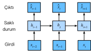

# Dizi Modelleri
:label:`sec_sequence`

Netflix'te film izlediğinizi düşünün. İyi bir Netflix kullanıcısı olarak, filmlerin her birini dürüstçe değerlendirmeye karar veriyorsunuz. Sonuçta, iyi bir film iyi bir filmdir, ve siz onlardan daha fazla izlemek istiyorsunuz, değil mi? Görünüşe göre, bu işler o kadar basit değil. İnsanların filmler hakkındaki görüşleri zamanla oldukça önemli ölçüde değişebilir. Aslında, psikologların bazı etkiler için koydukları isimler bile vardır:

* Başkasının fikrine dayalı olarak “çapalama” vardır. Örneğin, Oscar ödüllerinden sonra, ilgili filmin reytingleri hala film aynı olmasına rağmen yükselir. Bu etki, ödül unutulana kadar birkaç ay boyunca devam eder. Bu etkinin yarım puandan fazla reyting yükselttiği gösterilmiştir :cite:`Wu.Ahmed.Beutel.ea.2017`.
* İnsanların yeni normal olarak geliştirilmiş veya kötüleşmiş bir durumu kabul etmek için hızla adapte olduğu *zevksel uyarlama* vardır. Örneğin, birçok iyi film izledikten sonra, bir sonraki filmin eşit derecede iyi veya daha iyi olması beklentisi yüksektir. Bu nedenle, harika filmler izlendikten sonra ortalama bir film bile kötü sayılabilir.
* Mevsimsellik vardır. Çok az izleyici Ağustos ayında Noel Baba filmi izlemek ister.
* Bazı durumlarda, filmler yapımdaki yönetmenlerin veya aktörlerin yanlış davranışlarından dolayı sevilmeyen hale gelir.
* Bazı filmler kült filmlere dönüşmüştür, çünkü neredeyse komik bir şekilde kötüydüler. *Outer Space* ve *Troll 2* bu nedenle yüksek derecede şöhret elde etti.

Kısacası, film reytinglerinde sabitlik dışında her şey vardır. Böylece, zamansal dinamikleri kullanmak daha doğru film önerilerine yol açtı :cite:`Koren.2009`. Tabii ki, dizi verileri sadece film derecelendirmeleri ile ilgili değildir. Aşağıda daha fazla örnek görebilirsiniz.

* Birçok kullanıcı, uygulamaları açtıkları zamana göre son derece özel davranışlara sahiptir. Örneğin, sosyal medya uygulamaları kullanımı öğrencilerde okul zamanından sonra çok daha yaygındır. Borsa alım satım uygulamaları piyasalar açık olduğunda daha yaygın olarak kullanılır.
* Yarının hisse senedi fiyatlarını tahmin etmek, dün kaçırdığımız bir hisse senedi fiyatının boşluklarını doldurmaktan çok daha zordur, her ne kadar ikisi de bir sayıyı tahmin etme meselesi olsa da. Sonuçta, öngörü, geçmişe görüden çok daha zordur. İstatistiklerde, ilki (bilinen gözlemlerin ötesinde tahmin) *dışdeğerleme (extrapolation)* olarak adlandırılırken, ikincisi (mevcut gözlemler arasındaki tahmin) *aradeğerleme (interpolation)* olarak adlandırılır.
* Müzik, konuşma, metin ve videolar doğaları gereği dizilidir. Eğer onlarda yer değişimine verseydik, çok az anlam ifade ederlerdi. *Köpek adamı ısırdı* manşeti, kelimelerin aynı olmasına rağmen, *adam köpeği ısırdı* manşetinden çok daha az şaşırtıcıdır.
* Depremler son derece ilişkilidir, yani büyük bir deprem sonrası güçlü deprem olmayan zamana kıyasla çok daha fazla, çok daha küçük artçı şoklar vardır. Aslında depremler uzamsal olarak ilişkilidir, yani artçı şoklar genellikle kısa bir süre içinde ve yakın bir yerde meydana gelir.
* Twitter kavgalarında, dans düzenlerinde ve tartışmalarda görülebileceği gibi, insanlar birbirleri ile ardışık bir şekilde etkileşime girerler.

## İstatistiksel Araçlar

Dizi verileriyle uğraşmak için istatistiksel araçlara ve yeni derin sinir ağı mimarilerine ihtiyacımız var. İşleri basit tutmak için örnek olarak :numref:`fig_ftse100` içinde gösterilen hisse senedi fiyatını (FTSE 100 endeksi) kullanalım.


:width:`400px`
:label:`fig_ftse100`

Fiyatları $x_t$ ile gösterelim, yani *zaman adım* $t \in \mathbb{Z}^+$'de $x_t$ fiyatını gözlemliyoruz. Bu kitaptaki diziler için $t$'nin genellikle ayrık olacağını ve tamsayılara veya alt kümesine göre değişeceğini unutmayın. $t$. günde borsada iyi kazanmak isteyen bir borsa simsarının $x_t$ üzerinden tahmin ettiğini varsayalım:

$$x_t \sim P(x_t \mid x_{t-1}, \ldots, x_1).$$

### Özbağlanımlı Modeller 

Bunu başarmak için, simsarımız :numref:`sec_linear_concise` içinde eğittiğimiz gibi bir regresyon modelini kullanabilir. Sadece bir büyük sorun var: Girdilerimizin adedi, $x_{t-1}, \ldots, x_1$, $t$'ye bağlı olarak değişir. Yani, karşılaştığımız veri miktarı ile sayı artar ve bunu hesaplamalı olarak işlenebilir hale getirmek için bir yaklaşıma ihtiyacımız vardır. Bu bölümde konuların çoğu $P(x_t \mid x_{t-1}, \ldots, x_1)$'nin verimli bir şekilde nasıl tahmin edileceği etrafında dönecektir. Kısacası, aşağıdaki gibi iki stratejiye indirgeniyor.

İlk olarak, potansiyel olarak oldukça uzun dizinin $x_{t-1}, \ldots, x_1$ gerçekten gerekli olmadığını varsayalım. Bu durumda kendimizi $\tau$ uzunluğunda bir süre ile memnun edebilir ve sadece $x_{t-1}, \ldots, x_{t-\tau}$ gözlemlerini kullanabiliriz. İlk faydası, artık argüman sayısının en azından $t > \tau$ için her zaman aynı olmasıdır. Bu, yukarıda belirtildiği gibi derin bir ağı eğitmemizi sağlar. Bu tür modeller, kelimenin tam anlamıyla kendileri üzerinde bağlanım gerçekleştirdikleri için *özbağlanımlı modeller* olarak adlandırılacaktır.

:numref:`fig_sequence-model` içinde gösterilen ikinci strateji, geçmiş gözlemlerin $h_t$'sının bir özetini tutmak ve aynı zamanda $\hat{x}_t$'in tahmine ek olarak $h_t$'yı güncellemektir. Bu, bizi $\hat{x}_t = P(x_t \mid h_{t})$ ile $x_t$'i tahmin eden ve dahası $h_t = g(h_{t-1}, x_{t-1})$ formunu güncelleyen modellere yönlendirir. $h_t$ asla gözlenmediğinden, bu modellere *saklı özbağlanımlı modeller* de denir.


:label:`fig_sequence-model`

Her iki durumda da eğitim verilerinin nasıl oluşturulacağına dair açık bir soru ortaya çıkıyor. Kullanıcı tipik olarak tarihsel gözlemleri kullanarak, şu ana kadar verilen gözlemlere dayanarak bir sonraki gözlemi tahmin eder. Açıkça zamanın hareketsiz kalmasını beklemeyiz. Bununla birlikte, genel varsayım, $x_t$'in özgül değerlerinin değişebileceği halde, en azından dizinin dinamiklerinin değişmeyeceği yönündedir. Bu mantıklı, çünkü yeni dinamikler adı gibi yeni ve bu nedenle şimdiye kadar sahip olduğumuz verileri kullanarak tahmin edilemezler. İstatistikçiler değişmeyen dinamiklere durağan derler. Ne olursa olsun, böylece aşağıdaki ifade aracılığıyla tüm diziyi tahminleyebiliriz:

$$P(x_1, \ldots, x_T) = \prod_{t=1}^T P(x_t \mid x_{t-1}, \ldots, x_1).$$

Sürekli sayılar yerine kelimeler gibi ayrık nesnelerle uğraştığımızda da yukarıdaki hususların hala geçerli olduğunu unutmayın. Tek fark, böyle bir durumda $P(x_t \mid  x_{t-1}, \ldots, x_1)$'yi tahmin etmek için bir regresyon modeli yerine bir sınıflandırıcı kullanmamız gerektiğidir.

### Markov Modelleri

Özbağlanımlı bir modelde $x_t$'yi tahmin etmek için $x_{t-1}, \ldots, x_1$ yerine sadece $x_{t-1}, \ldots, x_{t-\tau}$ kullandığımız yaklaşımı hatırlayın. Bu yaklaşım doğru olduğunda, dizinin bir *Markov koşulu* karşıladığını söyleriz. Özellikle, eğer $\tau = 1$ ise, bir *birinci dereceden Markov modeli*miz vardır ve $P(x)$ şöyle ifade edilir:

$$P(x_1, \ldots, x_T) = \prod_{t=1}^T P(x_t \mid x_{t-1}) \text{ where } P(x_1 \mid x_0) = P(x_1).$$

Bu tür modeller özellikle $x_t$ yalnızca ayrı bir değer varsayıldığında iyi çalışır, çünkü bu durumda dinamik programlama zincir boyunca değerleri tam olarak hesaplamak için kullanılabilir. Örneğin, $P(x_{t+1} \mid x_{t-1})$'in verimli bir şekilde hesaplanmasını sağlayabiliriz:

$$\begin{aligned}
P(x_{t+1} \mid x_{t-1})
&= \frac{\sum_{x_t} P(x_{t+1}, x_t, x_{t-1})}{P(x_{t-1})}\\
&= \frac{\sum_{x_t} P(x_{t+1} \mid x_t, x_{t-1}) P(x_t, x_{t-1})}{P(x_{t-1})}\\
&= \sum_{x_t} P(x_{t+1} \mid x_t) P(x_t \mid x_{t-1})
\end{aligned}
$$

Sadece geçmiş gözlemlerin çok kısa bir tarihini hesaba katmamız gerektiği gerçeğini kullanabiliriz: $P(x_{t+1} \mid x_t, x_{t-1}) = P(x_{t+1} \mid x_t)$. Dinamik programlama detaylarına girmek bu bölümün kapsamı dışındadır. Kontrol ve pekiştirmeli öğrenme algoritmaları bu tür araçları kapsamlı olarak kullanır.

### Nedensellik

Prensipte, $P(x_1, \ldots, x_T)$'nin ters sırada açılmasında yanlış bir şey yoktur. Sonuçta, koşullandırma ile her zaman aşağıdaki gibi yazabiliriz:

$$P(x_1, \ldots, x_T) = \prod_{t=T}^1 P(x_t \mid x_{t+1}, \ldots, x_T).$$

Aslında, eğer bir Markov modelimiz varsa, bir ters koşullu olasılık dağılımı da elde edebiliriz. Bununla birlikte, birçok durumda, veriler için doğal bir yön vardır, yani zaman içinde ileriye giderler. Gelecekteki olayların geçmişi etkilemeyeceği açıktır. Bu nedenle, eğer $x_t$'i değiştirirsek, $x_{t+1}$'nin ilerlemesine ne olacağını etkileyebiliriz ama tersi değil. Yani, $x_t$'i değiştirirsek, geçmiş olayların üzerindeki dağılım değişmez. Sonuç olarak, $P(x_t \mid x_{t+1})$'den ziyade $P(x_{t+1} \mid x_t)$'yi açıklamak daha kolay olmalıdır. Örneğin, bazı durumlarda $\epsilon$ gürültüsü için $x_{t+1} = f(x_t) + \epsilon$'yi bulabildiğimiz gösterilmiştir, oysa tersi doğru değildir :cite:`Hoyer.Janzing.Mooij.ea.2009`. Bu harika bir haber, çünkü tipik olarak tahmin etmekle ilgilendiğimiz ileri yöndür. Peters ve diğerlerinin kitabı bu konuda daha fazla açıklama yapmaktadır :cite:`Peters.Janzing.Scholkopf.2017`. Bizse sadece yüzeyine bakıyoruz.

## Eğitim

Bu kadar çok istatistiksel aracı inceledikten sonra, bunu pratikte de deneyelim. Biraz veri üreterek başlıyoruz. İşleri basit tutmak için, (**$1, 2, \ldots, 1000$ adımları için biraz gürültülü bir sinüs fonksiyonu kullanarak dizi verimizi üretiyoruz.**)

```{.python .input}
%matplotlib inline
from d2l import mxnet as d2l
from mxnet import autograd, np, npx, gluon, init
from mxnet.gluon import nn
npx.set_np()
```

```{.python .input}
#@tab pytorch
%matplotlib inline
from d2l import torch as d2l
import torch
from torch import nn
```

```{.python .input}
#@tab tensorflow
%matplotlib inline
from d2l import tensorflow as d2l
import tensorflow as tf
```

```{.python .input}
#@tab mxnet, pytorch
T = 1000  # Toplamda 1000 nokta oluşturun
time = d2l.arange(1, T + 1, dtype=d2l.float32)
x = d2l.sin(0.01 * time) + d2l.normal(0, 0.2, (T,))
d2l.plot(time, [x], 'time', 'x', xlim=[1, 1000], figsize=(6, 3))
```

```{.python .input}
#@tab tensorflow
T = 1000  # Toplamda 1000 nokta oluşturun
time = d2l.arange(1, T + 1, dtype=d2l.float32)
x = d2l.sin(0.01 * time) + d2l.normal([T], 0, 0.2)
d2l.plot(time, [x], 'time', 'x', xlim=[1, 1000], figsize=(6, 3))
```

Ardından, böyle bir diziyi modelimizin üzerinde eğitebileceği özniteliklere ve etiketlere dönüştürmemiz gerekiyor. $\tau$ gömme boyutuna dayanarak, [**verileri $y_t = x_t$ ve $\mathbf{x}_t = [x_{t-\tau}, \ldots, x_{t-1}]$ çiftleri halinde eşleriz.**] Dikkatli okuyucu, bunun bize $\tau$ adet daha az veri örneği verdiğini fark etmiş olabilir, çünkü ilk $\tau$ için yeterli geçmişe sahip değiliz. Basit bir düzeltme, özellikle dizi uzunsa, bu ilk birkaç terimi atmaktır. Alternatif olarak diziye sıfırlarla dolgu yapabiliriz. Burada eğitim için sadece ilk 600 öznitelik-etiket çiftini kullanıyoruz.

```{.python .input}
#@tab mxnet, pytorch
tau = 4
features = d2l.zeros((T - tau, tau))
for i in range(tau):
    features[:, i] = x[i: T - tau + i]
labels = d2l.reshape(x[tau:], (-1, 1))
```

```{.python .input}
#@tab tensorflow
tau = 4
features = tf.Variable(d2l.zeros((T - tau, tau)))
for i in range(tau):
    features[:, i].assign(x[i: T - tau + i])
labels = d2l.reshape(x[tau:], (-1, 1))
```

```{.python .input}
#@tab all
batch_size, n_train = 16, 600
# Eğitim için yalnızca ilk `n_train` tane örnek kullanılır
train_iter = d2l.load_array((features[:n_train], labels[:n_train]),
                            batch_size, is_train=True)
```

Burada [**mimariyi oldukça basit tutuyoruz:**] Sadece iki tam bağlı katmanlı bir [**MLP**], ReLU etkinleştirmesi ve kare kaybı.

```{.python .input}
# Basit  bir MLP
def get_net():
    net = nn.Sequential()
    net.add(nn.Dense(10, activation='relu'),
            nn.Dense(1))
    net.initialize(init.Xavier())
    return net

# Square loss
loss = gluon.loss.L2Loss()
```

```{.python .input}
#@tab pytorch
# Ağın ağırlıklarını ilkleme işlevi
def init_weights(m):
    if type(m) == nn.Linear:
        nn.init.xavier_uniform_(m.weight)

# Basit  bir MLP
def get_net():
    net = nn.Sequential(nn.Linear(4, 10),
                        nn.ReLU(),
                        nn.Linear(10, 1))
    net.apply(init_weights)
    return net

# Not: `MSELoss` karesel hatayı 1/2 çarpanı olmadan hesaplar
loss = nn.MSELoss(reduction='none')
```

```{.python .input}
#@tab tensorflow
# Basmakalıp MLP mimarisi
def get_net():
    net = tf.keras.Sequential([tf.keras.layers.Dense(10, activation='relu'),
                              tf.keras.layers.Dense(1)])
    return net

# Not: `MeanSquaredError` karesel hatayı 1/2 çarpanı olmadan hesaplar
loss = tf.keras.losses.MeanSquaredError()
```

Şimdi [**modeli eğitmeye**] hazırız. Aşağıdaki kod esas olarak :numref:`sec_linear_concise` gibi, önceki bölümlerdeki eğitim döngüsüyle aynıdır. Bu yüzden, çok fazla ayrıntıya girmeyeceğiz.

```{.python .input}
def train(net, train_iter, loss, epochs, lr):
    trainer = gluon.Trainer(net.collect_params(), 'adam',
                            {'learning_rate': lr})
    for epoch in range(epochs):
        for X, y in train_iter:
            with autograd.record():
                l = loss(net(X), y)
            l.backward()
            trainer.step(batch_size)
        print(f'epoch {epoch + 1}, '
              f'loss: {d2l.evaluate_loss(net, train_iter, loss):f}')

net = get_net()
train(net, train_iter, loss, 5, 0.01)
```

```{.python .input}
#@tab pytorch
def train(net, train_iter, loss, epochs, lr):
    trainer = torch.optim.Adam(net.parameters(), lr)
    for epoch in range(epochs):
        for X, y in train_iter:
            trainer.zero_grad()
            l = loss(net(X), y)
            l.sum().backward()
            trainer.step()
        print(f'epoch {epoch + 1}, '
              f'loss: {d2l.evaluate_loss(net, train_iter, loss):f}')

net = get_net()
train(net, train_iter, loss, 5, 0.01)
```

```{.python .input}
#@tab tensorflow
def train(net, train_iter, loss, epochs, lr):
    trainer = tf.keras.optimizers.Adam()
    for epoch in range(epochs):
        for X, y in train_iter:
            with tf.GradientTape() as g:
                out = net(X)
                l = loss(y, out)
                params = net.trainable_variables
                grads = g.gradient(l, params)
            trainer.apply_gradients(zip(grads, params))
        print(f'epoch {epoch + 1}, '
              f'loss: {d2l.evaluate_loss(net, train_iter, loss):f}')

net = get_net()
train(net, train_iter, loss, 5, 0.01)
```

## Tahmin

Eğitim kaybı küçük olduğu için modelimizin iyi çalışmasını bekleriz. Bunun pratikte ne anlama geldiğini görelim. Kontrol edilmesi gereken ilk şey, [**modelin sadece bir sonraki adımında ne kadar iyi tahmin edebildiğidir**], yani *bir adım sonrasını tahmin*.

```{.python .input}
#@tab all
onestep_preds = net(features)
d2l.plot([time, time[tau:]], [d2l.numpy(x), d2l.numpy(onestep_preds)], 'time',
         'x', legend=['data', '1-step preds'], xlim=[1, 1000], figsize=(6, 3))
```

Bir adım sonrası tahminler, beklediğimiz gibi güzel görünüyor. 604 (`n_train + tau`) gözlemin ötesinde bile tahminler hala güvenilir görünüyor. Bununla birlikte, burada küçük bir sorun var: Sıra verilerini yalnızca 604 zaman adımına kadar gözlemlersek, gelecekteki tüm bir adım önde gelen tahminler için girdileri almayı umut edemeyiz. Bunun yerine, her seferinde bir adım ileriye doğru ilerlemeliyiz:

$$
\hat{x}_{605} = f(x_{601}, x_{602}, x_{603}, x_{604}), \\
\hat{x}_{606} = f(x_{602}, x_{603}, x_{604}, \hat{x}_{605}), \\
\hat{x}_{607} = f(x_{603}, x_{604}, \hat{x}_{605}, \hat{x}_{606}),\\
\hat{x}_{608} = f(x_{604}, \hat{x}_{605}, \hat{x}_{606}, \hat{x}_{607}),\\
\hat{x}_{609} = f(\hat{x}_{605}, \hat{x}_{606}, \hat{x}_{607}, \hat{x}_{608}),\\
\ldots
$$

Genel olarak, $x_t$'ye kadar gözlenen bir dizi için $t+k$ zaman adımında tahmin edilen çıktı $\hat{x}_{t+k}$, $k$*-adım tahmin* olarak adlandırılır. $x_{604}$'ya kadar gözlemlediğimizden, $k$-adım tahminimiz $\hat{x}_{604+k}$'dir. Başka bir deyişle, [**çok ileriki tahminler için kendi tahminlerimizi kullanmak zorunda kalacağız**]. Bakalım ne kadar iyi gidecek.

```{.python .input}
#@tab mxnet, pytorch
multistep_preds = d2l.zeros(T)
multistep_preds[: n_train + tau] = x[: n_train + tau]
for i in range(n_train + tau, T):
    multistep_preds[i] = net(
        d2l.reshape(multistep_preds[i - tau: i], (1, -1)))
```

```{.python .input}
#@tab tensorflow
multistep_preds = tf.Variable(d2l.zeros(T))
multistep_preds[:n_train + tau].assign(x[:n_train + tau])
for i in range(n_train + tau, T):
    multistep_preds[i].assign(d2l.reshape(net(
        d2l.reshape(multistep_preds[i - tau: i], (1, -1))), ()))
```

```{.python .input}
#@tab all
d2l.plot([time, time[tau:], time[n_train + tau:]],
         [d2l.numpy(x), d2l.numpy(onestep_preds),
          d2l.numpy(multistep_preds[n_train + tau:])], 'time',
         'x', legend=['data', '1-step preds', 'multistep preds'],
         xlim=[1, 1000], figsize=(6, 3))
```

Yukarıdaki örnekte görüldüğü gibi, tam bir felaket. Tahminler birkaç tahminden sonra oldukça hızlı bir şekilde bir sabite sönümlenir. Peki algoritma neden bu kadar kötü çalıştı? Bu sonuç hataların birikmesinden kaynaklanmaktadır. 1. adımdan sonra hatamızın $\epsilon_1 = \bar\epsilon$ olduğunu varsayalım. Şimdi 2. adımda *girdi* $\epsilon_1$ tarafından dürtülüyor ve bazı $c$ sabiti için $\epsilon_2 = \bar\epsilon + c \epsilon_1$ formunda hatalar görüyoruz. Hata, gerçek gözlemlerden oldukça hızlı bir şekilde uzaklaşabilir. Bu yaygın bir olgudur. Örneğin, önümüzdeki 24 saat için hava tahminleri oldukça doğru olma eğilimindedir ama bunun ötesinde doğruluk hızla azalır. Bu bölümde ve sonrasında bunun iyileştirilmesi için olası yöntemleri tartışacağız.

$k = 1, 4, 16, 64$ için tüm dizideki tahminleri hesaplayarak [**$k$ adım ilerideki tahminlerdeki zorluklara daha yakından bir göz atalım**].

```{.python .input}
#@tab all
max_steps = 64
```

```{.python .input}
#@tab mxnet, pytorch
features = d2l.zeros((T - tau - max_steps + 1, tau + max_steps))
# Sütun `i` (`i` < `tau`), `i + 1` ile `i + T - tau - max_steps + 1`
# arasındaki zaman adımları için `x`'ten gözlemlerdir.
for i in range(tau):
    features[:, i] = x[i: i + T - tau - max_steps + 1]

# Sütun `i` (`i` >= `tau`), 'i + 1' ile `i + T - tau - max_steps + 1` 
# arasındaki zaman adımları için (`i - tau + 1`)-adım ileriki tahminlerdir.
for i in range(tau, tau + max_steps):
    features[:, i] = d2l.reshape(net(features[:, i - tau: i]), -1)
```

```{.python .input}
#@tab tensorflow
features = tf.Variable(d2l.zeros((T - tau - max_steps + 1, tau + max_steps)))
# Sütun `i` (`i` < `tau`), `i + 1` ile `i + T - tau - max_steps + 1`
# arasındaki zaman adımları için `x`'ten gözlemlerdir.
for i in range(tau):
    features[:, i].assign(x[i: i + T - tau - max_steps + 1].numpy())

# Sütun `i` (`i` >= `tau`), 'i + 1' ile `i + T - tau - max_steps + 1` 
# arasındaki zaman adımları için (`i - tau + 1`)-adım ileriki tahminlerdir.
for i in range(tau, tau + max_steps):
    features[:, i].assign(d2l.reshape(net((features[:, i - tau: i])), -1))
```

```{.python .input}
#@tab all
steps = (1, 4, 16, 64)
d2l.plot([time[tau + i - 1: T - max_steps + i] for i in steps],
         [d2l.numpy(features[:, tau + i - 1]) for i in steps], 'time', 'x',
         legend=[f'{i}-step preds' for i in steps], xlim=[5, 1000],
         figsize=(6, 3))
```

Bu, gelecekte daha da ileriyi doğru tahmin etmeye çalıştıkça, tahminin kalitesinin nasıl değiştiğini açıkça göstermektedir. 4 adım ilerideki tahminler hala iyi görünse de, bunun ötesinde herhangi birşey neredeyse işe yaramaz.

## Özet

* Aradeğerleme ve dışdeğerleme arasında zorluk bakımında oldukça fark vardır. Sonuç olarak, bir diziniz varsa, eğitim sırasında verilerin zamansal sırasına daima saygı gösterin, yani gelecekteki veriler ile asla eğitmeyin.
* Dizi modelleri tahmin için özel istatistiksel araçlar gerektirir. İki popüler seçenek özbağlanımlı modeller ve saklı-değişken özbağlanımlı modellerdir.
* Nedensel modellerde (örn. ileriye akan zaman), ileri yönün tahmin edilmesi genellikle ters yönden çok daha kolaydır.
* $t$'ye kadar gözlenen bir dizi için, $t+k$ zaman adımındaki tahmin edilen çıktı $k$*-adım tahmin* olur. $k$'yı artırarak daha da ileriki zaman için tahmin ettiğimizde, hatalar birikir ve tahminin kalitesi genellikle dramatik bir şekilde bozulur.

## Alıştırmalar

1. Bu bölümün deneyindeki modeli geliştirin.
    1. Geçmiş 4 gözlemden daha fazlasını mı dahil ediyor musunuz? Gerçekten kaç taneye ihtiyacınız var?
    1. Gürültü olmasaydı kaç tane geçmiş gözleme ihtiyacınız olurdu? İpucu: $\sin$ ve $\cos$'u diferansiyel denklem olarak yazabilirsiniz.
    1. Toplam öznitelik sayısını sabit tutarken eski gözlemleri de dahil edebilir misiniz? Bu doğruluğu artırır mı? Neden?
    1. Sinir ağı mimarisini değiştirin ve performansını değerlendirin.
1. Bir yatırımcı satın almak için iyi bir yatırım bulmak istiyor. Hangisinin iyi olacağına karar vermek için geçmiş dönemlere bakıyor. Bu stratejide ne yanlış gidebilir ki?
1. Nedensellik metinler için de geçerli midir? Peki ne dereceye kadar?
1. Verinin dinamiğini yakalamak için gizli bir özbağlanımlı modelin ne zaman gerekli olabileceğine dair bir örnek verin.

:begin_tab:`mxnet`
[Tartışmalar](https://discuss.d2l.ai/t/113)
:end_tab:

:begin_tab:`pytorch`
[Tartışmalar](https://discuss.d2l.ai/t/114)
:end_tab:

:begin_tab:`tensorflow`
[Tartışmalar](https://discuss.d2l.ai/t/1048)
:end_tab:
